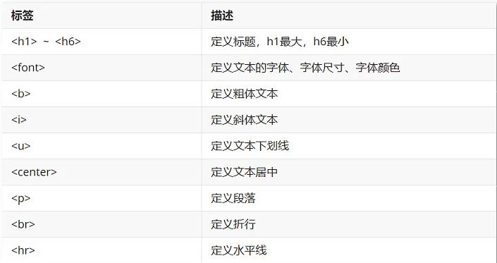
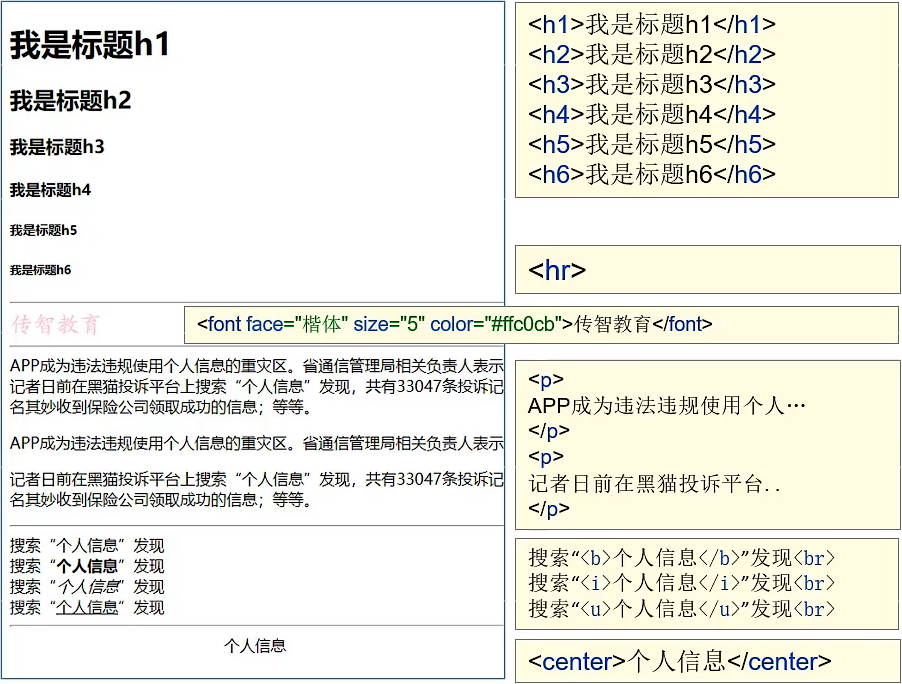
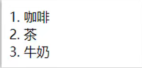

# HTML

## 什么是 HTML?

- HTML 是一门语言，所有的网页都是用 HTML 这门语言编写出来的

- **HTML (HyperText Markup Language**)：超文本标记语言

  - **超文本**：超越了文本的限制，比普通文本更强大。除了文字信息，还可以定义图片、音频、视频等内容

  - **标记语言**：由标签构成的语言

- HTML 运行在浏览器上，HTML 标签由浏览器来解析

- HTML 标签都是预定义好的。例如：使用 `` 展示图片

- **W3C 标准**：网页主要由三部分组成

  - **结构：**HTML

  - **表现：**CSS

  - **行为：**JavaScript

## HTML 快速入门

1. 新建文本文件，后缀名改为 `*.html`

2. 编写 HTML 结构标签

3. 在 `<body>` 中定义文字

   ```html
   <html>
       <head>
     	  <title>html 快速入内</title>
       </head>
       <body>
       	<font colors=red>乾坤未定，你我皆是黑马~</font>
       </body>
   </html>
   ```

   

## 基础标签





## 图片、音频、视频标签

| 标签      | 描述     |
| --------- | -------- |
| ``   | 定义图片 |
| `<audio>` | 定义音频 |
| `<video>` | 定义视频 |


- **img**：定义图片
  - `src`：规定显示图像的URL (统一资源定位符)
  - `height`：定义图像的高度
  - `width`：定义图像的宽度
- **audio**：定义音频。支持的音频格式：MP3、WAV、OGG
  - `src`：规定音频的URL
  - `controls`：显示播放控件
- **video**：定义视频。支持的音频格式：MP4、WebM、OGG
  - `src`：规定视频的 URL
  - `controls`：显示播放控件

## 超链接标签

| 标签  | 描述                             |
| ----- | -------------------------------- |
| `<a>` | 定义超链接，用于链接到另一个资源 |

- **href**：指定访问资源的 URL

- **target**：指定打开资源的方式

  - `_seIf`：默认值，在当前页面打开

  - `blank`：在空白页面打开

## 列表标签

- 有序列表 (order list)

  ```html
  <ol>
      <li>咖啡<li>
      <li>茶<li>
      <li>牛奶<li>
  <ol>
  ```

  

- 无序列表 (unorder list)

  ```html
  <ul>
      <li>咖啡<li>
      <li>茶<li>
      <li>牛奶<li>
  </ul>
  ```


| 标签   | 描述         |
| ------ | ------------ |
| `<ol>` | 定义有序列表 |
| `<ul>` | 定义无序列表 |
| `<li>` | 定义列表项   |

- 
  type：设置项目符号

## 表格标签

| 标签    | 描述           |
| ------- | -------------- |
| <table> | 定义表格       |
| <tr>    | 定义行         |
| <td>    | 定义单元格     |
| <th>    | 定义表头单元格 |

- 
  table：定义表格

  - border：规定表格边框的宽度
  - 
    width：规定表格的宽度

  - cellspacing：规定单元格之间的空白

- tr：定义行
  - align：定义表格行的内容对齐方式
- td：定义单元格
  - rowspan：规定单元格可横跨的行数
  - colspan：规定单元格可横跨的列数

## 布局标签

| 标签     | 描述                                                         |
| -------- | ------------------------------------------------------------ |
| `<div>`  | 用于组合行内元素。                                           |
| `<span>` | 定义 HTML 文档中的一个区域部分，经常与 CSS 一起使用，用来布局网页。 |

## 表单标签

- **表单**：在网页中主要负责数据采集功能，使用 `<form>` 标签定义表单
- **表单项（元素）**：不同类型的 input 元素、下拉列表、文本域等

| 标签         | 描述                                   |
| ------------ | -------------------------------------- |
| `<form>`     | 定义表单                               |
| `<input>`    | 定义表单项，通过 type 属性控制输入形式 |
| `<label>`    | 为表单项定义标注                       |
| `<select>`   | 定义下拉列表                           |
| `<option>`   | 定义下拉列表的列表项                   |
| `<textarea>` | 定义文本域                             |

- form：定义表单
  - action：规定当提交表单时向何处发送表单数据，URL
  - method：规定用于发送表单数据的方式
    - **get**：浏览器会将数据直接附在表单的 action URL 之后。大小有限制 4KB
    - **post**：浏览器会将数据放到 http 请求消息体中。大小无限制