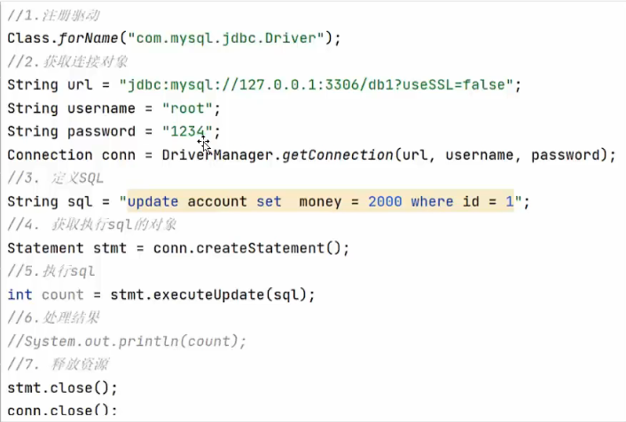
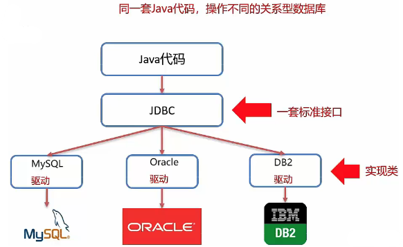
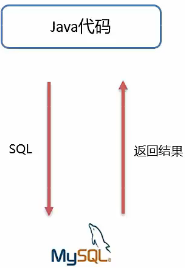
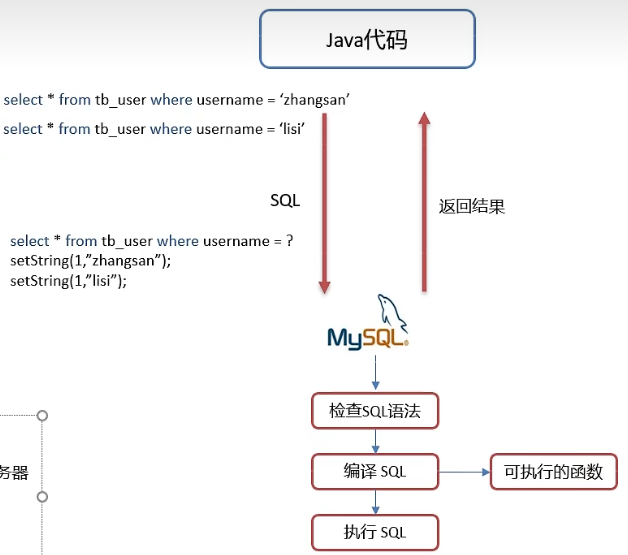
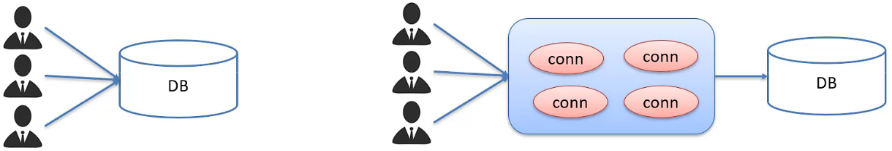

# JDBC

- JDBC 就是使用 Java 语言操作关系型数据库的一套 API

  

## 一、JDBC 简介

**JDBC 概念：**

- JDBC 就是使用 Java 语言操作关系型数据库的一套 API

- 全称：( **J**ava **D**ata**B**ase **C**onnectivity ) Java 数据库连接

**JDBC 本质：**

- 官方 ( sun公司 ) 定义的一套操作所有关系型数据库的规则，即接口
- 各个数据库厂商去实现这套接口，提供数据库驱动 jar 包
- 我们可以使用这套接口 ( JDBC ) 编程，真正执行的代码是驱动 jar 包中的实现类

**JDBC好处：**

- 各数据库厂商使用相同的接口，Java 代码不需要针对不同数据库分别开发
- 可随时替换底层数据库，访问数据库的 Java 代码基本不变



## 二、JDBC 快速入门

0. 创建工程，导入驱动jar包
   `mysql-connector-java-5.1.48jar`

1. 注册取动

   ```java
   Class.forName("com.mysql.jdbc.Driver");
   ```

2. 获取连接

   ```java
   Connection conn = DriverManager.getConnection(url, username, password);
   ```

3. 定义5QL语句

   ```java
   String sql = "update...";
   ```

4. 获取执行SQL对象

   ```java
   Statement stmt = conn.createStatement();
   ```

5. 执行SQL

   ```java
   stmt.executeUpdate(sql);
   ```

6. 处埋返回结果

7. 释放资源



## 三、JDBC API 详解

### DriverManager

- DriverManager (驱动管理类) 作用：

  1. 注册驱动

     ```java
     Class.forName("com.mysql.cj.jdbc.Driver");
     ```

     提示：

     - MySQL5 之后的驱动包，可以省略注册驱动的步骤
     - 自动加载 jar 包中 `META-lNF/services/java.sql.Driver` 文件中的驱动类

  2. 获取数据库连接

| static Connection | getConnection (String url, String user, String password) |
| ----------------- | -------------------------------------------------------- |

- 参数

  1. url: 连接路径

     > 语法：`jdbc:mysql://ip地址（域名）:端口号数据库名称?参数键值对1 & 参数键值对2...`
     > 示例：`jdbc:mysql://127.0.0.1:3306/db1`
     > 细节：
     >
     > - 如果连接的是本机 mysql 服务器，并且 mysql 服务默认端口是 3306，则 url 可以简写为：`jdbc:mysql:///数据库名称?参数键值对`
     > - 配置 useSSL=false 参数，禁用安全连接方式，解决警告提示

  2. user: 用户名

  3. password: 密码

### Connection

- Connection (数据库连接对象) 作用：

  1. 获取执行 SQL 的对象

     - 普通执行 SQL 对象

       `Statement createStatement ()`

     - 预编译 SQL 的执行 SQL 对象：防止 SQL 注入

       `PreparedStatement prepareStatement (sql)`

     - 执行存储过程的对象

       `CallableStatement prepareCall (sql)`

  2. 管理事务

     - MySQL事务管理

       > 开启事务：`BEGIN;` / `START TRANSACTION;`
       >
       > 提交事务：`COMMIT;`
       >
       > 回滚事务：`ROLLBACK;`
       >
       > MySQL 默认 **自动提交** 事务

     - JDBC 事务管理：Connection 接口中定义了 3 个对应的方法

       > 开启事务：`setAutoCommit(boolean autoCommit):true` 为自动提交事务；`false` 为手动提交事务，即为开启事务
       >
       > 提交事务：`commit()`
       >
       > 回滚事务：`rollback()`

### Statement

- Statement 作用：

  1. 执行SQL语句

- 执行SQL语句

  > `int executeUpdate (sql)`: 执行 DML、DDL 语句
  >
  > 返回值：(1) DML 语句影响的行数 (2) DDL 语句执行后，执行成功也可能返回 0

  > `ResultSet executeQuery (sql)`: 执行 DQL 语句
  >
  > 返回值：ResultSet 结果集对象

### ResultSet

- ResultSet (结果集对象) 作用：

  1. 封装了 DQL 查询语句的结果

  > `ResultSet stmt..executeQuery(sgl)`：执行 DQL 语句，返回 ResultSet 对象

- 获取查询结果

  > `boolean next ()`：(1) 将光标从当前位置向前移动一行 (2) 判断当前行是否为有效行
  >
  > 返回值：
  >
  > `true`：有效行，当前行有数据
  >
  > `false`：无效行，当前行没有数据

  

  > `XXX getXxx (参数)`：获取数据
  >
  > xxx：数据类型；如：`int getInt (参数)`；`String getString (参数)`
  > 参数：
  >
  > - int：列的编号，从1开始
  > - String：列的名称

#### ResultSet 案例

**需求：**查询 account 账户表数据，封装为 Account 对象中，并且存储到 ArrayList 集合中

```java
@Test
public void testResultSet() throws Exception {
    // 1. 注册驱动
    Class.forName("com.mysql.cj.jdbc.Driver"); //  mysql-jdbc 8.0 可以去掉

    // 2. 获取链接
    // String url = "jdbc:mysql://127.0.0.1:3306/db1";
    // 如果默认端口为 3306 可以简写为：
    String url = "jdbc:mysql:///db1?serverTimezone=UTC";
    String username = "root";
    String password = "root";

    Connection con = DriverManager.getConnection(url, username, password);
    // 3. 定义 SQL
    String sql = "select * from account";

    // 4. 获取 statement 对象
    Statement stmt = con.createStatement();

    // 5. 执行 sql
    ResultSet res = stmt.executeQuery(sql);
    // 6. 处理结果，遍历 res 中的所有数据
    // 6.1 光标向下移动一行，判断当前行是否存在数据

    // 创建集合
    List<Account> list = new ArrayList<>();

    while (res.next()) {
        Account account = new Account();
        // 6.2 获取数据 getXxx()
        account.setId(res.getInt(1));
        account.setName(res.getString(2));
        account.setMoney( res.getDouble(3));
        list.add(account);
    }
    // 打印输出
    for (Account account:list)
        System.out.println(account);

    // 7. 关闭连接
    con.close();
    stmt.close();
    res.close();
}
```

### PreparedStatement

#### PreparedStatement 作用：

- 预编译 SQL 语句并执行：**预防 SQL 注入** 问题

  1. 获取 PreparedStatement 对象

     ```java
     // SQL 语句中的参数值，使用？占位符替代
     String sql = "select * from user where username = ? and password = ?";
     // 通过 Connection ，对象获取，并传入对应 sql 语句
     PreparedStatement pstmt = conn.prepareStatement(sql);
     ```

  2. 设置参数值

     

  3. 执行SQL

  ```java
  executeUpdate (); // 不需要再传递 sql
  executeQuery(); // 不需要再传递 sql
  ```

#### SQL 注入

​	SQL 注入是通过操作输入来修改事先定义好的 SQL 语句，用以达到执行代码对服务器进行攻击的方法。

```java
/*
* 演示 SQL 注入
*  */
@Test
public void testUserLogin_Inject() throws Exception {
    // 2. 获取链接
    // 如果默认端口为 3306 可以简写为：
    String url = "jdbc:mysql:///test?serverTimezone=UTC";
    String username = "root";
    String password = "root";

    // 接收用户输入的用户名和密码
    String name = "zhangsan";
    // SQL 注入
    String pwd = "' or '1' = '1";

    // 创建连接
    Connection con = DriverManager.getConnection(url, username, password);

    // 拼接 SQL 字符串
    // username = 'name' and password = 'pwd';
    String sql = "SELECT * FROM tb_user WHERE username = '" + name +
    "' AND password = '" + pwd + "';";

    // 输入 SQL 语句
    System.out.println(sql);
    // 获取 stmt 对象
    Statement stmt = con.createStatement();
    // 执行 SQL
    ResultSet res = stmt.executeQuery(sql);

    // 判断登陆成功
    // 如果有查询到的数据，则登陆成功
    if (res.next()) System.out.println("登陆成功！");
    else System.out.println("登陆失败");
    // 7. 关闭连接
    con.close();
    stmt.close();
    res.close();
}
```

​	通过特殊的 SQL 语句登陆。

```mysql
-- ' or '1' = '1
-- 第一个 ' 跟 password 的字段组成了一个 ''
-- '1 跟 password 字段最后一个 ' 组成了 '1'
SELECT * FROM tb_user WHERE username = 'zhangsan' AND password = '' or '1' = '1';
```

​	改进后的代码：利用了 PreparedStatement

```java
@Test
public void testUserLogin() throws Exception {
    // 1. 注册驱动
    // Class.forName("com.mysql.cj.jdbc.Driver"); //  mysql-jdbc 8.0 可以去掉

    // 2. 获取链接
    // String url = "jdbc:mysql://127.0.0.1:3306/db1";
    // 如果默认端口为 3306 可以简写为：
    String url = "jdbc:mysql:///test?serverTimezone=UTC";
    String username = "root";
    String password = "root";

    // 接收用户输入的用户名和密码
    String name = "zhangsan";
    String pwd = "123";

    // 创建连接
    Connection con = DriverManager.getConnection(url, username, password);

    // 利用占位符预填写
    String sql = "SELECT * FROM tb_user WHERE username = ? and password = ?;";

    // 获取 pstmt 对象
    PreparedStatement pstmt = con.prepareStatement(sql);

    // 设置 ? 的值
    pstmt.setString(1, name);
    pstmt.setString(2, pwd);
    // 执行 SQL 语句
    ResultSet res = pstmt.executeQuery();
    if (res.next()) System.out.println("登陆成功");
    else System.out.println("登陆失败");

    // 7. 关闭连接
    con.close();
    pstmt.close();
    res.close();
}
```

#### PreparedStatement 原理

1. 在获取 PreparedStatement 对象时，将 SQL 语句发送给 MySQL 服务器进行检查，编译（这些步骤很耗时）
2. 执行时就不用再进行这些步骤了，速度更快
3. 如果 SQL 模板一样，则只需要进行一次检查、编译

#### PreparedStatement 好处：

1. **预编译** SQL，性能更高 
2. 防止 SQL 注入：**将敏感字符进行转义**



**开启预编译：**

1. PreparedStatement 预编译功能开启：`useServerPrepStmts=true` （URL 的参数）

2. 配置 MySQL 执行日志（重启 mysql 服务后生效）

   ```properties
   log-output=FILE
   general-log=1
   general_log_file="D:\mysql.log"
   slow-query-log=1
   slow_query_log_file="D:\mysql_slow.log"
   long_query_time=2
   ```

## 四、数据库连接池

### 数据库连接池简介

- 数据库连接池是个容器，负责 **分配**、**管理数据库连接** (Connection)
- 它允许应用程序 **重复使用** 一个现有的数据库连接，而不是再重新建立一个
- 释放空闲时间超过最大空闲时间的数据库连接来避免因为没有释放数据库连接而引起的数据库连接遗漏



**好处**：

- 资源重用
- 提升系统响应速度
- 避免数据库连接遗漏

### 数据库连接池实现

#### 标准接口：DataSource

- 官方 (SUN) 提供的数据库连接池标准接口，由第三方组织实现此接口。
- 功能：获取连接

```java
Connection getConnection()
```

#### 常见的数据库连接池：

- DBCP
- C3P0
- Druid

#### Druid (德鲁伊)

- Druid 连接池是阿里巴巴开源的数据库连接池项目
- 功能强大，性能优秀，是 Java 语言最好的数据库连接池之一

### Driud 使用步骤

1. 导入 jar 包 druid-1.1.12.jar
2. 定义配置文件
3. 加载配置文件
4. 获取数据库连接池对象
5. 获取连接

## 五、练习

### 完成商品品牌数据的增删改查操作

- **查询**：查询所有数据
- **添加**：添加品牌
- **修改**：根据 id 修改
- **删除**：根据 id 删除

#### 建表

```mysql
-- 删除 tb_brand 表
DROP TABLE IF EXISTS tb_brand;
	
-- 创建tb_brand 表
CREATE TABLE tb_brand (
	id INT PRIMARY KEY AUTO_INCREMENT,-- id主键
	brand_name VARCHAR ( 20 ),-- 品牌名称
	company_name VARCHAR ( 20 ),-- 企业名称
	ordered INT,-- 排序学段
	description VARCHAR ( 100 ),-- 描述信息
	STATUS INT -- 状态：0: 禁用1：启用
	
);

-- 添加数据
INSERT INTO tb_brand ( brand_name, company_name, ordered, description, STATUS )
VALUES
	( '三只松鼠', '三只松鼠股份有限公司', 5, '好吃不上火', 6 ),
	( '华为', '华为技术有限公司', 10, '华为致力于把数字世界带入每个人、每个家庭、每个组织，构建万物互联的智能世界', 1 ),
	( '小米', '小米科技有限公司', 50, 'are you ok', 1 );

SELECT * FROM tb_brand;
```

#### 实体类

```java
@Data
public class Band {
    // id主键
    private int id;
    // 品牌名称
    private String name;
    //  品牌名称
    private String brandName;
    // 企业名称
    private String companyName;
    // 描述信息
    private String description;
    // 状态：0: 禁用1：启用
    private int status = 0;   
}
```

#### 查询所有数据

1. 获取 Connection
2. 定义 SQL：`select * from tb_brand;`
3. 获取 PreparedStatement 对象
4. 设置参数：不需要
5. 执行 SQL
6. 处理结果：`List<Brand>`
7. 释放资源

```java
@Test
public void testSelectAll() throws Exception {
    System.out.println(System.getProperty("user.dir"));

    //加载配置文件
    Properties prop = new Properties();
    prop.load(new FileInputStream("src/druid.properties"));

    // 获取连接池对象
    DataSource dataSource = DruidDataSourceFactory.createDataSource(prop);

    // 1. 获取 Connection 连接
    Connection con = dataSource.getConnection();

    // 2. 定义 SQL 语句
    String sql = "SELECT * FROM tb_brand;";

    // 3. 获取 pstmt 对象 (预编译)
    PreparedStatement pstmt = con.prepareStatement(sql);

    // 5. 执行 sql
    ResultSet res = pstmt.executeQuery();
    List<Brand> brands = new ArrayList<>();

    // 6. 处理结果
    while (res.next()) {
        // 封装 brand 对象
        Brand brand = new Brand();
        brand.setBrandName(res.getString("brand_name"));
        brand.setDescription(res.getString("description"));
        brand.setId(res.getInt("id"));
        brand.setStatus(res.getInt("status"));
        brand.setCompanyName(res.getString("company_name"));
        brand.setOrdered(res.getInt("ordered"));

        // 装载集合
        brands.add(brand);
    }

    // 8. 释放资源
    pstmt.close();
    res.close();
    con.close();

    for (Brand brandList : brands) System.out.println(brandList);
}
```

#### 添加

1. 编写 SQL 语句

   ```mysql
   INSERT INTO tb_brand (brand_name,company_name,ordered,description,status) VALUES (?,?,?,?,?):
   ```

2. 是否需要参数？
   需要：除了 `id` 之外的所有数据

3. 返回结果如何封装？
   `boolean`

```java
@Test
public void testAdd() throws Exception {
    // 接收页面的数据
    String brandName = "香飘飘";
    String companyName = "香飘飘";
    int ordered = 1;
    String description = "绕地球一圈";
    int status = 1;

    // 2. 加载配置文件
    Properties prop = new Properties();
    prop.load(new FileInputStream("src/druid.properties"));

    // 3. 获取连接池对象
    DataSource dataSource = DruidDataSourceFactory.createDataSource(prop);

    // 4. 获取 Connection 连接
    Connection con = dataSource.getConnection();

    // 5. 定义 SQL 语句
       String sql = "INSERT INTO tb_brand (" +
                "brand_name, " +
                "company_name, " +
                "ordered, " +
                "description, " +
                "status" +
                ") VALUES (?, ?, ?, ?, ?);";

    // 6. 获取 pstmt 对象 (预编译)
    PreparedStatement pstmt = con.prepareStatement(sql);

    // 7. 设置参数
    pstmt.setString(1, brandName);
    pstmt.setString(2, companyName);
    pstmt.setInt(3, ordered);
    pstmt.setString(4, description);
    pstmt.setInt(5, status);

    // 8. 执行 sql
    int count = pstmt.executeUpdate(); // 影响的行数
    System.out.println(count > 0); // 输出一个 Boolean 值

    // 9. 断开连接
    pstmt.close();
    con.close();
}
```

#### 修改

1. 编写 SQL 语句

   ```mysql
   UPDATE tb_brand SET
       brand_name = ?,
       company_name = ?,
       ordered = ?,
       description = ?,
       status = ?
   WHERE id = ?;
   ```

2. 是否需要参数？

   需要：`Brand` 对象所有数据

3. 返回结果如何封装？

   `boolean`

```mysql
@Test
public void testUpdate() throws Exception {
    // 接收页面的数据
    String brandName = "香飘飘";
    String companyName = "香飘飘奶茶";
    int ordered = 100;
    String description = "绕地球一圈";
    int status = 1;
    int id = 4;

    // 2. 加载配置文件
    Properties prop = new Properties();
    prop.load(new FileInputStream("src/druid.properties"));

    // 3. 获取连接池对象
    DataSource dataSource = DruidDataSourceFactory.createDataSource(prop);

    // 4. 获取 Connection 连接
    Connection con = dataSource.getConnection();

    // 5. 定义 SQL 语句
    String sql = "UPDATE tb_brand SET " +
    "brand_name = ?, " +
    "company_name = ?, " +
    "ordered = ?, " +
    "description = ?, " +
    "status = ? " +
    "WHERE id = ?;";

    // 6. 获取 pstmt 对象 (预编译)
    PreparedStatement pstmt = con.prepareStatement(sql);

    // 7. 设置参数
    pstmt.setString(1, brandName);
    pstmt.setString(2, companyName);
    pstmt.setInt(3, ordered);
    pstmt.setString(4, description);
    pstmt.setInt(5, status);
    pstmt.setInt(6, id);

    // 8. 执行 sql
    int count = pstmt.executeUpdate(); // 影响的行数
    System.out.println(count > 0); // 输出一个 Boolean 值

    // 9. 断开连接
    pstmt.close();
    con.close();
}
```

#### 删除

1. 编写SQL语句

   ``` mysql
   DELETE FROM tb_brand WHERE id = ？
   ```

2. 是否需要参数？
   需要：`id`

3. 返回结果如何封装？
   `boolean`

```mysql
 @Test
 public void testDelete() throws Exception {
     // 接收页面的数据
     int id = 4;

    // 2. 加载配置文件
    Properties prop = new Properties();
    prop.load(new FileInputStream("src/druid.properties"));

    // 3. 获取连接池对象
    DataSource dataSource = DruidDataSourceFactory.createDataSource(prop);

    // 4. 获取 Connection 连接
    Connection con = dataSource.getConnection();

    // 5. 定义 SQL 语句
    String sql = "DELETE FROM tb_brand WHERE id = ?;";

    // 6. 获取 pstmt 对象 (预编译)
    PreparedStatement pstmt = con.prepareStatement(sql);

    // 7. 设置参数
    pstmt.setInt(1, id);

    // 8. 执行 sql
    int count = pstmt.executeUpdate(); // 影响的行数
    System.out.println(count > 0); // 输出一个 Boolean 值

    // 9. 断开连接
    pstmt.close();
    con.close();
}
```
