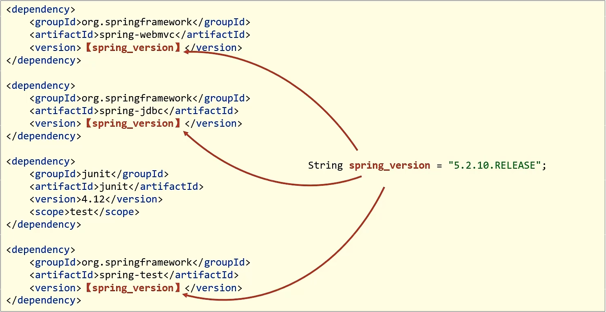
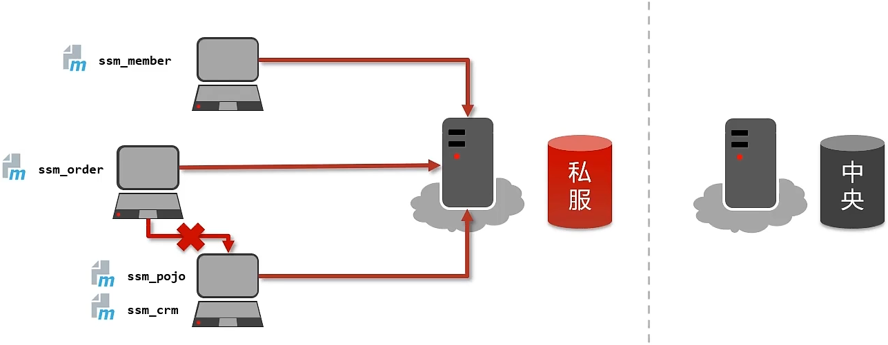

# Maven 基础

**Maven 是专门用于管理和构建 Java 项目的工具，它的主要功能有：**

- 提供了一套 **标准化的项目结构**

  

  > 不同 IDE 之间，项目结构不一样，不通用。

  

  

  > Maven 提供了一套标准化的项目结构，所有 IDE 使用 Maven 构建的项目结构完全一样，所有 IDE 创建的 Maven 项目可以通用。

- 提供了一套 **标准化的构建流程**（编译，测试，打包，发布.…）

  

  > Maven 提供了一套简单的命令来完成项目构建

- 提供了一套 **依赖管理** 机制

  依赖管理其实就是管理你项目所依赖的第三方资源 (jar 包、插件)

  

## 一、Maven 简介

- Apache Maven 是一个项目管理和构建工具，它基于项目对象模型 (POM) 的概念，通过一小段描述信息来管理项目的构建、报告和文档

- 官网：http://maven.apache.org/

### Maven 模型：


- 项目对象模型 (Project Object Model)

- 依赖管理模型 (Dependency)
- 插件 (Plugin)

### 仓库分类：

- 本地仓库 (Local Repository)：自己计算机上的一个目录

- 中央仓库 (Central Repository)：由 Maven 团队维护的全球唯一的仓库

  地址：https://repo1.maven.org/maven2/

- 远程仓库（私服 Remote Repository）：一般由公司团队搭建的私有仓库

当项目中使用坐标引入对应依赖 jar 包后，**首先** 会查找 **本地仓库** 中是否有对应的 jar 包：

- 如果 **有**，则在项目直接引用
- 如果 **没有**，则去中央仓库中下载对应的 jar 包到本地仓库

### Maven 安装配置

1. 解压 `apache-maven-3.6.1.rar` 既安装完成

2. 配置环境变量 `MAVEN_HOME` 为安装路径的 `bin` 目录

3. 配置本地仓库：修改 `conf/settings.xml` 中的 `<localRepository>` 为一个指定目录

4. 配置阿里云私服：修改 `conf/settings.xml` 中的 `<mirrors>` 标签，为其添加如下子标签：

   ```xml
   <mirror>
       <id>nexus-aliyun</id>  
       <name>nexus-aliyun</name> 
       <url>http://maven.aliyun.com/nexus/content/groups/public/</url>
       <mirrorOf>central</mirrorOf>
   </mirror>
   ```

## 二、Maven 基本使用

### Maven 常用命令

- **compile**：编译
- **clean**：清理
- **test**：测试
- **package**：打包
- **install**：安装

### Maven 生命周期

- Maven 构建项目生命周期描述的是一次构建过程经历经历了多少个事件

- Maven 对项目构建的生命周期划分为3套

  - **clean**：理工作

  - **default**：核心工作，例如编译，测试，打包，安装等

  - **site**：产生报告，发布站点等

> 同一生命周期内，执行后边的命令，前边的所有命令会自动执行


## 三、IDEA 配置 Maven

### IDEA 配置 Maven 环境

1. 选择 IDEA 中 File -> Settings
2. 搜索 maven
3. 设置 IDEA 使用本地安装的 Maven，并修改配置文件路径

### Maven 坐标详解

#### 什么是坐标？

- Maven 中的坐标是 **资源的唯一标识**
- 使用坐标来定义项目或引入项目中需要的依赖[

#### Maven 坐标主要组成

- **groupld**：定义当前 Maven 项目隶属组织名称（通常是域名反写，例如：com.itheima)
- **artifactld**：定义当前 Maven 项目名称（通常是模块名称，例如 order-service、goods-service)
- **version**：定义当前项目版本号


### IDEA 创建 Maven 项目

1. 创建模块，选择 Maven 点击 Next
2. 填写模块名称，坐标信息，点击 finish，创建完成
3. 编写 HelloWorld，并运行

### IDEA 导入 Maven 项目

1. 选择右侧 Maven 面板，点击 `+` 号
2. 选中对应项目的 `pom.xml` 文件，双击即可
3. 如果没有 Maven 面板，选择 `View → Appearance → Tool Window Bars`

## 四、依赖管理

#### 使用坐标导入 jar 包

1. 在 `pom.xml` 中编写 `<dependencies>` 标签
2. 在 `<dependencies>` 标签中使用 `<dependency>` 引l入坐标
3. 定义坐标的 `groupId`，`artifactId`，`version`
4. 点击刷新按钮，使坐标生效

#### 使用坐标导入 jar 包 - 自动导入

1. 选择 IDEA 中 `File --> Settings`
2. 在弹出的面板中找到 `Build Tools`
3. 选择 `Any changes`，点击 ok 即可生效

### 依赖范围

- 通过设置坐标的依赖范围 (scope)，可以设置对应 jar 包的作用范围：编译环境、测试环境、运行环境

```xml
<dependency>
	<groupId>junit</groupId>
	<artifactId>junit</artifactId>
	<version>4.13</version>
	<scope>test</scope>
</dependency>
```


- `<scope>` 默认值：compile

# Maven 进阶

## 一、分模块开发与设计

### 分模块开发意义

将原始模块按照功能拆分成若干个子模块，方便模块间的相互调用，接口共享


### 步骡：分模块开发

#### 1. 创建 Maven 模块

#### 2. 书写模块代码

> **注意事项**
>
> 分模块开发需要先针对模块功能进行设计，再进行编码。不会先将工程开发完毕，然后进行拆分

#### 3. 通过 maven 指令安装模块到本地仓库（install 指令)

> **注意事项**
>
> 团队内部开发需要发布模块功能到团队内部可共享的仓库中（私服）

## 二、依赖管理

依赖指当前项目运行所需的 jar，一个项目可以设置多个依赖

格式：


### 依赖传递

#### 依赖具有传递性

- **直接依赖**：在当前项目中通过依赖配置建立的依赖关系
- **间接依赖**：被资源的资源如果依赖其他资源，当前项目间接依赖其他资源
- **特殊优先**：当同级配置了相同资源的不同版本，后配置的覆盖先配置的


### 可选依赖

#### 可选依赖指对外隐藏当前所依赖的资源 —— 不透明


### 排除依赖

#### 排除依赖指主动断开依赖的资源，被排除的资源无需指定版本 —— 不需要


#### 排除依赖资源仅指定 GA 即可，无需指定 V

## 三、聚合与继承

### 聚合

**聚合**：将多个模块组织成一个整体，同时进行项目构建的过程称为聚合

**聚合工程**：通常是一个不具有业务功能的 “空” 工程（有且仅有一个 pom 文件）

**作用**：使用聚合工程可以将多个工程编组，通过对聚合工程进行构建，实现对所包含的模块进行同步构建

- 当工程中某个模块发生更新（变更）时，必须保障工程中与已更新模块关联的模块同步更新，此时可以使用聚合工程来解决批量模块同步构建的问题


#### 1. 创建 Maven 模块，设置打包类型为 pom


> **注意事项**
>
> 每个 maven 工程都有对应的打包方式，默认为 jar，web 工程打包方式为 war

2. #### 设置当前聚合工程所包含的子模块名称


> **注意事项**
>
> - 聚合工程中所包含的模块在进行构建时会根据模块间的依赖关系设置构建顺序，与聚合工程中模块的配置书写位置无关
>
> - 参与聚合的工程无法向上感知是否参与聚合，只能向下配置哪些模块参与本工程的聚合

### 继承


#### 概念

继承描述的是两个工程间的关系，与 java 中的继承相似，子工程可以继承父工程中的配置信息，常见于依赖关系的继承

#### 作用

- 简化配置

- 减少版本冲突

#### 1. 创建 Maven 模块，设置打包类型为 pom


> **注意事项**
>
> 建议父工程打包方式设置为 pom

#### 2. 在父工程的 pom 文件中配置依赖关系（子工程将沿用父工程中的依赖关系）


#### 3. 配置子工程中可选的依赖关系


#### 4. 在子工程中配置当前工程所继承的父工程


#### 5. 在子工程中配置使用父工程中可选依赖的坐标


> **注意事项**
>
> - 子工程中使用父工程中的可选依赖时，仅需要提供群组id和项目1d,无需提供版本，版本由父工程统一提供，避免版本冲突
>
> - 子工程中还可以定义父工程中没有定义的依赖关系

### 聚合与继承的区别

#### 作用：

- 聚合用于快速构建项目

- 继承用于快速配置

#### 相同点：

- 聚合与继承的 `pom.xml` 文件打包方式均为 pom，可以将两种关系制作到同一个 pom 文件中

- 聚合与继承均属于设计型模块，并无实际的模块内容

#### 不同点：

- 聚合是在当前模块中配置关系，聚合可以感知到参与聚合的模块有哪些

- 继承是在子模块中配置关系，父模块无法感知哪些子模块继承了自己

## 四、属性管理

### 属性



#### 1. 定义属性


#### 2. 引用属性


### 资源文件引用属性

#### 1. 定义属性


#### 2. 配置文件中引用属性


#### 3. 开启资源文件目录加载属性的过滤器


#### 4. 配置 maven 打 war 包时，忽略 `web.xml` 检查


### 其他属性（了解）

#### 属性列表

1. 自定义属性（常用)
2. 内置属性
3. Setting 属性
4. Java 系统属性
5. 环境变量属性


### 版本管理


#### 工程版本：

- SNAPSHOT (快照版本)

  - 项目开发过程中临时输出的版本，称为快照版本

  - 快照版本会随着开发的进展不断更新

- RELEASE（发布版本)
  - 项目开发到进入阶段里程碑后，向团队外部发布较为稳定的版本，这种版本所对应的构件文件是稳定的，即便进行功能的后续开发，也不会改变当前发布版本内容，这种版本称为发布版本

#### 发布版本:

- 
  alpha 版

- beta 版
- 纯数字版

## 五、多环境配置与应用

### 多环境开发


#### 定义多环境

```xml
<profiles>
    <!--开发环境-->
    <profile>
        <id>env_dep</id>
        <properties>
            <jdbc.url>jdbc:mysql:127.1.1.1:3306/ssm_db</jdbc.url>
        </properties>
        <!--设置默认启动环境-->
        <activation>
            <activeByDefault>true</activeByDefault>
        </activation>
    </profile>

    <!--生产环境-->
    <profile>
        <id>env_dep</id>
        <properties>
            <jdbc.url>jdbc:mysql:127.2.2.2:3306/ssm_db</jdbc.url>
        </properties>
    </profile>

    <!--测试环境-->
    <profile>
        <id>env_test</id>
        <properties>
            <jdbc.url>jdbc:mysql:127.2.2.2:3306/ssm_db</jdbc.url>
        </properties>
    </profile>
</profiles>
```

#### 2. 使用多环境（构建过程）


### 跳过测试

#### 应用场景

- 功能更新中并且没有开发完毕
- 快速打包
- ...

#### 跳过测试


> **注意事项**
>
> 执行的项目构建指令必须包含测试生命周期，否则无效果。例如执行 compile 生命周期，不经过 test 生命周期

#### 细粒度控制跳过测试


## 六、私服

### 私服简介

#### 团队开发现状分析



#### 私服简介

私服是一台独立的服务器，用于解决团队内部的资源共享与资源同步问题

- Nexus
  - Sonatype 公司的一款 maven 私服产品

### 私服仓库分类

#### 私服资源操作流程分析


### 资源上传与下载


#### 本地仓库访问私服权限设置

##### 配置位置（setting.xml 文件中)


#### 本地仓库访问私服地址设置

##### 配置位置（setting.xml 文件中)


#### 工程上传到私服服务器设置

##### 配置位置（工程 pom 文件中)


##### 发布命令


#### 私服访问中央服务器设置

##### 配置位置（nexus 服务器页面设置)


