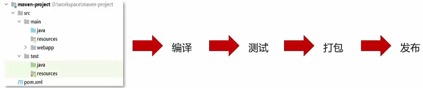

# Maven

**Maven 是专门用于管理和构建 Java 项目的工具，它的主要功能有：**

- 提供了一套 **标准化的项目结构**

  

  > 不同 IDE 之间，项目结构不一样，不通用。

  

  

  > Maven 提供了一套标准化的项目结构，所有 IDE 使用 Maven 构建的项目结构完全一样，所有 IDE 创建的 Maven 项目可以通用。

- 提供了一套 **标准化的构建流程**（编译，测试，打包，发布.…）

  

  > Maven 提供了一套简单的命令来完成项目构建

- 提供了一套 **依赖管理** 机制

  依赖管理其实就是管理你项目所依赖的第三方资源 (jar 包、插件)

  

## 一、Maven 简介

- Apache Maven 是一个项目管理和构建工具，它基于项目对象模型 (POM) 的概念，通过一小段描述信息来管理项目的构建、报告和文档

- 官网：http://maven.apache.org/

### Maven 模型：


- 项目对象模型 (Project Object Model)

- 依赖管理模型 (Dependency)
- 插件 (Plugin)

### 仓库分类：

- 本地仓库 (Local Repository)：自己计算机上的一个目录

- 中央仓库 (Central Repository)：由 Maven 团队维护的全球唯一的仓库

  地址：https://repo1.maven.org/maven2/

- 远程仓库（私服 Remote Repository）：一般由公司团队搭建的私有仓库

当项目中使用坐标引入对应依赖 jar 包后，**首先** 会查找 **本地仓库** 中是否有对应的 jar 包：

- 如果 **有**，则在项目直接引用
- 如果 **没有**，则去中央仓库中下载对应的 jar 包到本地仓库

### Maven 安装配置

1. 解压 `apache-maven-3.6.1.rar` 既安装完成

2. 配置环境变量 `MAVEN_HOME` 为安装路径的 `bin` 目录

3. 配置本地仓库：修改 `conf/settings.xml` 中的 `<localRepository>` 为一个指定目录

4. 配置阿里云私服：修改 `conf/settings.xml` 中的 `<mirrors>` 标签，为其添加如下子标签：

   ```xml
   <mirror>
       <id>nexus-aliyun</id>  
       <name>nexus-aliyun</name> 
       <url>http://maven.aliyun.com/nexus/content/groups/public/</url>
       <mirrorOf>central</mirrorOf>
   </mirror>
   ```

## 二、Maven 基本使用

### Maven 常用命令

- **compile**：编译
- **clean**：清理
- **test**：测试
- **package**：打包
- **install**：安装

### Maven 生命周期

- Maven 构建项目生命周期描述的是一次构建过程经历经历了多少个事件

- Maven 对项目构建的生命周期划分为3套

  - **clean**：理工作

  - **default**：核心工作，例如编译，测试，打包，安装等

  - **site**：产生报告，发布站点等

> 同一生命周期内，执行后边的命令，前边的所有命令会自动执行


## 三、IDEA 配置 Maven

### IDEA 配置 Maven 环境

1. 选择 IDEA 中 File -> Settings
2. 搜索 maven
3. 设置 IDEA 使用本地安装的 Maven，并修改配置文件路径

### Maven 坐标详解

#### 什么是坐标？

- Maven 中的坐标是 **资源的唯一标识**
- 使用坐标来定义项目或引入项目中需要的依赖[

#### Maven 坐标主要组成

- **groupld**：定义当前 Maven 项目隶属组织名称（通常是域名反写，例如：com.itheima)
- **artifactld**：定义当前 Maven 项目名称（通常是模块名称，例如 order-service、goods-service)
- **version**：定义当前项目版本号


### IDEA 创建 Maven 项目

1. 创建模块，选择 Maven 点击 Next
2. 填写模块名称，坐标信息，点击 finish，创建完成
3. 编写 HelloWorld，并运行

### IDEA 导入 Maven 项目

1. 选择右侧 Maven 面板，点击 `+` 号
2. 选中对应项目的 `pom.xml` 文件，双击即可
3. 如果没有 Maven 面板，选择 `View → Appearance → Tool Window Bars`

## 四、依赖管理

#### 使用坐标导入 jar 包

1. 在 `pom.xml` 中编写 `<dependencies>` 标签
2. 在 `<dependencies>` 标签中使用 `<dependency>` 引l入坐标
3. 定义坐标的 `groupId`，`artifactId`，`version`
4. 点击刷新按钮，使坐标生效

#### 使用坐标导入 jar 包 - 自动导入

1. 选择 IDEA 中 `File --> Settings`
2. 在弹出的面板中找到 `Build Tools`
3. 选择 `Any changes`，点击 ok 即可生效

### 依赖范围

- 通过设置坐标的依赖范围 (scope)，可以设置对应 jar 包的作用范围：编译环境、测试环境、运行环境

```xml
<dependency>
	<groupId>junit</groupId>
	<artifactId>junit</artifactId>
	<version>4.13</version>
	<scope>test</scope>
</dependency>
```


- `<scope>` 默认值：compile
