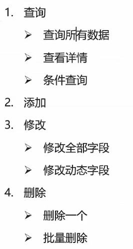

# MyBatis

**什么是 MyBatis ?**

- MyBatis 是一款优秀的特久层框架，用于简化 JDBC 开发

- MyBatis 本是 Apache 的一个开源项目 iBatis，2010 年这个项目由 apache software foundation 迁移到了 google code，并且改名为 MyBatis。2013 年 11 月迁移到 Github

- 官网：https://mybatis.org/mybatis-3/zh/index.html

**持久层**

- **负责** 将 **数据** 到 **保存到数据库** 的那 **一层代码**

- JavaEE 三层架构：表现层、业务层、持久层

**框架**

- 框架就是一个 **半成品软件**，是一套 **可重用的**、**通用的**、**软件基础代码** 模型

- 在框架的基础之上构建软件编写更加 **高效**、**规范**、**通用**、**可扩展**

**JDBC 缺点**


**MyBatis 简化**


> MyBatis 免除了几乎所有的 **JDBC 代码** 以及 **设置参数** 和 **获取结果集** 的工作

## MyBatis 快速入门

### 查询 user 表中所有数据

1. 创建 user 表，添加数据

   ```mysql
   CREATE DATABASE mybatis;
   
   USE mybatis;
   
   DROP TABLE IF EXISTS tb_user;
   
   CREATE TABLE tb_user (
   	id INT PRIMARY KEY AUTO_INCREMENT,
   	username VARCHAR ( 20 ),
   	password VARCHAR ( 20 ),
   	gender CHAR ( 1 ),
   	addr VARCHAR ( 30 )
   );
   
   INSERT INTO tb_user VALUES (1,'zhangsan', '123', '男', '北京');
   INSERT INTO tb_user VALUES (2,'李四', '234 ', '女', '天津');
   INSERT INTO tb_user VALUES (3,'王五', '11', '男', '西安');
   ```

   

2. 创建模块，导入坐标

   ```xml
   <dependencies>
       <!--jdbc connection-->
       <dependency>
           <groupId>mysql</groupId>
           <artifactId>mysql-connector-java</artifactId>
           <version>8.0.30</version>
       </dependency>
   
       <!--junit 单元测试-->
       <dependency>
           <groupId>junit</groupId>
           <artifactId>junit</artifactId>
           <version>4.13.2</version>
           <scope>test</scope>
       </dependency>
   
       <!--添加 slf4j 日志 api-->
       <dependency>
           <groupId>org.slf4j</groupId>
           <artifactId>jcl-over-slf4j</artifactId>
           <version>1.5.6</version>
       </dependency>
       <!--添加 logback-classic 依赖-->
       <dependency>
           <groupId>ch.qos.logback</groupId>
           <artifactId>logback-classic</artifactId>
           <version>1.4.0</version>
       </dependency>
       <!--添加logback-core 依赖-->
       <dependency>
           <groupId>ch.qos.logback</groupId>
           <artifactId>logback-core</artifactId>
           <version>1.4.0</version>
       </dependency>
   
       <!--添加 mybatis-->
       <dependency>
           <groupId>org.mybatis</groupId>
           <artifactId>mybatis</artifactId>
           <version>3.5.10</version>
       </dependency>
   
       <!--添加 lombok -->
       <dependency>
           <groupId>org.projectlombok</groupId>
           <artifactId>lombok</artifactId>
           <version>1.18.24</version>
       </dependency>
   </dependencies>
   ```

3. 编写 MyBatis 核心配置文件 -> 替换连接信息解决硬编码问题

   **`mybatis-config.xml`**

   ```xml
   <?xml version="1.0" encoding="UTF-8" ?>
   <!DOCTYPE configuration
           PUBLIC "-//mybatis.org//DTD Config 3.0//EN"
           "http://mybatis.org/dtd/mybatis-3-config.dtd">
   <configuration>
       <environments default="development">
           <environment id="development">
               <transactionManager type="JDBC"/>
               <dataSource type="POOLED">
                   <!--数据库链接信息-->
                   <property name="driver" value="com.mysql.cj.jdbc.Driver"/>
                   <property name="url" value="jdbc:mysql:///mybatis?serverTimezone=UTC"/>
                   <property name="username" value="root"/>
                   <property name="password" value="root"/>
               </dataSource>
           </environment>
       </environments>
       <mappers>
           <!--加载 SQL映射文件-->
           <mapper resource="UserMapper.xml"/>
       </mappers>
   </configuration>
   ```

4. 编写 SQL映射文件 -> 统一管理 SQL语句，解决硬编码问题

   **`UserMapper.xml`**

   ```xml
   <?xml version="1.0" encoding="UTF-8" ?>
   <!DOCTYPE mapper
           PUBLIC "-//mybatis.org//DTD Mapper 3.0//EN"
           "http://mybatis.org/dtd/mybatis-3-mapper.dtd">
   <!--
       namespace:名称空间
   -->
   <mapper namespace="User">
       <!--resultType -> 返回结果的类型，一般为实体类-->
       <select id="selectAll" resultType="com.itheima.pojo.User">
           select * from tb_user;
       </select>
   </mapper>
   ```


### IDEA 配置 MySQL

`jdbc:mysql://localhost:3306/mybatis?serverTimezone=UTC&useUnicode=true&useSSL=false`

## Mapper 代理开发

**目的**

- **解决** 原生方式中的 **硬编码**
- **简化** 后期执行 SQL

### 使用 Mapper 代理方式完成入门案例

1. 定义与 SQL 映射文件 **同名** 的 Mapper **接口**，并且将 Mapper 接口和 SQL 映射文件放置在 **同一目录** 下

   

2. 设置 SQL 映射文件的 namespace，属性为 Mapper 接口全限定名

   ```xml
   <mapper namespace="com.itheima.mapper.UserMapper">
       <!--resultType -> 返回结果的类型，一般为实体类-->
       <select id="selectAll" resultType="com.itheima.pojo.User">
           select * from tb_user;
       </select>
   </mapper>
   ```

   > namespace：名称空间
   >     一般情况下 mapper 的 namespace 能随便写，不重复即可，
   >    但如果希望使用 mybatis **动态代理** 的接口，就需要namespace中的值和 **需要对应** 的Mapper (dao) 接口的 **全路径一致**。
   >     例如：`com.zpc.mybatis.dao.UserDao`

3. 在 Mapper 接口中定义方法，方法名就是 SQL 映射文件中 SQL 语句的 id，并保持参数类型和返回值
   类型一致

   ```java
   public interface UserMapper {
       List<User> selectAll();
   }
   ```

4. 编码

   1. 通过 SqlSession 的 getMapper 方法获取 Mapper 接口的代理对象

   2. 调用对应方法完成 SQL的执行

      ```java
      public static void main(String[] args) throws IOException {
          // 1. 加载 mybatis 的核心配置文件，获取 SQLSessionFactory
          String resource = "mybatis-config.xml";
          InputStream inputStream = Resources.getResourceAsStream(resource);
          SqlSessionFactory sqlSessionFactory = new SqlSessionFactoryBuilder().build(inputStream);
      
          // 2. 获取 SQLSession 对象，用它来执行 sql
          SqlSession sqlSession = sqlSessionFactory.openSession();
      
          // 3. 获取 UserMapper 接口的代理对象
          UserMapper userMapper = sqlSession.getMapper(UserMapper.class);
          System.out.println( );
      
          // 4. 释放资源
          sqlSession.close();
      }
      ```

      

> 细节：如果 Mapper 接口名称和 SQL 映射文件名称相同，并在同一目录下，则可以使用包扫描的方式简化 SQL 映射文件的加载


#### 手动添加 resource 目录

问题：maven 在 compile  的时候 xml 文件没有被编译

修改 `pom.xml`

```xml
<build>
    <resources>
        <!--自定义 resource 目录-->
        <resource>
            <directory>src/main/java/com/itheima/mapper</directory>
            <includes>
                <include>**/*.xml</include>
            </includes>
        </resource>
        <!--默认 resource 目录-->
        <resource>
            <directory>src/main/resources</directory>
        </resource>
    </resources>
</build>
```

#### 关于加载 Mapper

- 包扫描 - 避免每个 mapper 都要手动装载

```xml
<!--包扫描-->
<package name="com.itheima.mapper"/>
```

- 手动装载 mapper

```xml
<!--加载 SQL 映射文件-->
<mapper resource="UserMapper.xml"/>
```

## MyBatis 核心配置文件

MyBatis 的配置文件包含了会深深影响 MyBatis 行为的设置和属性信息。 配置文档的顶层结构如下：

- configuration（配置）
  - [properties（属性）](https://mybatis.net.cn/configuration.html#properties)
  - [settings（设置）](https://mybatis.net.cn/configuration.html#settings)
  - [typeAliases（类型别名）](https://mybatis.net.cn/configuration.html#typeAliases)
  - [typeHandlers（类型处理器）](https://mybatis.net.cn/configuration.html#typeHandlers)
  - [objectFactory（对象工厂）](https://mybatis.net.cn/configuration.html#objectFactory)
  - [plugins（插件）](https://mybatis.net.cn/configuration.html#plugins)
  - environments（环境配置）
    - environment（环境变量）
      - transactionManager（事务管理器）
      - dataSource（数据源）
  - [databaseIdProvider（数据库厂商标识）](https://mybatis.net.cn/configuration.html#databaseIdProvider)
  - [mappers（映射器）](https://mybatis.net.cn/configuration.html#mappers)

## 配置文件完成增删改查

### 例：完成品牌数据的增删改查操作

**要完成的功能列表清单：**



#### 准备环境

- **数据库表 `tb_brand`**

- **实体类 Brand**

- **测试用例**

- **安装 MyBatisX 插件**

  MybatisX 是一款基于 IDEA 的 **快速开发插件**，为效率而生。

  **主要功能：**

  XML 和 接口方法 **相互跳转**

  根据接口方法 **生成 statement**

#### 查询 - 查询所有数据

1. 编写接口方法：Mapper 接口

   - 参数：无

   - 结果：`List <Brand>`

2. 编写 SQL 语句：SQL 映射文件

3. 执行方法，测试

##### 问题

数据库表的 **字段名称** 和 **实体类的属性名称** **不一样**，不能自动封装数据（蛇转驼峰）

**解决方法：**

1. ResultMap

   ```xml
   <!--
   	id 自定
   	type 映射类型，一般为对应的实体类
   	column 表的列名
   	property 实体类的属性名
   -->
   <resultMap id="brandResultMap" type="com.itheima.pojo.Brand">
       <!--id 标签用来完成主键的映射-->
       <!-- <id column="" property=""></id> -->
       <result column="brand_name" property="brandName"></result>
       <result column="company_name" property="companyName"></result>
   </resultMap>
   
   <select id="selectAll" resultMap="brandResultMap">
       select *
       from tb_brand;
   </select>
   ```

2. 起别名

   ```xml
   <select id="selectAll" resultType="com.itheima.pojo.Brand">
   	select id,brand_name as brandName, company_name as companyName, ordered, description, status from tb_brand;
   </select>
   ```

   **缺点：**每次差吨都要定义一次别名

3. 通过 SQL 片段替代字段名称

   ```xml
   <!--SQL 片段-->
   <sql id="brand_column">
       id, brand_name as brandName, company_name as companyName, ordered, description, status
   </sql>
   <select id="selectAll" resultType="com.itheima.pojo.Brand">
       select
       <include refid="brand_column"></include>
       from tb_brand;
   </select>
   ```

   **缺点：**不够灵活

### 查询 - 查看详情

1. 编写接口方法：Mapper 接口
   - 参数：id
   - 结果：Brand
2. 编写 SQL 语句：SQL 映射文件
3. 执行方法，测试

##### 问题：

* 参数占位符：
    1. `#{}`：会将其替换为 `?`. 为了防止 SQL 注入
    2. `${}`：拼 SQL. 会存在 SQL 注入的问题
    3. 使用时机：
        * 参数传递的时候：`#{}`
        * 表明或者列明不固定的情况（需要拼接字符串）：`${}` 会存在 SQL 注入问题
 * 参数类型：parameterType 可以省略
 * 特殊字符处理：由于 `<` 是 xml 的开始符号，故在 SQL 语句中需要进行特殊处理
    * 转义字符
    * `<![CDATA[内容]]>`

### 查询 - 多条件查询

1. 编写接口方法：Mapper 接口
   参数：所有查询条件
   结果：`List<Brand>`
2. 编写 SQL 语句：SQL 映射文件
3. 执行方法，测试


#### 参数接收

1. 散装参数：如果方法中有 **多个参数**，需要使用 `@Param ("SQL占位符名称")`
2. 对象参数：对象的 **属性名** 称要和 **参数占位符** 名称 **一致**
3. map 集合参数

### 查询 - 多条件 - 动态条件查询

- SQL 语句会随着用户的输入或外部条件的变化而变化，我们称为动态 SQL

```xml
<select id="selectByCondition" resultMap="brandResultMap">
    select *
    from tb_brand
    where
    <if test="status != null">
        status = #{status}
    </if>
    <if test="companyName != null and companyName != ''">
        and company_name like #{companyName}
    </if>
    <if test="brandName != null and brandName != ''">
        and brand_name like #{brandName};
    </if>
</select>
```

#### 动态条件查询 

[动态SQL之<where>、<if>条件判断](https://blog.csdn.net/u010502101/article/details/79117000/)

* **if：条件判断**
  * test：逻辑表达式
* **choose (when, otherwise)**
  * `choose` 标签作用是通过条件判断来拼接 SQL 语句，类似于 Java 中的 `switch` 语句，从上到下，当有匹配的条件时，跳出 `choose` 语句
  * 如果所有条件都不成立则执行 `otherwise` 标签中的内容
* **trim (where, set)**
* **foreach**

**问题：如果其中一个条件没写，会导致 SQL 语句报错**

```mysql
### SQL: select * from tb_brand  where and company_name like ? and brand_name like ?;
```

解决方法：

* `<where>` 替换 where 关键字。在没有条件时，mybaits 会自动去除 SQL and 语句

  ```xml
  <select id="selectByCondition" resultMap="brandResultMap">
      select *
      from tb_brand
      <where>
          <if test="status != null">
              and status = #{status}
          </if>
          <if test="companyName != null and companyName != ''">
              and company_name like #{companyName}
          </if>
          <if test="brandName != null and brandName != ''">
              and brand_name like #{brandName};
          </if>
      </where>
  </select>
  ```

* 恒等式

  ```xml
  <select id="selectByCondition" resultMap="brandResultMap">
      select *
      from tb_brand
      where 1 = 1
      <if test="status != null">
      	and status = #{status}
      </if>
      <if test="companyName != null and companyName != ''">
  	    and company_name like #{companyName}
      </if>
      <if test="brandName != null and brandName != ''">
  	    and brand_name like #{brandName};
      </if>
  </select>
  ```

  

### 查询单条动态条件查询

- 从多个条件中选择一个
  - choose (when, otherwise)：选择，类似于 Java 中的 switch 语句

```xml
<select id="SelectByConditionSingle" resultMap="brandResultMap">
    select *
    from tb_brand
    <where>
        <choose> <!-- 相当于 switch -->
            <when test="status != null"> <!-- 相当于 case -->
                status = #{status}
            </when>
            <when test="companyName != null and companyName != ''"> <!-- 相当于 case -->
                companyName like #{companyName}
            </when>
            <when test="brandName != null and brandName != ''"> <!-- 相当于 case -->
                brandName like #{brandName}
            </when>
        </choose>
    </where>
</select>
```

### 添加

1. 编写接口方法：Mapper 接口

   - 参数：除了 id 之外的所有数据

   - 结果：void

   ```java
   void AddBrand(Brand brand);
   ```

2. 编写 SQL 语句：SQL 映射文件

   ```xml
   <insert id="AddBrand" >
       insert into tb_brand (brand_name, company_name, ordered, description, status) VALUES (#{brandName},#{companyName},#{ordered},#{description},#{status});
   </insert>
   ```

3. 执行方法，测试

- MyBatis事务：

  - `openSession()`：默认开启事务，进行增删改操作后需要使用 `sqlSession.commit();` 手动提交事务

  - `openSession(true)`：可以设置为自动提交事务（关闭事务）

    ```java
    SqlSession sqlSession = sqlSessionFactory.openSession(true);
    ```

### 添加 - 主键返回

在数据添加成功后，需要获取插入数据库数据的主键的值

- 比如：添加订单和订单项

  1. 添加订单

  1. 添加订单项，订单项中需要设置所属订单的 id

```xml
<!--主键返回-->
<insert id="AddBrandAndReturnId" useGeneratedKeys="true" keyProperty="id" >
    insert into tb_brand (brand_name, company_name, ordered, description, status) VALUES (#{brandName},#{companyName},#{ordered},#{description},#{status});
</insert>
```

### 修改 - 修改全部字段

1. 编写接口方法：Mapper 接口

   - 
     参数：所有数据

   - 结果：void

   ```java
   void updateBrand(Brand brand);
   ```

   

2. 编写 SQL 语句：SQL 映射文件

   ```xml
   <update id="updateBrand">
       update tb_brand
       set brand_name   = #{brandName},
           company_name = #{companyName},
           status       = #{status},
           description  = #{description},
           ordered      = #{ordered}
       where id = #{id};
   </update>
   ```

   

3. 执行方法，测试

### 修改 - 修改动态字段

1. 编写接口方法：Mapper 接口

   - 参数：部分数据，封装到对象中

   - 结果：void

2. 编写 SQL 语句：SQL 映射文件

3. 执行方法，测试

SET 元素可以用于 **动态包含** 需要 **更新的列**，**忽略** 其它 **不更新的列**。

```xml
<update id="updateBrandDynamic">
    update tb_brand
    <set>
        <if test="brandName != null and brandName != ''">
            brand_name = #{brandName},
        </if>
        <if test="companyName != null and companyName != ''">
            company_name = #{companyName},
        </if>>
        <if test="description != null and description != ''">
            description = #{description},
        </if>
        <if test="status != null">
            status = #{status},
        </if>>
        <if test="ordered != null">
            ordered = #{ordered},
        </if>>
    </set>
    where id = #{id};
</update>
```

> SET 元素会动态地在行首插入 SET 关键字，并会 **删掉额外的逗号**（这些逗号是在使用条件语句给列赋值时引入的）。

### 删除一个

1. 编写接口方法：Mapper 接口

   - 参数：id

   - 结果：void

   ```java
   void deleteById(int id);
   ```

   

2. 编写 SQL 语句：SQL 映射文件

   ```xml
   <delete id="deleteById">
       delete
       from tb_brand
       where id = #{id};
   </delete>
   ```

3. 执行方法，测试

### 批量删除

1. 编写接口方法：Mapper 接口
   参数：id 数组
   结果：void

   ```java
   void deleteByIds(@Param("ids") int[] ids);
   ```

2. 编写 SQL 语句：SQL 映射文件

   ```xml
   <delete id="deleteByIds">
       delete
       from tb_brand
       where id in (
       <foreach collection="ids" item="id" separator=",">
           #{id}
       </foreach>
       );
   </delete>
   ```

3. 执行方法，测试

**mybaits 会将数组的参数，封装为一个 Map 集合**

    * 默认：`array = 数组`
        * 使用 `@Param` 注解 改变 map 集合的默认 key 的名称

### MyBatis 参数传递

MyBatis 接口方法中可以接收各种各样的参数，MyBatis 底层对于这些参数进行不同的封装处理方式

- 单个参数：
  1. POO 类型：
  2. Map 集合：
  3. Collection:
  4. List:
  5. Array:
  6. 其他类型：

- 多个参数：

> MyBatis 提供了 ParamNameResolver 类来进行参数封装

## 注解完成增删改查


## 动态 SQL