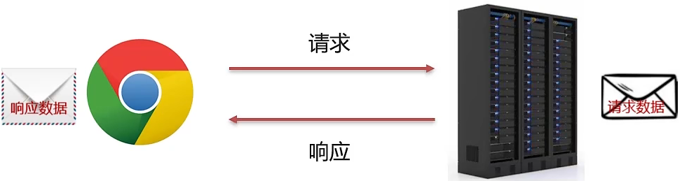

# Web 核心

### 什么是 JavaWeb?

Web：全球广域网，也称为万维网 (www)，能够通过浏览器访问的网站
JavaWeb：是用 Java 技术来解决相关 web 互联网领域的技术栈

### JavaWeb技术栈

- **B/S 架构**：

  Browser/Server，浏览器/服务器 架构模式，它的特点是，客户端 **只需要浏览器**，应用程序的 **逻辑和数据都存储在服务器端**。浏览器只需要请求服务器，获取 Web 资源，服务器把 Web 资源发送给浏览器即可。

  - **好处**：

    易于维护升级：服务器端升级后，客户端无需任何部署就可以使用到新的版本

- 静态资源：HTML、CSS、JavaScript、图片等。负责 **页面展现**
- 动态资源：Servlet、JSP 等。负责 **逻辑处理**

- 数据库：负责 **存储数据**

# HTTP

- **既念**：HyperText Transfer Protocol，超文本传输协议，规定了浏览器和服务器之间数据传输的规则。

## HTTP 协议 **特点**：

1. 基于 TCP 协议：**面向连接**，**安全**

2. 基于 **请求 - 响应** 模型的：一次请求对应一次响应

3. HTTP 协议是 **无状态的协议**：对于事务处理 **没有记忆能力**。每次请求 - 响应都是 **独立的**。

   - **缺点**：多次请求间不能共享数据。

   - **优点**：速度快

## HTTP - 请求数据格式

- 请求数据分为 3 部分：
  1. **请求行**：请求数据的第一行。其中 GET 表示请求方式，`/` 表示请求资源路径，`HTTP/1.1` 表示协议版本
  2. **请求头**：第二行开始，格式为 `key:value` 形式
  3. **请求体**：POST 请求的最后一部分，存放请求参数

# Web服务器 - Tomcat

# servlet