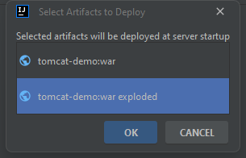
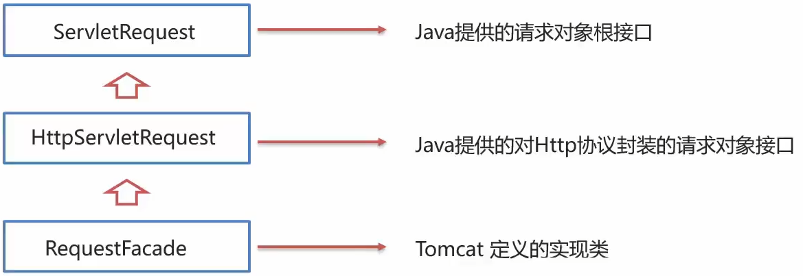

# Web 核心

### 什么是 JavaWeb?

Web：全球广域网，也称为万维网 (www)，能够通过浏览器访问的网站
JavaWeb：是用 Java 技术来解决相关 web 互联网领域的技术栈

### JavaWeb技术栈

- **B/S 架构**：

  Browser/Server，浏览器/服务器 架构模式，它的特点是，客户端 **只需要浏览器**，应用程序的 **逻辑和数据都存储在服务器端**。浏览器只需要请求服务器，获取 Web 资源，服务器把 Web 资源发送给浏览器即可。

  - **好处**：

    易于维护升级：服务器端升级后，客户端无需任何部署就可以使用到新的版本

- 静态资源：HTML、CSS、JavaScript、图片等。负责 **页面展现**

- 动态资源：Servlet、JSP 等。负责 **逻辑处理**

- 数据库：负责 **存储数据**


# HTTP

- **既念**：HyperText Transfer Protocol，超文本传输协议，规定了浏览器和服务器之间数据传输的规则。


## HTTP 协议 **特点**：

1. 基于 TCP 协议：**面向连接**，**安全**

2. 基于 **请求 - 响应** 模型的：一次请求对应一次响应

3. HTTP 协议是 **无状态的协议**：对于事务处理 **没有记忆能力**。每次请求 - 响应都是 **独立的**。

   - **缺点**：多次请求间不能共享数据。

   - **优点**：速度快


## HTTP - 请求数据格式

### 请求数据分为 3 部分：

1. **请求行**：请求数据的第一行。其中 GET 表示请求方式，`/` 表示请求资源路径，`HTTP/1.1` 表示协议版本
2. **请求头**：第二行开始，格式为 `key：value` 形式
3. **请求体**：POST 请求的最后一部分，存放请求参数


### 常见的HTTP请求头：

1. `Host`：表示请求的主机名
2. `User-Agent`：浏览器版本，例如 Chrome 浏览器的标识类似 Mozilla/5.0 ... Chrome/79，IE 浏览器的标识类似 Mozilla/5.0 (Windows NT...) like Gecko;
3. `Accept`：表示浏览器能接收的资源类型，如 `text/*`, `image/*` 或者 `*/*` 表示所有；
4. `Accept-Language`：表示浏览器偏好的语言，服务器可以据此返回不同语言的网页；
5. `Accept-Encoding`：表示浏览器可以支持的压缩类型，例如 gzip，deflate 等。

### GET 请求和 POST 请求区别：

1. GET 请求请求参数在请求行中，没有请求体。POST 请求请求参数在请求体中
2. GET 请求请求参数大小有限制，POST 没有

## HTTP - 响应数据格

### 响应数据分为 3 部分：

1. **响应行**：响应数据的第一行。其中 HTTP/1.1 表示协议版本，200 表示响应状态码，OK 表示状态码描述

2. **响应头**：第二行开始，格式为 `key:value` 形式

3. **响应体**：最后一部分。存放响应数据

   

### 常见的 HTTP 响应头：

1. `Content-Type`：表示该响应内容的类型，例如 text/html，image/jpeg;
2. `Content-Length`：表示该响应内容的长度 (字节数);
3. `Content-Encoding`：表示该响应压缩算法，例如 gzip;
4. `Cache-Control`：指示客户端应如何缓存，例如 `max-age=300` 表示可以最多缓存 300 秒

### 状态码大类


### 常见的响应状态码

| 状态码 | 英文描述                               | 解释                                                         |
| ------ | -------------------------------------- | ------------------------------------------------------------ |
| 200    | **`OK`**                               | 客户端请求成功，即**处理成功**，这是我们最想看到的状态码     |
| 302    | **`Found`**                            | 指示所请求的资源已移动到由 `Location` 响应头给定的 URL，浏览器会自动重新访问到这个页面 |
| 304    | **`Not Modified`**                     | 告诉客户端，你请求的资源至上次取得后，服务端并未更改，你直接用你本地缓存吧。隐式重定向 |
| 400    | **`Bad Request`**                      | 客户端请求有**语法错误**，不能被服务器所理解                 |
| 403    | **`Forbidden`**                        | 服务器收到请求，但是 **拒绝提供服务**，比如：没有权限访问相关资源 |
| 404    | **`Not Found`**                        | **请求资源不存在**，一般是 URL 输入有误，或者网站资源被删除了 |
| 428    | **`Precondition Required`**            | **服务器要求有条件的请求**，告诉客户端要想访问该资源，必须携带特定的请求头 |
| 429    | **`Too Many Requests`**                | **太多请求**，可以限制客户端请求某个资源的数量，配合 Retry-After (多长时间后可以请求)响应头一起使用 |
| 431    | **` Request Header Fields Too Large`** | **请求头太大**，服务器不愿意处理请求，因为它的头部字段太大。请求可以在减少请求头域的大小后重新提交。 |
| 405    | **`Method Not Allowed`**               | 请求方式有误，比如应该用 GET 请求方式的资源，用了 POST       |
| 500    | **`Internal Server Error`**            | **服务器发生不可预期的错误**。服务器出异常了，赶紧看日志去吧 |
| 503    | **`Service Unavailable`**              | **服务器尚未准备好处理请求**，服务器刚刚启动，还未初始化好   |
| 511    | **`Network Authentication Required`**  | **客户端需要进行身份验证才能获得网络访问权限**               |


# Web服务器 - Tomcat

​	Web 服务器是一个应该程序（软件），对 HTTP 协议的操作进行封装，使得程序员不必直接对协议进行操作，让 Web 开发更加便捷。主要功能是 “提供网上信息浏览服务”


1. Web服务器作用？

   - 封装 HTTP 协议操作，简化开发

   - 可以将 web 项目部署到服务器中，对外提供网上浏览服务

## 简介

- 概念：Tomcat 是 Apache 软件基金会一个核心项目，是一个开源免费的轻量级Web 服务器，支持Servlet/，JSP 少量 JavaEE 规范

- JavaEE：Java Enterprise Edition，Java 企业版。指 Java 企业级开发的技术规范总和。
  - 包含 13 项技术规范：JDBC、JNDl、EJB、RMl、JSP、Servlet、.XML、MS、Java IDL、JTS、JTA、JavaMail、JAF
- Tomcat 也被称为 Web 容器、Servlet 容器。Servlet 需要依赖于 Tomcat 才能运行
- 官网：https://tomcat.apache.org/

## 基本使用

- **启动**：

  1. 双击：`bin\startup.bat`

  2. 控制台中文乱码：修改 `conf/logging.properties`

     将其改为 `GBK` -> `java.util.logging.ConsoleHandler.encoding = GBK`

- **关闭**：

  1. 直接 `×` 掉运行窗口：强制关闭
  2. `bin\shutdown.bat`：正常关闭
  3. `Ctrl+C`：正常关闭

- **配置**：

  1. 修改启动端口号：`conf/server.xml`

     

  > 注：HTTP 协议默认端口号为 80，如果将 Tomcat 端口号改为 80，则将来访问 Tomcat 时，将不用输入端口号

### 启动时可能出现的问题：

1. 端口号冲突：找到对应程序，将其关闭掉

   

2. 启动窗口一闪而过：检查 `JAVA_HOME`、`JRE_HOME` 环境变量是否正确配置

### Tomcat - 部署项目

将项目放置到 webapps 目录下，即部署完成

## IDEA 中创建 Maven Web 项目

### Web 项目结构：

- Maven Web 项目结构：开发中的项目

  

- 部署的 JavaWeb 项目结构：开发完成，可以部署的项目

  


- 编译后的 Java 字节码文件和 resources 的资源文件，放到 `WEB-INF` 下的 classes 目录下
- `pom.xml` 中依赖坐标对应的 jar 包，放入 `WEB-INF` 下的 `lib` 目录下

> `<packaging>`：打包方式
>
> * jar：默认值
> * war：Web 项目

### 不使用骨架创建 Maven Web 项目

1. 选择 web 项目骨架，创建项目

2. `pom.xml` 中添加打包方式为 war

   ```xml
   <packaging>war</packaging>
   ```

3. 补齐缺失的目录结构：webapp 

   `Project Settings -> Facts`

## IDEA 中使用 Tomcat

### 打成 war 包，放入 webapp 中

### IDEA 中使用 Tomcat - 集成本地 Tomcat

问题：[Tomcat部署时war和war exploded区别以及如何实现热部署 - 楼兰胡杨 - 博客园 (cnblogs.com)](https://www.cnblogs.com/east7/p/11025410.html)



## 使用 Tomcat - Tomcat Maven插件

1. pom.xml添加Tomcat插件

   ```xml
   <!--tomcat 插件-->
   <plugin>
       <groupId>org.apache.tomcat.maven</groupId>
       <artifactId>tomcat7-maven-plugin</artifactId>
       <version>2.2</version>
       <configuration>
           <port>80</port> <!--访问端口号-->
           <path></path> <!--项目访问路径-->
       </configuration>
   </plugin>
   ```

2. 使用 Maven Helper 插件快速启动项目，选中项目，右键 -> `Run Maven` -> `tomcat7:run`

# Servlet

- Servlet 是 Java 提供的一门动态 web 资源开发技术
- Servlet 是 JavaEE 规范之一，其实就是一个接口，将来我们需要定义 Servlet 类实现 Servlet 接口，并由 web 服务器运行 Servlet

## 快速入门

1. 创建 web 项目，导入 Servlet 依赖坐标

   ```xml
   <dependency>
       <groupId>javax.servlet</groupId>
       <artifactId>servlet-api</artifactId>
       <version>2.5</version>
       <scope>provided</scope>
   </dependency>
   ```

2. **创建**：定义一个类，实现 Servlet 接口，并重写接口中所有方法，并在 service 方法中输入一句话

   ```java
   public void service(ServletRequest servletRequest, ServletResponse servletResponse) throws ServletException, IOException {
   	System.out.println("servlet hello world");
   }
   ```

3. **配置**：在类上使用 `@WebServlet` 注解，配置该 Servlet 的访问路径

   ```java
   @WebServlet("/demo1")
   public class ServletDemo implements Servlet {}
   ```

4. **访问**：启动 Tomca，浏览器输入 URL 访问该 Servlet

   `localhost:8080/tomcat_demo/demo1`

## Servlet 执行流程


1. **Servlet 由谁创建？Servlet 方法由谁调用？**

   Servlet 由 web 服务器创建，Servlet 方法由 web 服务器调用。

2. **服务器怎么知道 Servlet 中一定有 service 方法？**

   因为我们自定义的 Servlet，必须实现 Servlet 接口并复写其方法，而 Servlet 接口中有 service 方法

## Servlet 生命周期

- 对象的生命周期指一个对象从被创建到被销毁的整个过程


- Servlet 运行在 Servlet 容器 (web 服务器) 中，其生命周期由容器来管理，分为 4 个阶段：

1. **加载和实例化**：默认情况下，当 Servlet 第一次被访问时，由容器创建 Servlet 对象
2. **初始化**：在 Servlet 实例化之后，容器将调用Servlet的init(0方法初始化这个对象，完成一些如加载配置文件、创建连接等初始化的工作。该方法只调用一次
3. **请求处理**：每次请求 Servlet 时，Servlet 容器都会调用 Servlet 的 `service()` 方法对请求进行处理。
4. **服务终止**：当需要释放内存或者容器关闭时，容器就会调用 Servlet ?实例的 `destroy()` 方法完成资源的释放。在 `destroy()` 方法调用之后，容器会释放这个 Servlet ?实例，该实例随后会被 Java 的垃圾收集器所回收

```java
@WebServlet(urlPatterns = "/demo1",loadOnStartup = 1) // 启动的时候实例化，加快启动速度
```

- 负整数：第一次被访问时创建 Servlet 对象
- 0 或 正整数：服务器启动时创建 Servlet 对象数字越小优先级越高

### 初始化方法：

```java
public void init(ServletConfig servletConfig) throws ServletException {}
```

- **调用时机**：默认情况下，Servlet 被第一次访问时，调用
  - loadOnStartup：默认值 -1

- **调用次数**：1 次

### 提供服务

```java
public void service(ServletRequest servletRequest, ServletResponse servletResponse) throws ServletException, IOException {}
```

- **调用时机**：每一次 Servlet 被访问

- **调用次数**：多次

### 销毁方法

```java
public void destroy() {}
```

* **调用时机**：内存释放或服务器关闭时，Servlet 对象会销毁
* **调用次数**：1 次

### 获取 ServletConfig 信息

```java
public ServletConfig getServletConfig() {
    return null;
}
```

### 获取 Servlet 信息

```java
public String getServletInfo() {
	return null;
}
```

- Returns information about the servlet,such as author,version,and copyright.

## Servlet 体系结构


我们将来开发 B/S 架构的 web 项目，都是针对 HTTP 协议,所以我们自定义 Servlet ,会继承 HttpServlet。

```java
@WebServlet("/demo2")
public class ServletDemo2 extends HttpServlet {
    @Override
    protected void doGet(HttpServletRequest req, HttpServletResponse resp) throws ServletException, IOException {
        super.doGet(req, resp);
        System.out.println("get...");
    }

    @Override
    protected void doPost(HttpServletRequest req, HttpServletResponse resp) throws ServletException, IOException {
        super.doPost(req, resp);
        System.out.println("post...");
    }
}
```

### 思考

#### HttpServlet 中为什么要根据请求方式的不同，调用不同方法？

POST 和 GET 请求的方式不一样。

#### 如何调用？

```java
package com.itheima.web;

import javax.servlet.*;
import javax.servlet.http.HttpServletRequest;
import java.io.IOException;

public class MyServletHttp implements Servlet {
    public void init(ServletConfig servletConfig) throws ServletException {

    }

    public ServletConfig getServletConfig() {
        return null;
    }

    public void service(ServletRequest servletRequest, ServletResponse servletResponse) throws ServletException, IOException {
        // 根据请求方式的不同，进行分别的处理
        HttpServletRequest request = (HttpServletRequest) servletRequest;
        // 1. 获取请求方式
        String method = request.getMethod();
        // 2. 判断
        if ("GET".equals(method)) {
            // get 方式的处理逻辑
            doGet(servletRequest, servletResponse);


        } else if ("POST".equals(method)) {
            // post 方式的处理逻辑
            doPost(servletRequest, servletResponse);
        }
    }

    protected void doPost(ServletRequest servletRequest, ServletResponse servletResponse) {
    }

    protected void doGet(ServletRequest servletRequest, ServletResponse servletResponse) {
    }

    public String getServletInfo() {
        return null;
    }

    public void destroy() {

    }
}
```

### 总结

1. HttpServlet 使用步骤
   - 继承 HttpServlet
   - 重写 doGet 和 doPost 方法
2. HttpServlet 原理
   获取请求方式，并根据不同的请求方式，调用不同的 doXxx 方法

## Servlet urlPattern 配置

Servlet 要想被访问，必须配置其访问路径 (urlPattern)

1. 一个 Servlet，可以配置多个 urlPattern
   `@WebSerylet (urlPatterns {"/demo1","/demo2"})`

2. urlPattern 配置规则

   - **精确匹配**：

     配置路径：`@WebServlet(urlPatterns = "/user/select")`

     访问地址：[localhost:8080/tomcat_demo/user/select](http://localhost:8080/tomcat_demo/user/select)

   - **目录匹配**

     配置路径：`@WebServlet(urlPatterns = "/user/*")`

     访问地址：[localhost:8080/tomcat_demo/user/2](http://localhost:8080/tomcat_demo/user/2) 或 其他

     > 如果精确匹配的路径和目录匹配冲突，则精确匹配的优先级高于目录匹配

   - **扩展名匹配**

     配置路径：`@WebServlet(urlPatterns = "*.do")`

     访问地址：[localhost:8080/tomcat_demo/demo.do](http://localhost:8080/tomcat_demo/demo.do) 或 其他 `.do`

   - **任意匹配**

     配置路径：`@WebServlet(urlPatterns = "/")`

     ​					 	`@WebServlet(urlPatterns = "/*")`

     访问地址：[localhost:8080/tomcat_demo/任意值](localhost:8080/tomcat_demo/任意值)

     > `/*` 的优先级 大于 `/`

     - `/` 和 `/*` 区别：

       - 当我们的项目中的 Servlet 置了 `"/"`，会覆盖掉 tomcat 中的 DefaultServlet，当其他的 url-pattern 都匹配不上时都会走这个 Servlet

       - 当我们的项目中配置了 `"/*"` 意味着匹配任意访问路径

   - **优先级**：
     `精确路径` > `目录路径` > `扩展名路径` > `/*` > `/`

## XML 配置方式编写 Servlet

Servlet 从3.0 版本后开始支持使用注解配置，3.0 版本前只支持 XML 配置文件的配置方式

- 步骤：

  1. 编写 Servlet 类

  2. 在 web.xml 中配置该 Servlet

     ```xml
     <!--
         Servlet 全类名
     -->
     <servlet>
         <servlet-name>demo9</servlet-name>
         <servlet-class>com.itheima.web.ServletDemo9</servlet-class>
     </servlet>
     
     <servlet-mapping>
         <servlet-name>demo9</servlet-name>
         <url-pattern>/demo9</url-pattern>
     </servlet-mapping>
     ```

     

# Request & Response

Request (请求) & Response (响应)


- Request：获取请求数据

- Response：设置响应数据

## Request 继承体系



1. Tomcat 需要解析请求数据，封装为 request 对象，并且创建 request 对象传递到 service 方法中
2. 使用 request 对象，查阅 JavaEE API 文档的 HttpServletRequest 接口

## Request 获取请求数据

### 请求数据分为 3 部分：

#### 请求行：`GET /request-demo/req1?username=zhangsan HTTP/1.1`

- `String getMethod()`：获取请求方式：`GET`
- `String getContextPath()`：获取虚拟目录、虚拟路由（项目访问路径）：`/request-demo`
- `StringBuffer getRequestURL()`：获取 **URL**`http:/localhost:8080/request-demo/req1`
- `String getRequestURI()`：获取 **URI** (统一资源标识符)：`/request-demo/req1`
- `String getQueryString()`：获取请求参数 (GET 方式)：`username=zhangsan&password=123`

#### 请求头：`User-Agent:Mozilla/5.0 Chrome/91.0.4472.106`

- `String getHeader(String name)`：根据请求头名称，获取值

#### 请求体：`username=superbaby&password=123`

- `ServletInputStream getlnputStream()`：获取字节输入流
- `BufferedReader getReader()`：获取字符输入流

### 请求参数获取方式：

GET 方式 通过 `String getQueryString()` 

POST 方式 通过 `String getReader()` 输入流

### Request 通用方式获取请求参数：


- `Map<String,String[]> getParameterMap()`：获取所有参数 Map 集合
- `String[] getParameterValues(String name)`：根据名称获取参数值（数组）
- `String getParameter(String name)`：根据名称获取参数值（单个值）


```java
@Override
protected void doGet(HttpServletRequest req, HttpServletResponse resp) throws ServletException, IOException {

    System.out.println("get...");
    // 1. 获取所有参数的 Map 集合
    Map<String, String[]> map = req.getParameterMap();
    for (String key : map.keySet()) {
        // username:zhangsan
        System.out.print(key + ":");

        // 获取值
        String[] values = map.get(key);
        for (String value : values) {
            System.out.print(value + " ");
        }
        System.out.println();
    }

    System.out.println("------------");
    // 2. 根据 key 获取参数值，数组
    String[] hobbies = req.getParameterValues("hobby");
    for (String hobby : hobbies) {
        System.out.print("hobbies:" + hobby + " ");
    }

    System.out.println("------------");
    // 3. 根据 key 获取单个参数值
    String username = req.getParameter("username");
    String password = req.getParameter("password");

    System.out.println("username:" + username);
    System.out.println("password" + password);
}
```

### Servlet 模板


### Request 请求参数中文乱码处理

请求参数如果存在中文数据，则会乱码（Tomcat 编解码编码不一致）


#### 解决方案：

```java
// 1. 解决乱码：POST，getReader()
req.setCharacterEncoding("UTF-8"); // 设置字符输入流编码
```

#### URL 编码

1. 将字符串按照编码方式转为二进制

2. 每个字节转为 2 个 16 进制数并在前边加上 %

   

### 总结

#### 中文乱码解决方案：

- POST：设置输入流的编码

```java
req.setCharacterEncoding("UTF-8");
```

- 通用方式 (GET / POST)：先解码，再编码

```java
new String(username.getBytes("ISO-8859-1"),"UTF-8");
```

#### URL 编码实现方式：

- 编码：

```java
URLEncoder.encode(str,"utf-8");
```

- 解码：

```java
URLDecoder.decode(s,"ISO-8859-1");
```

## Request 请求转发

请求转发 (forward)：一种在服务器内部的资源跳转方式


**实现方式**：

```java
req.getRequestDispatcher("资源B路径").forward(req,resp);
```

请求转发资源间共享数据：使用 Request 对象

- `void setAttribute(String name,Object o)`：存储数据到 request 域（范围）中
- `Object getAttribute(String name)`：根据 key，获取值
- `void removeAttribute(String name)`：根据 key，删除该键值对

## Response 设置响应数据功能介绍

响应数据分为 3 部分：

1. 响应行：

   ```
   HTTP/1.1 200 OK
   ```

   - `void setStatus(int sc)`：设置响应状态码

2. 响应头：

   ```
   Content-Type:text/html
   ```

   - `void setHeader(String name,String value)`：设置响应头键值对

3. 响应体：

   ```
   <html><head>head><body></body></html>
   ```

   - `PrintWriter getWriter()`：获取字符输出流
   - `ServletOutputStream getOutputStream()`：获取字节输出流

## Response 完成重定向

重定向 (Redirect)：一种资源跳转方式


### 实现方式：

```java
resp.setStatus(302);
resp.setHeader("location","资源B的路径");
```

```java
resp.sendRedirect("资源B的路径");
```

### 重定向 和 转发的区别


### 明确路径谁使用？

- 浏览器使用：需要加虚拟目录（项目访问路径）
- 服务端使用：不需要加虚拟目录

```java
String contextPath = req.getContextPath();
resp.sendRedirect(contextPath + "/resp2");
```

## Response 响应字符数据

### 使用：

1. 通过 Response：对象获取字符输出流

   ```java
   PrintWriter writer = resp.getWriter();
   ```

2. 写数据

   ```java
   writer.write("aaa");
   ```

### 注意：

- 该流不需要关闭，随着响应结束，response 对象销毁，由服务器关闭

- 中文数据乱码：原因通过 Response 获取的字符输出流默认编码：`ISO-8859-1`

  ```java
  resp.setContentType("text/html;charset=utf-8");
  ```

## Response 响应字节数据

### 使用：

1. 通过 Response 对象获取字符输出流

   ```java
   ServletOutputStream outputStream = resp.getOutputStream();
   ```

2. 写数据

   ```java
   outputStream.write(字节数据);
   ```

   

# 案例

## 用户登录

### 流程说明：

1. 用户填写用序名密码，提交到
2.  LoginServlet
3. 在 LoginServlet 中使用 MyBatis 查询数据库，验证用户名密码是否正确
4. 如果正确，响应 “登录成功”，如果错误，响应 “登录失败”


### 准备环境：

1. 复制资料中的静态页面到项目的 webapp 目录下
2. 创建 db1 数据库，创建 tb_user 表，创建 User 实体
3. 导入 MyBatis 坐标，MySQL 驱动坐标
4. 创建 mybatis-config.xml 核心配置文件，UserMapper.xml 映射文件，UserMapper 接口

**UserMapper.java**

```java
package com.itheima.mapper;

import com.itheima.pojo.User;
import org.apache.ibatis.annotations.Param;
import org.apache.ibatis.annotations.Select;

public interface UserMapper {
    /*
    * 查找用户
    *  */
    @Select("SELECT * FROM tb_user WHERE username = #{username} and password = #{password}")
    User getUserInfo(@Param("username") String username, @Param("password") String password);
}
```

**LoginServlet.java**

```java
package com.itheima.servlet;

import com.itheima.mapper.UserMapper;
import com.itheima.pojo.User;
import org.apache.ibatis.io.Resources;
import org.apache.ibatis.session.SqlSession;
import org.apache.ibatis.session.SqlSessionFactory;
import org.apache.ibatis.session.SqlSessionFactoryBuilder;

import javax.servlet.ServletException;
import javax.servlet.annotation.WebServlet;
import javax.servlet.http.HttpServlet;
import javax.servlet.http.HttpServletRequest;
import javax.servlet.http.HttpServletResponse;
import java.io.IOException;
import java.io.InputStream;
import java.io.PrintWriter;

@WebServlet("/loginServlet")
public class LoginServlet extends HttpServlet {

    @Override
    protected void doGet(HttpServletRequest req, HttpServletResponse resp) throws ServletException, IOException {
        System.out.println("测试");
        // 1. 接收用户名和密码
        String username = req.getParameter("username");
        String password = req.getParameter("password");
        System.out.println(username);
        System.out.println(password);

        // 2. 调用 MyBatis 完成查询
        // 2.1 获取 SqlSessionFactory 对象
        String resource = "mybatis-config.xml";
        InputStream inputStream = Resources.getResourceAsStream(resource);
        SqlSessionFactory sqlSessionFactory = new SqlSessionFactoryBuilder().build(inputStream);
        // 2.2 获取 SQLSession
        SqlSession sqlSession = sqlSessionFactory.openSession();
        // 2.3 获取 Mapper
        UserMapper userMapper = sqlSession.getMapper(UserMapper.class);
        // 2.4 调用方法
        User userInfo = userMapper.getUserInfo(username, password);
        // 2.5 释放资源
        sqlSession.close();

        // 前端显示
        // 获取字符输出流，并设置 content type
        resp.setContentType("text/html;charset=utf-8");
        PrintWriter writer = resp.getWriter();
        // 3. 判断 user 释放为 null
        if (userInfo != null) {
            // 登陆成功
            writer.write("登陆成功");
            System.out.println("success");
        } else {
            // 登陆失败
            writer.write("登陆失败");
            System.out.println("failed");
        }
    }

    @Override
    protected void doPost(HttpServletRequest req, HttpServletResponse resp) throws ServletException, IOException {
        this.doGet(req, resp);
    }
}
```

## 用户注册

### 流程说明：

1. 用户填写用户名、密码等信息，点击注册按钮，提交到 RegisterServlet
2. 在 RegisterServlet 中使用 MyBatis 保存数据
3. 保存前，需要判断用户名是否已经存在：根据用户名查询数据库


## 代码优化

### 问题：

1. 代码重复
2. SqlSessionFactory 工厂只创建一次，不要重复创建

### 解决办法

`util.SqlSessionFactoryUtils.java`

```java
package com.itheima.util;

import org.apache.ibatis.io.Resources;
import org.apache.ibatis.session.SqlSessionFactory;
import org.apache.ibatis.session.SqlSessionFactoryBuilder;

import java.io.IOException;
import java.io.InputStream;

public class SqlSessionFactoryUtils {
    // 静态代码块会随着类的加载而执行且只执行一次，可以把代码放到静态代码块中。
    private static final SqlSessionFactory sqlSessionFactory;

    static {
        try {
            String resource = "mybatis-config.xml";
            InputStream inputStream = Resources.getResourceAsStream(resource);
            sqlSessionFactory = new SqlSessionFactoryBuilder().build(inputStream);
        } catch (IOException e) {
            throw new RuntimeException(e);
        }

    }

    public static SqlSessionFactory getSqlSessionFactory() {
        return sqlSessionFactory;
    }
}
```

# MVC 及三层架构

## MVC 模式

### MVC 是一种分层开发的模式，其中：

- M：Model，业务模型，处理业务
- V：View，视图，界面展示
- C：Controller，控制器，处理请求，调用模型和视图

### MVC 好处

- 
  职责单一，互不影响

- 有利于分工协作

- 有利于组件重用


## 三层架构


- **数据访问层**：对数据库的 CRUD 基本操作
- **业务逻辑层**：对业务逻辑进行封装，组合数据访问层层中基本功能，形成复杂的业务逻辑功能
- **表现层**：接收请求，封装数据，调用业务逻辑层，响应数据

# 会话跟踪技术

## 会话跟踪技术

- **会话**：用户打开浏览器，访问 web 服务器的资源，会话建立，直到有一方断开连接，会话结束。在一次会话中可以包含 **多次** 请求和响应

- **会话跟踪**：一种 **维护浏览器状态** 的方法，服务器需要识别多次请求是否来自于同一浏览器，以便在同一次会话的多次请求之间 **共享数据**

- HTTP 协议是 **无状态** 的，每次浏览器向服务器请求时，服务器都会将该请求视为 **新的** 请求，因此我们需要会话跟踪技术来实现会话内数据共享
- 实现方式：
  1. **客户端** 会话跟踪技术：Cookie
  2. **服务端** 会话跟踪技术：Session

## Cookie

### Cookie 基本使用

**Cookie**：客户端会话技术，将数据保存到客户端，以后每次请求都携带 Cookie 数据进行访问

#### 发送 Cookie

1. 创建 Cookie 对象，设置数据
   `Cookie cookie new Cookie("key","value");`
2. 发送 Cookie 到客户端：使用 response 对象
   `response.addCookie(cookie);`


### Cookie 原理

### Cookie 使用细节

### Session 基本使用

### Session 原理

### Session 使用细节

