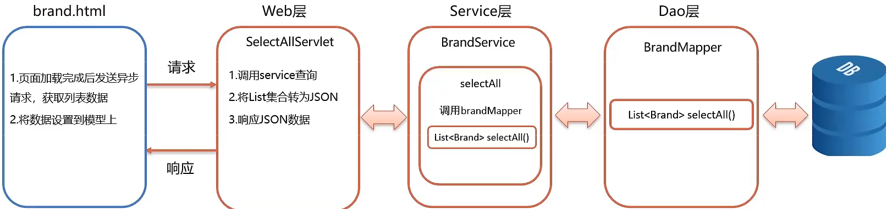
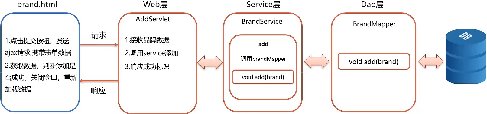
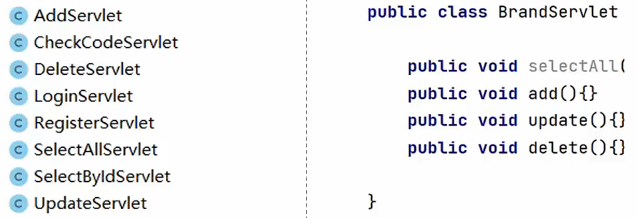
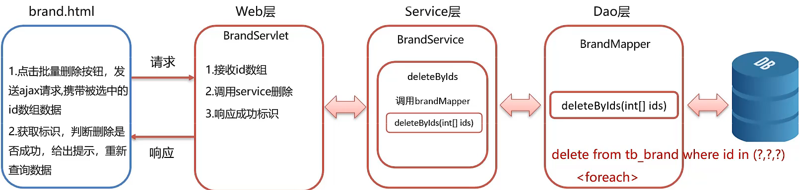
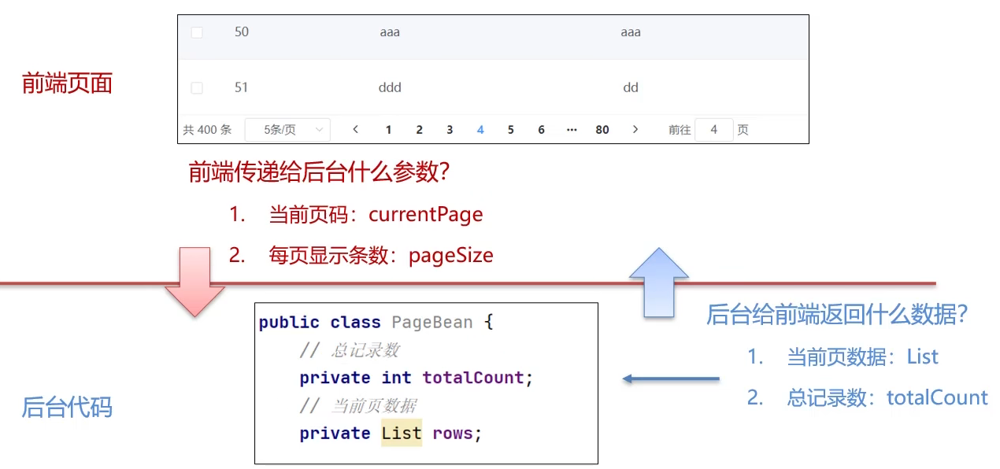
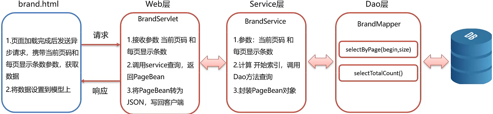
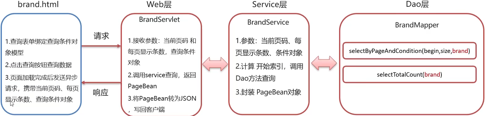

### 功能列表：


1）查询所有
2）新增品牌
3）修改品牌
4）删除品牌
5）批量删除
6）分页查询
7）条件查询

### 环境搭建

1）将资料的 `brand-case` 模块导入到 idea  中
2）执行资料中提供的 `tb_brand.sql` 脚本

### 查询所有



### 新增品牌



### Servlet 代码优化

- Web 层的 Servlet 个数太多了，不利于管理和编写。

- 将Servlet进行归类，对于同一个实体的操作方法，写到一个 Servlet 中。比如：`BrandServlet`、`UserServlet`



1. 获取最后一段路径，其实就是方法名称
2. 通过反射获取方法对象，执行方法

> 自定义 Servlet，使用请求路径进行方法分发，
> 替换 `HttpServlet` 的根据请求方式进行方法分发 

#### getMethod 方法要注意的地方：

**句法：**

```java
public Method getMethod (String method_name, Class ...paramType);
```

```java
类对象.getMethod(mName,HttpServletRequest.class,HttpServletResponse.class);
```

- 第一个参数是 mName “**方法名称**”

- 第二个参数是“**方法参数的类对象**”//这个就是为什么他是 `.class` 的原因，为什么参数是类对象？因为这个是 Java 规定的

### 批量删除



### 分 页查询



```mysql
-- 分页查询
-- 参数1：开始索引
-- 参数2：查询的条目数

SELECT * FROM tb_brand LIMIT 0, 5

SELECT * FROM tb_brand LIMIT 5, 5

-- 页面传递的参数
-- 当前页码
-- 每页显示条数
-- 根据传递的参数计算
-- 参数1：开始索引 = （当前页码 - 1）* 每页显示条数
-- 参数2：查询的条目数 = 每页显示条数
```

#### PageBean.java

```java
package com.itheima.pojo;

import java.util.List;

// 分页查询的 JavaBean
public class PageBean<T> {
    // 总记录数
    private int totalCount;
    // 当前页数据
    private List<T> rows; // 不指定泛型、在创建 PageBean 的时候指定泛型
}
```

#### BrandService.java

```java
/**
 * 分页查询
 * @param currentPage 当前页码
 * @param pageSize 每页显示条数
 * @return
 */
PageBean<Brand> selectByPage(int currentPage,int pageSize);
```

#### BrandServiceImpl.java

```java
public PageBean<Brand> selectByPage(int currentPage, int pageSize) {
    // 1. 获取 SqlSession 对象
    SqlSession sqlSession = sqlSessionFactory.openSession();
    // 2. 获取 BrandMapper
    BrandMapper mapper = sqlSession.getMapper(BrandMapper.class);

    // 3. 计算开始索引
    int begin = (currentPage - 1) * pageSize;
    int size = pageSize;
    // 4. 查询当前页数据
    List<Brand> rows = mapper.selectByPage(begin, size);
    // 5. 查询总记录数
    int totalCount = mapper.selectTotalCount();
    // 6. 封装 PageBean 对象
    PageBean<Brand> brandPageBean = new PageBean<>();
    brandPageBean.setRows(rows);
    brandPageBean.setTotalCount(totalCount);
    // 7. 释放资源
    sqlSession.close();
    // 8. 返回对象
    return brandPageBean;
}
```

#### BrandServlet.java

```java
public void selectByPage(HttpServletRequest req, HttpServletResponse resp) throws IOException {
    // 1. 接收当前页码和每页显示条数 url?currentPage=1&pageSize=5
    int currentPage = Integer.parseInt(req.getParameter("currentPage"));
    int pageSize = Integer.parseInt(req.getParameter("pageSize"));

    // 2. 调用 Service 查询
    PageBean<Brand> brandPageBean = brandService.selectByPage(currentPage, pageSize);

    // 3. 转换为 JSON
    String jsonString = JSON.toJSONString(brandPageBean);

    // 4. 写数据
    resp.setContentType("text/json;charset=utf-8");
    resp.getWriter().write(jsonString);
}
```



### 条件查询

