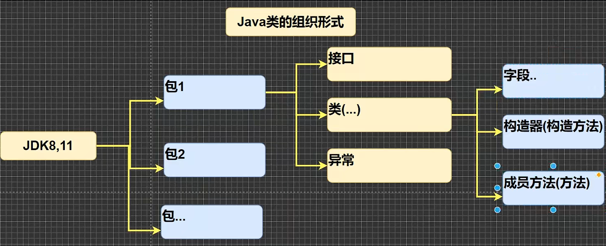

[TOC]

# 一、Java 概述

## 1.1 Java 的特点

- Java语言是面向对象的 (oop)
- Java语言是健壮的。Java的强类型机制. 异常处理. 垃圾的自动收集等是Java程序健壮性的重要保证
- Java语言是跨平台性的。【即:一个编译好的.  class 文件可以在多个系统下运行，这种特性称为跨平台】
- Java语言时解释型的【了解】

***	区别是：解释性语言，编译后的代码，不能直接被机器执行,需要解释器来执行,编译性语言,编译后的代码，可以直接被机器执行, C/C++*** 

## 1.2 Java 开发快速入门

### 1.2.1 什么是运行

- 有了可执行的 java 程序 (Hello.class 字节码文件)
- 通过运行工具 java.exe 对字节码文件进行执行,本质就是 .  class 装载到 jvm 机执行 java 程序开发注意事项
- 对修改后的 Hello.java 源文件需要重新编译，生成新的 class 文件后,再进行执行,才能生效。
- java 为源文件 .class 为字节码文件

​	**举例**

```java
public class Hello {
    public static void main(String[] args) {
        System.out.println("hello,world~");
    }
}
```
  - `public class Hello`表示 Hello 是一个类，是一个 public 公有的类
  - `Hello{}`表示一个类的开始和结束
  - `public static void main(String[] args)` 表示一个主方法,即我们程序的入口
  - `main(){}` 表示方法的开始和结束
  - `System.out.println( "hello, world~"); `表示输出 "hello,world~" 到屏幕
  - `;` 表示语句结束


## 1.3 Java 开发注意事项和细节说明
- Java 源文件以 .java 为扩展名。源文件的基本组成部分是类(class)，如本类中的Hello
  类。

- Java 应用程序的执行入口是 main() 方法。它有固定的书写格式 :

  `public static void main(String[] args){...}`

- Java 语言严格区分大小写。

- .Java 方法由一条条语句构成，每个语句以 “;” 结束。

- 大括号都是成对出现的,缺一不可。【习惯，先写再写代码】

- 一个源文件中最多只能有一个 public 类。其它类的个数不限。[【演示】

- 如果源文件包含一个 public 类,则文件名必须按该类名命名!

- 一个源文件中最多只能有一个 public 类。其它类的个数不限,也可以将 main 方法写在非 public 类中，然后指定运行非 public 类，这样入口方法就是非 public 的 main 方法

## 1.4 Java 常用的转义字符

- `\t` : 一个制表位，实现对齐的功+++9*-36
- 20..
  能“ 
- `\n` : 换行符
- `\\`: 一个 \
- `\"` : 一个 "
- `\'` : 一个 '
- `\r` : 一个回车 `System.out.println("韩顺平教育\r北京")`

***控制台按 Tab 键可以实现快速补齐***

## 1.5 注释 -  [Comment01.java](/home/zhang/Java/代码/Comment01.java)

### 	1.5.1 介绍
​	用于注解说明解释程序的文字就是注释，注释提高了代码的阅读性（可读性） 注释是一个程序员必须要具有的良好编程习惯。将自己的思想通过注释先整理出来，再用代码去体现。【举例】

### 	1.5.2 Java 中的注释类型

- 单行注释
  格式：`// 注释文字`

- 多行注释

  格式：`/*注释文字*/`

- 文档注释
  - 被注释的文字，不会被 VM（ java 虚拟机 ）解释执行
  - ***多行注释里面不允许有多行注释嵌套***

## 1.6 文档注释

​	注释内容可以被 JDK 提供的工具 javadoc 所解析，生成一套以网页文件形式体现的该程序的说明一般写在类


## 1.7 Java 代码规范

- 类、方法的注释，要以 javadoc 的方式来写。
- 非 Java Doc 的注释，往往是给代码的维护者看的，着重告述读者为什么这样写，如何修改，注意什么问题等
- 使用 tab 操作，实现缩进，默认整体向右边移动，时候用`shift + tab`整体向左移
- 运算符和 = 两边习惯性各加一个空格。比如：`2 + 4 * 5 + 345 - 89`
- 源文件使用` utf-8` 编码
- 行宽度不要超过 `80`字符
- 代码编写次行风格和行尾风格

## 1.8 DOS 命令（了解）
### 1.8.1 DOS 介绍

​	Dos : Disk Operating System 磁盘操作系统，简单说一下 windows 的目录结构。

### 1.8.2 相关的知识补充

**相对路径：从当前目录开始定位，形成的一个路径**
**绝对路径：从顶级目录d,开始定位，形成的路径常用的 dos 命令**

- 查看当前目录是有什么
  案例演示：`dir `

- 查看指定目录下有什么 

  案例演示：`dir d:\abc2\test200`

- 切换到其他盘下：盘符号 cd
  案例演示：切换到 c 盘 `cd /D C:`

- 切换到当前盘的其他目录下（使用相对路径和绝对路径演示）
  案例演示：`cd d:\abc2\test200cd..abc2\test200`

- 切换到上一级
  案例演示：`cd..`

- 切换根目录

  案例演示：`cd \`

# 二、变量

## 2.1 变量的基本使用 

### 2.1.1 变量使用注意事项 - [VarDetails.java](代码/VarDetails.java)

- 变量表示内存中的一个存储区域【不同的变量，类型不同，占用的空间大小不同，比如：int 4 个字节，double 就是 8 个字节，先有基本印象，后面说字节】
- 该区域有自己 的名称【变量名】和类型【数据类型】
- 变量必须先声 明，后使用，即有顺序
- 该区域的数据 / 值可以在同一类型范围内不断变化
- 变量在同一个作用域内不能重名
- `变量 = 变量名 + 值 + 数据类型`，这一点请大家注意。变量三要素。

### 2.1.2 程序中 + 号的使用

- 当左右两边都是数值型时，则做加法运算

- 当左右两边有一方为字符串，则做拼接运算
- 运算顺序，是从左到右的

# 三、数据类型

​	每一种数据都定义了明确的数据类型，在内存中分配了不同大小的内存空间字节）。

- .java 数据类型分为两大类型本数据类型，引用类生

- 基本数据类型有 8 中数值型

  - 数值型 

    - 整数类型，存放整数 ：Java 的整数类型就是用于存放整数值的，比如12,30,3456等等

      byte [1] , short [2], int [4] , long [8]

    - 浮点（小数）类型 ：float [4] , double [8]

  - 字符型 char ：存放单个字符 'a'

  - 布尔型 boolean ：存放 true，false

- 引用类型

  - 类 ：class
  - 接口 ：interface
  - 数组 ：[]

## 3.1 整型类型 - [IntDetails.java](/home/zhang/Java/代码/IntDetails.java)

| 类型           | 占用存储空间 | 范围                                      |
| -------------- | ------------ | ----------------------------------------- |
| byte [字节]    | 1字节        | -128～127                                 |
| short [短整型] | 2字节        | -(2^15) ~2^15-1  /  32768 - 32767         |
| int [整型]     | 4字节        | -2^31~2^31-1   /   -2147483648-2147483647 |
| long [长整型]  | 8字节        | -2^63～2^63-1                             |

- Java 各整数类型有固定的范围和字段长度，不受具体 OS 影响以保证 Java 程序的可移植性

- Java 的整型常量（具体值）默认为 int 型，声明 long 型常量须后加 ' l '或 ' L '

- Java 程序中变量常声明为 int 型，除非不足以表示大数，才使用 long

- bit : 计算机中的最小存储单位。byte : 计算机中基本存储单元,1 byte = 8 bit

## 3.2 浮点类型 - [FloatDetails.java](/home/zhang/Java/代码/FloatDetails.java)

**Java 的浮点类型可以表示一个小数，比如 123.4，7.8，0.12等等**

- 与整数类型类似，Java 浮点类型也有固定的范围和字段长度，不受具体 OS 的影响。【 float 4 个字节 double 是 8个字节 】

- Java 的浮点型常量默认为 double 型，声明 float 型常量，须后加 ' f '或 ' F '

- 浮点型常量有两种表示形式

  十进制数形式：如：`5.12`    `512.0f`    `.512` ( 必须有小数点 )

  科学计数法形式:如：5.12e2 [ 5.12 * 10 的 2 次方 ]    `5.12E-2` [ 5.12 / 10 的 2 次方 ]

- 通常情况下，应该使用 double 型，因为它比 float 型更精确。【举例说明】

  `double num9 = 2.1234567851;`

  `float num10 = 2.1234567851F;`

1. 浮点数使用陷阱: 2.7 和 8.1 / 3 比较

   ```java
   double num11 = 2.7;
   double num12 = 8.1 / 3; // 2.7
   System.out.println(num11); // 2.7
   System.out.println(num12); // 接近 2.7 的一个小数，而不是 2.7
   ```

   得到一个重要的使用点：当我们对运算结果是小数的进行相等判断是，要小心。应该是以两个数的差值的绝对值，在某个精度范围类判断。

   ```java
   // 正确的写法
   if (Math.abs(num11 - num12) < 0.00001) {
       System.out.println("差值非常小，到我的规定精度，认为相等.··");
   }
   ```

## 3.3 Java API文档

- API ( Application Programming Interface，用程序编程接口 ) 是 Java 提供的基本编程接口( Java 提供的类还有相关的方法) - [中文在线文档](https://www.matools.com )

- Java 语言提供了大量的基础类，因此 Oracle 公司也为这些基础类提供了相应的 API 文档，用于告诉开发者如何使用这些类，以及这些类里包含的方法

- Java 类的组织形式

  

## 3.4 字符类型 (char) - [CharDetails.java](../代码/CharDetails.java)

### 3.4.1 字符类型使用细节

- 字符常量是用单引号(·')括起来的单个字符。例如：`char c1 = 'a';    char c2 = '中';    char c3 = '9';`
- Java 中还允许使用转义字符 ' \  '来将其后的字符转变为特殊字符型常量。例如：`char c3 = '\n';    // '\n'表换行符`
- 在 java 中，char 的本质是一个整数，在输出时，是
- [unicode 码对应的字符](http://tool.chinaz.com/Tools/Unicode.aspx)
- 可以直接给 char 赋一个整数，然后输出时，会按照对应的 unicode 字符输出 [97]
- char 类型是可以进行运算的，相当于一个整数，因为它都对应有 Unicode 码

## 3.5 布尔类型：boolean - [Boolean01.java](../代码/Boolean01.java)

- 不可以 0 或非 0 的整数替代 `false` 和 `true` ，这点和 C 语言不同

## 3.6 基本数据类型转换

### 3.6.1 自动类型转换 - [AutoConvertDetail.java](../代码/AutoConvertDetail.java)

​	**当 Java 程序在进行赋值或者运算时，精度小的类型自动转换为精度大的数据类型**
**这个就是自勋类型转换。**

- 数据类型按精度（容量）大小排序为（背，规则）

  

- 有多种类型的数据混合运算时，系统首先自动将所有数据转换成容量最大的那种数据类型，然后再进行计算。

- 当我们把精度（容量）大的数据类型赋值给精度（容量）小的数据类型时就会报错，反之就会进行自动类型转换。
-  ( byte,short ) 和 char 之间不会相互自动转换
- byte,short,char 他们三者可以计算，在计算时首先转换为 int 类型
- boolean 不参与转换
-  自动提升原则：表达式结果的类型自动提升为操作数中最大的类型

### 3.6.2 强制类型转换

**自动类型转换的逆过程，将容量大的数据类型转换为容量小的数据类型。使用时要**
**加上强制转换符(，但可能造成精度降低或溢出格外要注意。**

- 当进行数据的大小从大 —> 小，就需要使用到强制转换
- 强转符号只针对于最近的操作数有效，往往会使用小括号提升优先级
-  char 类型可以保存 int 的常量值，但不能保存 int 的变量值，需要强转 

```java
判断是否能够通过编译：
1.short s = 12; // ok
s = s - 9; // 错误int -> short
    
2.byte b = 10; // ok
b = b + 11; // 错误 int -> byte
b = ( byte )( b + 11 ); // 正确，使用强转
    
3.char c = 'a'; // ok
int i = 16; // ok
float d .314F; // ok
double result = c + i + d; // ok float -> double

4.byte b = 16; // ok
short s = 14;// ok
short t = s + b; // 错误 int -> short
```

# 四、运算符

## 4.1 算术运算符 - [ArithmeticOperator.java](../代码/chapter04/ArithmeticOperator.java)

-  在 % 的本质看一个公式`a % b = a - a / b * b`

## 4.2 关系运算符 - [RelationalOperator.java](../代码/chapter04/RelationalOperator.java)

- 关系运算符的结果都是 boolean 型，也就是要么是 `true` ,要么是 `false`
- 关系表达式经常用在结构的条件中或循环结构的条件中

## 4.3 逻辑运算符 - [LogiclOperator01.java](../代码/chapter04/LogiclOperator01.java)

**用于连接多个条件（多个关系表达式），最终的结果也是一个 boolean 值**

- ***短路与 &&：如果第一个条件为 `false`，则第二个条件不会判断，最终结果为 `false`***

- **短路或 ||：如果第一个条件为 `true`，则第二个条件不会判断，最终结果为 `true`。效率高**

- 取反 ！

- 逻辑与 &

- 逻辑或 |
- **逻辑异或 ^：当 a 和 b 不同时，则结果为 `true`,否则为 `false`**

## 4.4 赋值运算符 - [AssignOperator.java](../代码/chapter04/AssignOperator.java)

- 复合赋值运算符会进行类型转换

```java
byte b = 3;
b += 2; // b = (byte) (b + 2);
```

## 4.5 二元运算符 - [TernaryOperator.java](../代码/chapter04/TernaryOperator.java)

`条件表达式 ? 表达式 1 ：表达式 2 ;`

- 如果条件表达式为 `true`，运算后的结果是表达式 1；
- 如果条件表达式为 `false`，运算后的结果是表达式 2。

## 4.6 运算符优先级

- () , {}等
- 单目运行
- ++ 算术运算符
- 位移运算符
- 比较运算符
- 逻辑运算符
- 三元运算符
- 赋值运算符

## 4.7 标识符的命名规则和规范

### 4.7.1 标识符概念

- Java对各种变量、方法和类等命名时使用的字符序列称为标识符
- 凡是自己可以起名字的地方都叫标识符 `int num1 = 90;`

### 4.7.2 标识符的命名规则（必须遵守）

- 由 26 个英文字母大小写，0 - 9，或 $ 组成
- 数字不可以开头。`int 3ab = 1; //错误`
- 不可以使用关键字和保留字，但能包含关键字和保留字。
- Java 中严格区分大小写，长度无限制。`int totalNum = 10; int n = 90;`
- 标识符不能包含空格。`int a b = 90;`

### 4.7.3 标识符命名规范（更加专业）

- 包名：多单词组成时所有字母都小写：`aaa.bbb.ccc // 比如com.hsp.crm`
- 类名、接口名：多单词组成时，所有单词的首字母大写：`XxxYyyZzz` 。比如：`TankShotGame`
- 变量名、方法名：多单词组成时，第一个单词首字母小写，第二个单词开始每个单词首字母大写：`xxxYyyZzz`。比如：`tankShotGame`
- 常量名：所有字母都大写。多单词时每个单词用下划线连接：`XXX_YYY_ZZZ`。比如：定义一个所得税率 `TAX_RATE`
- 后面我们学习到类，包，接口，等时，我们的命名规范要这样遵守，更加详细的看文档。

## 4.8 关键字

### 4.8.1 关键字的定义和特点（不用背）

- **定义：被 Java 语言赋予了特殊含义，用做专门用途的字符串（单词）**
- 特点：关键字中所有字母都为小写


## 4.9 保留字

- **Java 保留字：现有 Java 版本尚未使用，但以后版本可能会作为关键字使用。**

- 自己命名标识符时要避免使用这些保留字 `onValue、cast、future、generic、inner、operator、outer、rest、var、goto、const`

## 4.10 键盘输入语句

**在编程中，需要接收用户输入的数据，就可以使用键盘输入语句来获取。** 

Input.java ，需要一个扫描器（对象），就是 Scanner。

```java
import java.util.Scanner; // 表示把 java.util 下的 Scanner 类导入
public class Input {
    public static void main(String[] args) {
        // 演示接受用户的输入
        // 步骤
        // Scanner类表示简单文本扫描器，在java.util包
        // 1.引入/导入Scanner类所在的包
        // 2.创建Scanner对象
        Scanner myScanner = new Scanner(System.in);
        // 3.接受用户的输入；使用相关的方法
        System.out.println("请输入文字");
        String name = myScanner.next()
    }
}
```

## 4.11 进制

对于整数，有四种表示方式：

- 二进制：0 , 1，满 2 进 1 以 0b 或 0B 开头。
- 十进制：0-9，满 10 进 1 。
- 八进制：0-7，满 8 进 1 以数字 0 开头表示。
- 十六进制：0-9及 (10) - F (15) , 满 16 进 1 以 0x 或 0X 开头表示。此处的A -F不区分大小写。

## 4.12 反码、补码、移码

- 二进制的最高位是符号位：0 表示正数，1 表示负数【老韩口诀：0->0 1-> -】
- **正数**的原码，反码，补码都一样【三码合一】
- **负数**的反码=它的原码符号位不变，其它位取反（0 -> 1 ，1 -> 0）
- **负数**的补码=它的反码+1，负数的反码 = 负数的补码 -1
- 0 的反码，补码都是 0
- Java 没有无符号数，换言之，Java 中的数都是有符号的
- 在计算机运算的时候，都是以补码的方式来运算的
- 当我们看运算结果的时候，要看他的原码【重点】

## 4.13 位运算符 - [BitOperator01.java](../代码/chapter05/BitOperator01.java)

Java 中有 7 个位运算（&、|、^、~、>>、<< 和 >>> ）

- 按位与 & ：两位全为1，结果为 1，否则为 0
- 按位或 | ：两位有一个为 1，结果为 1，否则为 0
- 按位异或 Λ ：两位一个为 0 ，一个为 1 ，结果为 1 ，否则为 0
- 按位取反 ~ ：0 -> 1 ，1 -> 0

- 算术右移 >> ：低位溢出，符号位不变，并用符号位补溢出的高位
- 算术左移 << ：符号位不变，低位补 0

- 逻辑右移也叫无符号右移，运算规则是：低位溢出，高位补 0 
- 特别说明：没有 <<< 符号

# 五、控制结构

## 5.1 顺序控制

程序从上到下逐行地执行，中间没有任何判断和跳转。

## 5.2 分支控制

### 5.2.1 分支控制 if - else

- 单分支 - [If01.java](../代码/chapter05/If01.java)
- 双分支 - [If02.java](../代码/chapter05/If02.java)
- 多分支 - [If03.java](../代码/chapter05/If03.java)
- 嵌套分支：嵌套最好不要超过三层 - [NestedIf.java](../代码/chapter05/NestedIf.java)
- switch 分支结构 - [Swatch01.java](../代码/chapter05/Swatch01.java)

## 5.3 循环控制

### 5.3.1 for 循环控制

```java
for(循环变量初始化;循环条件;循环变量迭代){
	循环体（语句）;
}
```

- `for (;;) {} // 死循环`

- for 循环执行顺序：

  ```java
  for(表达式1；表达式2；表达式3){
  	循环体
  }
  执行过程：
  java
  1、执行for后表达式1。
  
  2、执行表达式2，若表达式2的值为真（或非0），则执行for内循环体，然后执行。
  
  3、否则，则循环结束，执行（5）（3）执行表达式3。
  
  4、返回继续执行（2）（5）循环结束，执行for语句的循环体下面的语句。
  ```

#### 增强 for 循环

```java
int[] nums = {1, 2, 3};
// 执行流程是 依次从 nums 数组中取出数据，赋值给 i，如果取出完毕，退出 for 循环
for (int i : nums) {
    System.out.println(i);
}
```

### 5.3.2 while 循环制

```java
while(循形条件){
	循环体（语句）;
	循环变量迭代;
}	
```

- 循环条件是返回一个布尔值的表达式
- while 循环是先判断再执行语句

### 5.3.3 do..while循舔控制

```java
循环变量初始化;
do{
	循环体（语句）;
	循环变量迭代：
}while(循环条件);
```

### 5.3.4 多重循环控制（难点！重点！）

- 将一个循环放在另一个循环体内，就形成了嵌套循环。其中，for,while,do..while 均可以作为外层循环和内层循环。【建议一般使用两层，最多不要超过3层，否则，代码的可读性很差】。
- 实质上，嵌套循环就是把内层循环当成外层循环的循环体。当只有内层循环的循环条件为 false 时，才会完全跳出内层循环，才可结束外层的当次循环，开始下一次的循环【听不懂，走案例】。
- 设外层循环次数为 m 次， 内层为 n 次，则内层循环体实际上需要执行 m*n 次。

例 - [Stars.java](../代码/chapter05/Stars.java)

## 5.4 跳转控制语句

### 5.4.1 break：退出循环 

```java
{
	...
	break;
	...
}
```

### 5.4.2 continue：退出本次循环

### 5.4.3 return：退出所在方法

- 若 return 在 main 方法中，退出程序

# 六、数组、排序、查找

**	数组可以存放多个同一类型的数据。数组也是一种数据类型，是引用类型。**

## 6.1 数组的使用

### 6.1.1 数组定义

`数据类型数组名 [] = new 数据类型[大小]`

### 6.1.2 数组使用

- 动态初始化 1：

```java
// 数据类型数组名 [] = new 数据类型[大小]
int a[] = new int[5];// 创建了一个数组，名字 a ,存放 5 个 int
```

- 动态初始化 2：

```java
// 先声明，在 new 分配空间
double scores[]; // 声明数组，这时 scores 为 null
scores = new double[5]; // 分配内存空间，可以存放数据
```

- 静态初始化：

  `int a[] = {2,5,6,7,8,9,90,34,56};`

### 6.1.3 数组使用注意事项和细节

- 数组是多个相同类型数据的组合，实现对这些数据的统一管理

- 数组中的元素可以是任何数据类型，包括基本类型和引用类型，但是不能混用

- 数组创建后，如果没有赋值有默认值

  `int = 0 , short = 0 , byte = 0 , long = 0 , float = 0.0 , double = 0.0 , char = \u0000 , boolean = false , String = null`

- 使用数组的步骤：1、声明数组并开辟空间；2、给数组各个元素赋值；3、使用数组

- 数组的下标是从 0 开始

- 数组下标必须在指定范围内使用，否则报：下标越界异常，比如

  `int[] arr = new int[5];  // 则有效下标为 0 - 4`

- 数组属引用类型，数组型数据是对象 ( object )

## 6.2 数组赋值机制 - [ArrayAssign.java](../代码/chapter06/ArrayAssign.java)

- 基本数据类型赋值，这个值就是具体的数据，而且相互不影响

  `int n1 = 2;int = n2 n1;`

- 数组在默认情况下是引用传递，赋的值是地址

## 6.3 数组拷贝 - [ArrayCopy.java](../代码/chapter06/ArrayCopy.java)

编写代码实现数组拷贝（内容复制）

```java
// 将int [] arr1 = {10,20,30}; // 拷贝到 arr2 数组
int[] arr1 = { 1, 2, 3 };
int[] arr2 = new int[arr1.length];
for (int i = 0; i < arr2.length; i++) 
arr2[i] = arr1[i];
```

## 6.4 数组反转 - [ArrayReverse.java](../代码/chapter06/ArrayReverse.java)

- 方法一：

```java
int[] arr = { 11, 22, 33, 44, 55, 66 };  // 定义数组
int temp = arr[0];
for (int i = 0; i < arr.length / 2; i++) {
    temp = arr[i];
    arr[i] = arr[arr.length - 1 - i];
    arr[arr.length - i - 1] = temp;
}
```

- 方法二：

```java
int[] arr = { 11, 22, 33, 44, 55, 66 }; // 定义数组
int[] arr2 = new int[arr.length]; // 存放逆置后的数组
for (int i = 0; i < arr.length; i++) {
    arr2[i] = arr[arr.length - 1 - i];
}
arr = arr2; // arr2 会被当做垃圾，销毁
```

## 6.5 数组添加 - [ArrayAdd.java](../代码/chapter06/ArrayAdd.java)

## 6.6 排序

### 6.6.1排序的分类

- **内部排序：**

  指将需要处理的所有数据都加载到内部存储器中进行排序。包括（ *交换式排序法*、*选择式排序法*、*插入式排序法* )

  - 冒泡排序 - [BubbleSore.java](../代码/chapter06/BubbleSore.java)

- **外部排序法：**

  数据量过大，无法全部加载到内存中，需要借助外部存储进行排序。包括（合并排序法和直接合并排序法 )

## 6.7 查找

​	在 Java 中，我们常用的查找有两种：

- 顺序查找 - [SeqSearch.java](../代码/chapter06/SeqSearch.java)
- 二分查找【二分法，放在算法讲解】

## 6.8 多维数组 - 二维数组

### 6.8.1 二维数组的使用- [TwoDimensionArray01.java](../代码/chapter06/TwoDimensionArray01.java)

`arr[i]` 表示二维数组的第 i + 1 个元素比如 arr[0]：二维数组的第一个元素
`arr[i].length` 得到对应的每个一维数组的长度

- **使用方式1：动态初始化**

语法：`类型[][] 数组名 = new 类型 [大小][大小]`

比如：`int a [][] = new int[3][3]`

- **使用方式2：动态初始化**

先声明：`类型数组名[][];`

再定义（开辟空间）：`数组名 = new 类型 [大小][大小]`

赋值：有默认值，比如 int 类型的就是 0 

- **使用方式3：动态初始化**

先声明行：`int[][] yanghui = new int[10][]; // 定义数组`

在定义列：`yanghui[i] = new int[i + 1];`

- **使用方式4：静态初始化**

`定义类型数组名 = {{ 值1,值2...},{值1,值2...},{值1,值2...}}`

使用即可 [ 固定方式访问 ]

### 6.8.2 二维数组的遍历

[杨辉三角](../代码/chapter06/YangHui.java)

### 6.8.3 二维数组使用细节和注意事项

- 一维数组的声明方式有：

`int[] x` 或者 `int x[]`

- 二维数组的声明方式有：

`int[][] y`或者 `int [][] y` 或者 `int[] y[]`

- 二维数组实际上是由多个一维数组组成的，它的各个一维数组的长度可以相同， 也可以不相同。比如：`map [][]` 是一个二维数组 

`int map [][] = {{ 1,2 } , { 3,4,5 }}`

​	由 `map[0]` 是一个含有两个元素的一维数组，`map[1]` 是一个含有三个元素的维数组构成，我们也称为列数不等的二维数组。

[TOC]

# 七、面向对象编程（基础）

## 7.1  类与对象

 	一个程序就是一个世界，有很多事物（ 对象 [ 属性 ，行为 ] ）

### 7.1.1 类与对象的关系[Object01.java](../代码/chapter07/Object01.java)


```java
class Cat {
    // 属性
    String name; // 名字
    int age; // 年龄
    String color; // 颜色
    double weight; // 体重
}
```

### 7.1.2 属性/成员变量 

- 从概念或叫法上看：`成员变量 = 属性 = field` （字段）（即成员变量是用来表示属性 的，授课中，统一叫属性）

  `Car(name,price,color)`

- 属性是类的一个组成部分，一般是基本数据类型，也可是引用类型（对象，数组） 比如我们前面定义猫类的 `int age` 就是属性

### 7.1.3 注意事项和细节说明 [PropertiesDetail.java ]()

- 属性的定义语法同变量，示例：`访问修饰符 属性类型 属性名;`

  *有四种访问修饰符：publice, protected, 默认, private*

- 属性的定义类型可以为任意类型，包含基本类型或引用类型

- 属性如果不赋值，有默认值，规则和数组一致。

### 7.1.4 如何创建对象 [Object02.java](../代码/chapter07/Object02.java)

- 先声明再创建 

```java
Cat cat; // 声明对象 cat

cat = new Cat(); // 创建 
```

- 直接创建

`Cat cat = new Cat();`

### 7.1.5 如何使用对象

`对像名.属性名;`

### 7.1.6 类和对象的内存分配机制（重要）

**Java内存的结构分析：** 

- 栈：一般存放基本数据类型（局部变量） 

- 堆：存放对象(Cat cat,数组等) 

- 方法区：常量池（常量，比如字符串），类加载信息 

```java
Person p1 = new Person();
p1.age = 10;
p1.name = "小明";
Person p2 = p1;// 把p1赋给了p2,让p2指向p1
System.out.printIn(p2.age);
```


## 7.2 成员方法 [Method01.java](../代码/chapter07/Method01.java)

​	某些情况下，我们要需要定义成员方法（简称方法）。比如人类：除了有一些属性外（年龄， 姓名），我们人类还有一些行为比如：可以说话、跑步，通过学习，还可以做算术题。这时就 要用成员方法才能完成。现在要求对Person类完善。

```java
public 返回数据类型方法名（形参列表）{//方法体
	语句;    
	return 返回值;
}
```

**返回数据类型：**

- 一个方法最多有一个返回值【可以返回数组】

  ```java
  public int[] getSumAndSub(int n1, int n2) {
      int[] resArr = new int[2];
      resArr[0] = n1 + n2;
      resArr[1] = n1 - n2;
      return resArr;
  }
  ```

- 返回类型可以为任意类型，包含基本类型或引用类型（数组，对象）

- 如果方法要求有返回数据类型，则方法体中最后的执行语句必须为 return 值；而且要求返回值类型必须和 return 的值类型一致 或兼容

- 如果方法是 void，则方法体中可以没有 return 语句，回或者只写 return; 

### 7.2.1 方法名

- 遵循驼峰命名法，最好见名知义，表达出该功能的意思即可。比如得到两个数的和 getSum,开发中按照规范

**形参列表： [MethodDetail.java](../代码/chapter07/MethodDetail.java)**

- 一个方法可以有 0 个参数，也可以有多个参数，中间用逗号隔开，比如`getSum(int n1,int n2)` 

- 参数类型可以为任意类型，包含基本类型或引用类型，比如`printArr(int[][] map)` 

- 调用带参数的方法时，一定对应着参数列表传入相同类型或兼容类型的参数！【getSum】
- 方法定义时的参数称为形式参数，简称形参；方法调用时的传入参数称为实际参数，简称实参， 实参和形参的类型要一致或兼容、个数、顺序必须一致！

**方法体：**

- 里面写完成功能的具体的语句，可以为输入、输出、变量、运算分支、循环、方法调用，但里 面不能再定义方法！即：方法不能嵌套定义。

### 7.2.2 成员方法传参机制 [MethodParameter01.java](../Java/代码/chapter07/MethodParameter01.java)

​	***引用类型【数组、对象等】传递的是地址（传递也是值，但是值是地址），可以通过形参影响实参！***[MethodParameter02.java](../Java/代码/chapter07/MethodParameter02.java)

## 7.3 方法递归调用

**递归重要规则：**

- 执行一个方法时，就创建一个新的受保护的独立空间（栈空间）
- 方法的局部变量是独立的，不会相互影响，比如 n 变量
- 如果方法中使用的是引用类型变量（比如数组，对象），就会共享该引 用类型的数据
- 递归必须向退出递归的条件逼近，否则就是无限递归，出现 StackOverflowError
- 当一个方法执行完毕，或者遇到 return,就会返回，遵守谁调用，就将结果返回给谯，同时当方法执行完毕或者返回时，该方法也就执行完毕。

------

[RecursionExercise01.java](../代码/chapter07/RecursionExercise01.java)

迷宫：[Maze.java](../代码/chapter07/Maze.java)【拓展：求最短路径 -> Floyd、Dijkstra】

*汉诺塔：[HanoiTower.java](../代码/chapter07/HanoiTower.java)【不懂】*

## 7.2 方法重载 [OverLoad01.java](../代码/chapter07/OverLoad01.java)

​	Java 中允许同一个类中，多个同名方法的存在，但要求形参列表不一致！ 

比如：`System.out.println();` out 是 PrintStream 类型

### 7.2.1 重载的好处：

- 减轻了起名的麻烦

- 减轻了记名的麻烦

### 7.2.2 注意事项和使用细节：

- 方法名：必须相同
- 形参列表：必须不同 (形参**类型**或**个数**或**顺序**，至少有一样不同，参数名无要求)
- 返回类型：无要求

## 7.3 可变参数

​	***Java 允许将同一个类中多个同名同功能但参数个数不同的方法，封装成一个方法。 就可以通过可变参数实现。***

**基本语法:** 

```java
访问修饰符 返回类型 方法名（数据类型...形参名）{
}

public int sum(int... nums) {
    System.out.println("接受得参数个数 = " + nums.length);
    int res = 0;
    for (int i = 0; i < nums.length; i++)
        res += nums[i];
    return res;
}
```

### 7.3.1 注意事项和使用细节 ： [VarParameterDetail.java](../代码/chapter07/VarParameterDetail.java)

- 可变参数的实参可以为 `0 个或任意多个`
- 可变参数的实参可以为`数组`
- 可变参数的`本质就是数组`
- 可变参数可以和普通类型的参数一起放在形参列表，但必须保证`可变参数在最后`
- 一个形参列表中只能出现一个可变参数

可变参数用`类型...`定义，可变参数相当于数组类型

---

### 廖雪峰：可变参数

可变参数用`类型...`定义，可变参数相当于数组类型：

```java
class Group {
    private String[] names;

    public void setNames(String... names) {
        this.names = names;
    }
}
```

上面的`setNames()`就定义了一个可变参数。调用时，可以这么写：

```java
Group g = new Group();
g.setNames("Xiao Ming", "Xiao Hong", "Xiao Jun"); // 传入3个String
g.setNames("Xiao Ming", "Xiao Hong"); // 传入2个String
g.setNames("Xiao Ming"); // 传入1个String
g.setNames(); // 传入0个String
```

完全可以把可变参数改写为`String[]`类型：

```java
class Group {
    private String[] names;

    public void setNames(String[] names) {
        this.names = names;
    }
}
```

但是，调用方需要自己先构造`String[]`，比较麻烦。例如：

```java
Group g = new Group();
g.setNames(new String[] {"Xiao Ming", "Xiao Hong", "Xiao Jun"}); // 传入1个String[]
```

另一个问题是，调用方可以传入`null`：

```java
Group g = new Group();
g.setNames(null);
```

而可变参数可以保证无法传入`null`，因为传入0个参数时，接收到的实际值是一个空数组而不是`null`。

---


## 7.4 作用域

​	*在 Java 编程中，主要的变量就是属性（成员变量）和局部变量。我们说的局部变量一般是指在成员方法中定义的变量。* 

**Java 中作用域的分类：**

| 全局变量 | 也就是属性，作用域为整个类体                                 |
| :------: | :----------------------------------------------------------- |
| 局部变量 | 也就是除了属性之外的其他变量，作用域为定义它的代码块中！ 全局变量（属性）可以不赋值，直接使用，因为有默认值，局部变量必须赋值后 才能使用，因为没有默认值。 |

### 7.4.1 注意事项和细节使用：[VarScopeDetail.java](../代码/chapter07/VarScopeDetail.java)

- 属性和局部变量可以重名，访问时遵循就近原则。

- 在同一个作用域冲，比如在同一个成员方法中，两个局部变量，不能重名。

- 属性生命周期较长，伴随着对象的创建而创建，伴随着对象的死亡而死亡；局部变量生命周期较短，伴随着它的代码块的执行而创建，伴随着代码块的结束而死亡。 即在一次方法调用过程中。

- 作用域范围不同

  全局变量：可以被本类使用，或其他类使用( 通过对象调用) 

  局部变量：只能在本类中对应的方法中使用 

- 修饰符不同

  - 全局变量/属性可以加修饰符
  - 局部变量不可以加修饰符

## 7.5 构造方法/构造器

​	构造方法又叫构造器 ( constructor ) ，是类的一种特殊的方法，它的主要作用是完成对新对象的初始化。

​	❗不创建对象，***仅初始化对象***

**基本语法：**

```java
[修饰符] 方法名 (形参列表) {
	方法体;
}

public conPerson(String pName, int pAge) {
    System.out.println("构造器被调用，完成对象属性初始化！");
    name = pName;
    age = pAge;
}
```

**老韩说明：**

- 构造器的修饰符可以默认，也可以是`public、protected、private`
- ❗构造器***没有返回值***
- 方法名和类名字必须一样
- 参数列表和成员方法一样的规则
- 构造器的调用由系统完成

### 7.5.1 注意事项和使用细节：[ConstructorDetail.java](../代码/chapter07/ConstructorDetail.java)

- 一个类可以定义多个不同的构造器，即构造器重载

  比如：我们可以再给 `Person 类 `定义一个构造器，用来创建对象的时候，只指定人名不需要指定年龄

- 构造器名和类名要相同

- 构造器没有返回值

- 构造器是完成对象的初始化，并不是创建对象

- 在创建对象时，系统自动的调用该类的构造方法

- 如果程序员没有定义构造器，系统会自动给类生成一个默认无参构造器（也叫默认构造器)，比如 `Dog(){}` 使用 `javap指令` 反编译看看

- 一旦定义了自己的构造器，默认的构造器就覆盖了，就不能再使用默认的无参构造器，除非显式的定义一下。即：`Person(){}`

### 7.5.2 对象创建的流程分析

```java
class Person { // Person
    int age = 90;
    String name;
    
    Person(String n,int a); // 构造器
    name = n; // 给属性赋值 
    age = a; // ..
}
Person p = new Person("小倩",20);
```

**流程分析（面试题）：**

- 1.加载 Person 类信息 ( Person.class ) ，只会加载一次
- 2.在堆中分配空间（地址）
- 3.完成对象初始化
  - 3.1 默认初始化 `age = 0 name = null`

  - 3.2 显式初始化 `age = 90 name = null`

  - 3.3 构造器的初始化 `age = 20 name = 小倩`
- 4.在对象在堆中的地址，返回给 p（p 是对象名，也可以理解成是对象的引用）

---

## 廖雪峰 - 构造方法

### 默认构造方法

是不是任何`class`都有构造方法？是的。

那前面我们并没有为`Person`类编写构造方法，为什么可以调用`new Person()`？

原因是如果一个类没有定义构造方法，编译器会自动为我们生成一个默认构造方法，它没有参数，也没有执行语句，类似这样：

```java
class Person {
    public Person() {
    }
}
```

要特别注意的是，如果我们自定义了一个构造方法，那么，编译器就*不再*自动创建默认构造方法：

```java
public class Main {
    public static void main(String[] args) {
        Person p = new Person(); // 编译错误:找不到这个构造方法
    }
}

class Person {
    private String name;
    private int age;

    public Person(String name, int age) {
        this.name = name;
        this.age = age;
    }
    
    public String getName() {
        return this.name;
    }

    public int getAge() {
        return this.age;
    }
}

```

如果既要能使用带参数的构造方法，又想保留不带参数的构造方法，那么只能把两个构造方法都定义出来：

```java
public class Main {
    public static void main(String[] args) {
        Person p1 = new Person("Xiao Ming", 15); // 既可以调用带参数的构造方法
        Person p2 = new Person(); // 也可以调用无参数构造方法
    }
}

class Person {
    private String name;
    private int age;

    public Person() {
    }

    public Person(String name, int age) {
        this.name = name;
        this.age = age;
    }
    
    public String getName() {
        return this.name;
    }

    public int getAge() {
        return this.age;
    }
}
```

没有在构造方法中初始化字段时，引用类型的字段默认是`null`，数值类型的字段用默认值，`int`类型默认值是`0`，布尔类型默认值是`false`：

```java
class Person {
    private String name; // 默认初始化为null
    private int age; // 默认初始化为0

    public Person() {
    }
}
```

也可以对字段直接进行初始化：

```java
class Person {
    private String name = "Unamed";
    private int age = 10;
}
```

那么问题来了：既对字段进行初始化，又在构造方法中对字段进行初始化：

```java
class Person {
    private String name = "Unamed";
    private int age = 10;

    public Person(String name, int age) {
        this.name = name;
        this.age = age;
    }
}
```

当我们创建对象的时候，`new Person("Xiao Ming", 12)`得到的对象实例，字段的初始值是啥？

在Java中，创建对象实例的时候，按照如下顺序进行初始化：

1. 先初始化字段，例如，`int age = 10;`表示字段初始化为`10`，`double salary;`表示字段默认初始化为`0`，`String name;`表示引用类型字段默认初始化为`null`；
2. 执行构造方法的代码进行初始化。

因此，构造方法的代码由于后运行，所以，`new Person("Xiao Ming", 12)`的字段值最终由构造方法的代码确定。

### 多构造方法

可以定义多个构造方法，在通过`new`操作符调用的时候，编译器通过构造方法的参数数量、位置和类型自动区分：

```java
class Person {
    private String name;
    private int age;

    public Person(String name, int age) {
        this.name = name;
        this.age = age;
    }

    public Person(String name) {
        this.name = name;
        this.age = 12;
    }

    public Person() {
    }
}
```

如果调用`new Person("Xiao Ming", 20);`，会自动匹配到构造方法`public Person(String, int)`。

如果调用`new Person("Xiao Ming");`，会自动匹配到构造方法`public Person(String)`。

如果调用`new Person();`，会自动匹配到构造方法`public Person()`。

一个构造方法可以调用其他构造方法，这样做的目的是便于代码复用。调用其他构造方法的语法是`this(…)`：

```java
class Person {
    private String name;
    private int age;

    public Person(String name, int age) {
        this.name = name;
        this.age = age;
    }

    public Person(String name) {
        this(name, 18); // 调用另一个构造方法Person(String, int)
    }

    public Person() {
        this("Unnamed"); // 调用另一个构造方法Person(String)
    }
}
```

---

## 7.6 this 关键字 [ThisDetai.java](../代码/chapter07/ThisDetai.java)

​	简单的说，那个对象调用，this 就代耒那个对象。

- this 关键字可以用来访问本类的属性、方法、构造器
- this 用于区分当前类的属性和局部变量
- 访问成员方法的语法：`this.方法名(参数列表);`
- 访问构造器语法：`this(参数列表);`注意只能在构造器中使用（即只能在构造器中访问另外一个构造器)
- this不能在类定义的外部使用，**❗只能在类定义的方法中使用**

## 7.7 包

### 7.7.1 基本介绍

​	包的本质实际上就是创建不同的 文件夹 / 目录 来保存类文件

#### 包基本语法：

`package com.hspedu;`
**说明：**

- package ：关键字，表示打包
- com.hspedu ：表示包名

#### 包的三大作用：

- 区分相同名字的类
- 当类很多时，可以很好的管理类[看Java API文档1]
- 控制访问范围

#### 命名

**命名规则：**

​	只能包含数字、字母、下划线、小圆点，但不能用数字开头，不能是关键字或保留字

**命名规范：**

​	一般是小写字母 + 小圆点一般是，`com.公司名.项目名.业务模块名`。比如：`com.hspedu.oa.model;;com.hspedu.oa.controller;`

### 7.7.2 常用的包

一个包下，包含很多的类，Java 中常用的包有：

```java
java.lang.* // lang包是基本包，默认引入，不需要再弱引入
java.util.* // util包，系统提供的工具包，工具类，使用Scanner
java.net.* // 网络包，网络开发
java.awt.* // 是做java的界面开发，GUI
```

### 7.7.3 注意事项和使用细节

- package 的作用是声明当前类所在的包，需要放在类的最上面，一个类中最多只有一句 package
- import 指令位置放在 package 的下面，在类定义前面，可以有多句且没有顺序要求访问修饰符

## 7.8 访问修饰符

### 7.8.1 基本介绍

**Java 提供四种访问控制修饰符号，用于控制方法和属性（成员变量）的访问权限（范围）：**

- 公开级别：用 public 修饰，对外公开

- 受保护级别：用 protected 修饰，对子类和同一个包中的类公开

- 默认级别：没有修饰符号，向同一个包的类公开

- 私有级别：用 private 修饰，只有类本身可以访问，不对外公开


### 7.8.2 使用的注意事项

- 修饰符可以用来修饰类中的属性，成损方法以及类
- **只有默认的和 public 才能修饰类**，并且遵循上述访问权限的特点
- 因为没有学习继承，因此关于在子类中的访问权限，我们讲完子类后，在回头讲解
- 成员方法的访问规则和属性完全一样

# 八、面向对象编程（中级）

面向对象编程有三大特征：**封装**、**继承**和**多态**。

## 8.1 封装

​	封装 (encapsulation) 就是把抽象出的数据【属性】和对数据的操作【方法】封装在一起，数据被保护在内部，程序的其它部分只有通过被授权的操作【方法】，才能对数据进行操作。

**封装的理解和好处：**

- 隐藏实现细节：方法（连接数据库）<- 调用（传入参数..）
- 可以对数据进行验证，保证安全合理

### 封装的实现步骤（三步）

- 将属性进行私有化private【不能直接修改属性】

- 提供一个公共的 (public) set 方法，用于对属性判断并赋值

```java
public void setXxx (类型 参数名) {// Xxx表示某个属性
	//加入数据验证的业务逻辑
	属性 = 参数名;
}
```

- 提供一个公共的 get 方法，用于获取属性的值 

```java
public XX getXxx(){ // 权限判断
	return XX;
}
```

## 8.2 继承

### 8.2.1 继承基本介绍和示意图：

​	继承可以解决代码复用，让我们的编程更加靠近人类思维。

​	当多个类存在相同的属性（变量和方法时，可以从这些类中抽象出父类，在父类中定义这些相同的属性和方法，所有的子类不需要重新定义这些属性和方法，只需要通过 extends 来声明继承父类即可。


### 8.2.2 继承的基本语法：

```java
class 子类 extends 父类{

}
```

- 子类就会自动拥有父类定以的属性和方法
- 父类又叫超类，基类
- 子类又叫派生类

### 8.2.3 继承给编程带来的便利：

- 代码的复用性提高了
- 代码的扩展性和维护性提高了

### 8.2.4 继承的深入讨论 / 细节问题：【难点】

- 子类继承了所有的属性和方法，但是私有属性不能在子类直接访问，要通过公共的方法去访问

- 子类必须调用父类的构造器，完成父类的初始化

- 当创建子类对象时，不管使用子类的哪个构造器，默认情况下总会去调用父类的无参构造器，如果父类没有提供无参构造器，则必须在子类的构造器中用 super 去指定使用父类的哪个构造器，完成对父类的初始化工作，否则，编译不会通过【父类有无参构造器，子类默认选择无参构造器；父类无无参构造器，子类需要用 super 关键字选择指定构造器】

- 如果希望指定去调用父类的某个构造器，则显式的调用一下：`super (参数列表)`

- super 在使用时，必须放在构造器第一行

- `super()` 和  `this()` 都只能放在构造器第一行，因此这两个方法不能共存在一个构造器

- Java 所有类都是 Object 类的子类，Object 是所有类的基类

- 父类构造器的调用不限于直接父类！将一直往上追朔直到 Object 类（顶级父类）

- 子类最多只能继承一个父类（指直接继承），即 Java 中是单继承机制

  若让 A 类继承 B 类和 C 类，可以【A 继承 B，B 继承 C】

- 不能滥用继承，子类和父类之间必须满足 `is-a` 的逻辑关系

---

### 廖雪峰 - 继承

继承是面向对象编程中非常强大的一种机制，它首先可以复用代码。当我们让`Student`从`Person`继承时，`Student`就获得了`Person`的所有功能，我们只需要为`Student`编写新增的功能。

Java使用`extends`关键字来实现继承：

```
class Person {
    private String name;
    private int age;

    public String getName() {...}
    public void setName(String name) {...}
    public int getAge() {...}
    public void setAge(int age) {...}
}

class Student extends Person {
    // 不要重复name和age字段/方法,
    // 只需要定义新增score字段/方法:
    private int score;

    public int getScore() { … }
    public void setScore(int score) { … }
}
```

可见，通过继承，`Student`只需要编写额外的功能，不再需要重复代码。

 注意：子类自动获得了父类的所有字段，严禁定义与父类重名的字段！

在OOP的术语中，我们把`Person`称为超类（super class），父类（parent class），基类（base class），把`Student`称为子类（subclass），扩展类（extended class）。

### 继承树

注意到我们在定义`Person`的时候，没有写`extends`。在Java中，没有明确写`extends`的类，编译器会自动加上`extends Object`。所以，任何类，除了`Object`，都会继承自某个类。下图是`Person`、`Student`的继承树：

```
┌───────────┐
│  Object   │
└───────────┘
      ▲
      │
┌───────────┐
│  Person   │
└───────────┘
      ▲
      │
┌───────────┐
│  Student  │
└───────────┘
```

Java只允许一个class继承自一个类，因此，一个类有且仅有一个父类。只有`Object`特殊，它没有父类。

类似的，如果我们定义一个继承自`Person`的`Teacher`，它们的继承树关系如下：

```ascii
       ┌───────────┐
       │  Object   │
       └───────────┘
             ▲
             │
       ┌───────────┐
       │  Person   │
       └───────────┘
          ▲     ▲
          │     │
          │     │
┌───────────┐ ┌───────────┐
│  Student  │ │  Teacher  │
└───────────┘ └───────────┘
```

### protected

继承有个特点，就是子类无法访问父类的`private`字段或者`private`方法。例如，`Student`类就无法访问`Person`类的`name`和`age`字段：

```java
class Person {
    private String name;
    private int age;
}

class Student extends Person {
    public String hello() {
        return "Hello, " + name; // 编译错误：无法访问name字段
    }
}
```

这使得继承的作用被削弱了。为了让子类可以访问父类的字段，我们需要把`private`改为`protected`。用`protected`修饰的字段可以被子类访问：

```java
class Person {
    protected String name;
    protected int age;
}

class Student extends Person {
    public String hello() {
        return "Hello, " + name; // OK!
    }
}
```

因此，`protected`关键字可以把字段和方法的访问权限控制在继承树内部，一个`protected`字段和方法可以被其子类，以及子类的子类所访问，后面我们还会详细讲解。

### super

`super`关键字表示父类（超类）。子类引用父类的字段时，可以用`super.fieldName`。例如：

```
class Student extends Person {
    public String hello() {
        return "Hello, " + super.name;
    }
}
```

实际上，这里使用`super.name`，或者`this.name`，或者`name`，效果都是一样的。编译器会自动定位到父类的`name`字段。【就近】

但是，在某些时候，就必须使用`super`。我们来看一个例子：

```java
public class Main {
    public static void main(String[] args) {
        Student s = new Student("Xiao Ming", 12, 89);
    }
}

class Person {
    protected String name;
    protected int age;

    public Person(String name, int age) {
        this.name = name;
        this.age = age;
    }
}

class Student extends Person {
    protected int score;

    public Student(String name, int age, int score) {
        this.score = score;
    }
}

```

运行上面的代码，会得到一个编译错误，大意是在`Student`的构造方法中，无法调用`Person`的构造方法。

***这是因为在Java中，任何`class`的构造方法，第一行语句必须是调用父类的构造方法。如果没有明确地调用父类的构造方法，编译器会帮我们自动加一句`super();`，所以，`Student`类的构造方法实际上是这样：***

```java
class Student extends Person {
    protected int score;

    public Student(String name, int age, int score) {
        super(); // 自动调用父类的构造方法
        this.score = score;
    }
}
```

但是，`Person`类并没有无参数的构造方法，因此，编译失败。

解决方法是调用`Person`类存在的某个构造方法。例如：

```java
class Student extends Person {
    protected int score;

    public Student(String name, int age, int score) {
        super(name, age); // 调用父类的构造方法Person(String, int)
        this.score = score;
    }
}
```

这样就可以正常编译了！

因此我们得出结论：如果父类没有默认的构造方法，子类就必须显式调用`super()`并给出参数以便让编译器定位到父类的一个合适的构造方法。

这里还顺带引出了另一个问题：即子类*不会继承*任何父类的构造方法。子类默认的构造方法是编译器自动生成的，不是继承的。

### 阻止继承

正常情况下，只要某个class没有`final`修饰符，那么任何类都可以从该class继承。

从Java 15开始，允许使用`sealed`修饰class，并通过`permits`明确写出能够从该class继承的子类名称。

例如，定义一个`Shape`类：

```
public sealed class Shape permits Rect, Circle, Triangle {
    ...
}
```

上述`Shape`类就是一个`sealed`类，它只允许指定的3个类继承它。如果写：

```
public final class Rect extends Shape {...}
```

是没问题的，因为`Rect`出现在`Shape`的`permits`列表中。但是，如果定义一个`Ellipse`就会报错：

```
public final class Ellipse extends Shape {...}
// Compile error: class is not allowed to extend sealed class: Shape
```

原因是`Ellipse`并未出现在`Shape`的`permits`列表中。这种`sealed`类主要用于一些框架，防止继承被滥用。

`sealed`类在Java 15中目前是预览状态，要启用它，必须使用参数`--enable-preview`和`--source 15`。


### 区分继承和组合

在使用继承时，我们要注意逻辑一致性。

考察下面的`Book`类：

```java
class Book {
    protected String name;
    public String getName() {...}
    public void setName(String name) {...}
}
```

这个`Book`类也有`name`字段，那么，我们能不能让`Student`继承自`Book`呢？

```java
class Student extends Book {
    protected int score;
}
```

显然，从逻辑上讲，这是不合理的，`Student`不应该从`Book`继承，而应该从`Person`继承。

究其原因，是因为`Student`是`Person`的一种，它们是is关系，而`Student`并不是`Book`。实际上`Student`和`Book`的关系是has关系。

具有has关系不应该使用继承，而是使用组合，即`Student`可以持有一个`Book`实例：

```java
class Student extends Person {
    protected Book book;
    protected int score;
}
```

因此，继承是is关系，组合是has关系。

## 8.3 super 关键字

### 8.3.1 基本介绍

super 代表父类的引用，用于访问父类的属性、方法、构造器

### 8.3.2 基本语法

- 访问父类的属性，但不能访问父类的 private 属性 `super.属性名;`
- 访问父类的方法，不能访问父类的 private 方法 `super.方法名(参数列表);`
- 访问父类的构造器（这点前面用过）：`super(参数列表);`只能放在构造器的第一句，只能出现一句

### 8.3.3 super 给编程带来的便利 / 细节

- 调用父类的构造器的好处(分工明确，父类属性由父类初始化，子类的属性由子类初始化

- 当子类中有和父类中的成员（属性和方法）重名时，为了访问父类的成员，必须通过super。如果没有重名，使用 super、this、直接访问是一样的效果！

  

  

- super 的访问不限于直接父类，如果爷爷类和本类中有同名的成员，也可以使用 super；去访问爷爷类的成员；如果多个基类（上级类）中都有同名的成员，使用 super 访问遵循就近原则。A -> B -> C，也需要遵守访问权限规则

### 8.3.4 super 和 this 的比较

| No.  |   区别点   |                            this                            |                           super                            |
| :--- | :--------: | :--------------------------------------------------------: | :--------------------------------------------------------: |
| 1    |  访问属性  | 访问本类中的属性<br />如果本类没有此属性则从父类中继续查找 |                    直接访问父类中的属性                    |
| 2    |  调用方法  |  访问本类中的方法<br />如果本类没有此方法则从父类继续查找  |                    直接访问父类中的方法                    |
| 3    | 调用构造器 |            调用本类构造器，必须放在构造器的首行            | 调用父类的构造器，必须放在子类构造器的首航。和 this 二选一 |
| 4    |    特殊    |                        表示当前对象                        |                    子类中访问父类的对象                    |

## 8.4 方法重泻/覆盖 (Override)

简单的说：方法覆盖（重写）就是子类有一个方法，和父类的某个方法的名称、返回类型、参数一样，那么我们就说子类的这个方法覆盖了父类的方法。

- 子类的方法的参数，方法名称，要和父类方法的参数，方法名称完全一样

- 子类方法的返回类型和父类方法返回类型一样，或者**是父类返回类型的子类**比如父类返回类型是 Object，子类方法返回类型是 String

```java
public object getInfo() {}
public String getInfo() {}
```

- ❗子类方法不能缩小父类方法的访问权限 `public > protected > 默认 > private`，可以相等或扩大

---

### 廖雪峰 - Override

在继承关系中，子类如果定义了一个与父类方法签名【方法名 + 参数列表】完全相同的方法，被称为覆写（Override）。

例如，在`Person`类中，我们定义了`run()`方法：

```
class Person {
    public void run() {
        System.out.println("Person.run");
    }
}
```

在子类`Student`中，覆写这个`run()`方法：

```
class Student extends Person {
    @Override
    public void run() {
        System.out.println("Student.run");
    }
}
```

Override和Overload不同的是，如果方法签名不同，就是Overload，Overload方法是一个新方法；如果方法签名相同，并且返回值也相同，就是`Override`。

 注意：方法名相同，方法参数相同，但方法返回值不同，也是不同的方法。在Java程序中，出现这种情况，编译器会报错。

```
class Person {
    public void run() { … }
}

class Student extends Person {
    // 不是Override，因为参数不同:
    public void run(String s) { … }
    // 不是Override，因为返回值不同:
    public int run() { … }
}
```

加上`@Override`可以让编译器帮助检查是否进行了正确的覆写。希望进行覆写，但是不小心写错了方法签名，编译器会报错。但是`@Override`不是必需的。

### 8.4.1 重载 (Overload) 和重写 (Override) 的区别


## 8.5 多态【难】

### 8.5.1 多【多种】态【状态】基本介绍

方法或对象具有多种形态。是面向对象的第三大特征，多态是建立在封装和继承基础之上的。

### 8.5.2 多态的具体体现

- 方法的多态 PloyMethod.java

- 对象的多态（核心，困难，重点)

  **老韩重要的几句话（记住）：**

  - (1) 一个对象的编译类型和运行类型可以不一致

    ```java
    Animal animal = new Dog(); // 【animal 编译类型是 Animal,运行类型 Dog】
    ```

  - (2) 编译类型在定义对象时，就确定了，不能改变

    ```java
    Animal animal = new Cat(); // 【animal 的运行类型变成了 Cat,编译类型仍然是 Animal】
    ```

  - (3) 运行类型是可以变化的

  - (4) 编译类型看定义时 = 号的左边，运行类型看 = 号的右边

### 8.5.3 多态注意事项和细节讨论

多态的前提是：两个对象（类）存在继承关系

**多态的向上转型：**

- 1）本质：父类的引用指向了子类的对象 `Animal animal = new Dog(); // 向上转型`

- 2）语法：`父类类型 引用名 = new 子类类型();`

- 3）特点：编译类型看左边，运行类型看右边。
- 可以调用父类中的所有成员（需遵守访问权限）【调用方法是按照从运行类型（子类）开始查找，然后调用，规则和方法调用规则一致】

- 不能调用子类中特有成员；

- 最终运行效果看子类的具体实现！

**多态的向下转型：**

- 1）语法：`子类类型 引用名 = (子类类型) 父类引用;`
- 2）只能强转父类的引用，不能强转父类的对象
- 3）要求父类的引用必须指向的是当前目标类型的对象
- 4）当向下转型后，可以调用子类类型中所有的成员
- 属性没有重写之说！属性的值看编译类型 -> **访问属性看编译类型**
- instanceOf 比较操作符，用于判断对象的【运行类型】是否为 XX 类型或 XX 类型的子类型

### 8.5.4 Java 的动态绑定机制【非常非常重要】

- 当调用对象方法的时候，该方法会和该对象的内存地址 / n 运行类型绑定
- 当调用对象属性时，没有动态绑定机制，哪里声明，那里使用

### 8.5.5 多态的应用

- 多态数组：数组的定义类型为父类类型，里面保存的实际元素类型为子类类型

---

### 廖雪峰 - 多态

现在，我们考虑一种情况，如果子类覆写了父类的方法：

```java
public class Main {
    public static void main(String[] args) {
        Person p = new Student();
        p.run(); // 应该打印Person.run还是Student.run?
    }
}

class Person {
    public void run() {
        System.out.println("Person.run");
    }
}

class Student extends Person {
    @Override
    public void run() {
        System.out.println("Student.run");
    }
}
// Student.run
```

那么，一个实际类型为`Student`，引用类型为`Person`的变量，调用其`run()`方法，调用的是`Person`还是`Student`的`run()`方法？

运行一下上面的代码就可以知道，实际上调用的方法是`Student`的`run()`方法。因此可得出结论：

Java的实例方法调用是基于运行时的实际类型的动态调用，而非变量的声明类型。

这个非常重要的特性在面向对象编程中称之为多态。它的英文拼写非常复杂：Polymorphic。

### 多态

多态是指，针对某个类型的方法调用，其真正执行的方法取决于运行时期实际类型的方法。例如：

```
Person p = new Student();
p.run(); // 无法确定运行时究竟调用哪个run()方法
```

有童鞋会问，从上面的代码一看就明白，肯定调用的是`Student`的`run()`方法啊。

但是，假设我们编写这样一个方法：

```
public void runTwice(Person p) {
    p.run();
    p.run();
}
```

它传入的参数类型是`Person`，我们是无法知道传入的参数实际类型究竟是`Person`，还是`Student`，还是`Person`的其他子类，因此，也无法确定调用的是不是`Person`类定义的`run()`方法。

所以，多态的特性就是，运行期才能动态决定调用的子类方法。对某个类型调用某个方法，执行的实际方法可能是某个子类的覆写方法。这种不确定性的方法调用，究竟有什么作用？

我们还是来举栗子。

假设我们定义一种收入，需要给它报税，那么先定义一个`Income`类：

```java
class Income {
    protected double income;
    public double getTax() {
        return income * 0.1; // 税率10%
    }
}
```

对于工资收入，可以减去一个基数，那么我们可以从`Income`派生出`SalaryIncome`，并覆写`getTax()`：

```java
class Salary extends Income {
    @Override
    public double getTax() {
        if (income <= 5000) {
            return 0;
        }
        return (income - 5000) * 0.2;
    }
}
```

如果你享受国务院特殊津贴，那么按照规定，可以全部免税：

```java
class StateCouncilSpecialAllowance extends Income {
    @Override
    public double getTax() {
        return 0;
    }
}
```

现在，我们要编写一个报税的财务软件，对于一个人的所有收入进行报税，可以这么写：

```java
public double totalTax(Income... incomes) {
    double total = 0;
    for (Income income: incomes) {
        total = total + income.getTax();
    }
    return total;
}
```

来试一下：

```java
public class Main {
    public static void main(String[] args) {
        // 给一个有普通收入、工资收入和享受国务院特殊津贴的小伙伴算税:
        Income[] incomes = new Income[] {
            new Income(3000),
            new Salary(7500),
            new StateCouncilSpecialAllowance(15000)
        };
        System.out.println(totalTax(incomes));
    }

    public static double totalTax(Income... incomes) {
        double total = 0;
        for (Income income: incomes) {
            total = total + income.getTax();
        }
        return total;
    }
}

class Income {
    protected double income;

    public Income(double income) {
        this.income = income;
    }

    public double getTax() {
        return income * 0.1; // 税率10%
    }
}

class Salary extends Income {
    public Salary(double income) {
        super(income);
    }

    @Override
    public double getTax() {
        if (income <= 5000) {
            return 0;
        }
        return (income - 5000) * 0.2;
    }
}

class StateCouncilSpecialAllowance extends Income {
    public StateCouncilSpecialAllowance(double income) {
        super(income);
    }

    @Override
    public double getTax() {
        return 0;
    }
}
// 800.0
```

观察`totalTax()`方法：利用多态，`totalTax()`方法只需要和`Income`打交道，它完全不需要知道`Salary`和`StateCouncilSpecialAllowance`的存在，就可以正确计算出总的税。如果我们要新增一种稿费收入，只需要从`Income`派生，然后正确覆写`getTax()`方法就可以。把新的类型传入`totalTax()`，不需要修改任何代码。

可见，多态具有一个非常强大的功能，就是允许添加更多类型的子类实现功能扩展，却不需要修改基于父类的代码。

### 覆写Object方法

因为所有的`class`最终都继承自`Object`，而`Object`定义了几个重要的方法：

- `toString()`：把instance输出为`String`；
- `equals()`：判断两个instance是否逻辑相等；
- `hashCode()`：计算一个instance的哈希值。

在必要的情况下，我们可以覆写`Object`的这几个方法。例如：

```java
class Person {
    ...
    // 显示更有意义的字符串:
    @Override
    public String toString() {
        return "Person:name=" + name;
    }

    // 比较是否相等:
    @Override
    public boolean equals(Object o) {
        // 当且仅当o为Person类型:
        if (o instanceof Person) {
            Person p = (Person) o;
            // 并且name字段相同时，返回true:
            return this.name.equals(p.name);
        }
        return false;
    }

    // 计算hash:
    @Override
    public int hashCode() {
        return this.name.hashCode();
    }
}
```

### 用 super

在子类的覆写方法中，如果要调用父类的被覆写的方法，可以通过`super`来调用。例如：

```java
class Person {
    protected String name;
    public String hello() {
        return "Hello, " + name;
    }
}

Student extends Person {
    @Override
    public String hello() {
        // 调用父类的hello()方法:
        return super.hello() + "!";
    }
}
```

### final

继承可以允许子类覆写父类的方法。如果一个父类不允许子类对它的某个方法进行覆写，可以把该方法标记为`final`。用`final`修饰的方法不能被`Override`：

```java
class Person {
    protected String name;
    public final String hello() {
        return "Hello, " + name;
    }
}

Student extends Person {
    // compile error: 不允许覆写
    @Override
    public String hello() {
    }
}
```

如果一个类不希望任何其他类继承自它，那么可以把这个类本身标记为`final`。用`final`修饰的类不能被继承：

```java
final class Person {
    protected String name;
}

// compile error: 不允许继承自Person
Student extends Person {
}
```

对于一个类的实例字段，同样可以用`final`修饰。用`final`修饰的字段在初始化后不能被修改。例如：

```java
class Person {
    public final String name = "Unamed";
}
```

对`final`字段重新赋值会报错：

```java
Person p = new Person();
p.name = "New Name"; // compile error!
```

可以在构造方法中初始化final字段：

```java
class Person {
    public final String name;
    public Person(String name) {
        this.name = name;
    }
}
```

这种方法更为常用，因为可以保证实例一旦创建，其`final`字段就不可修改。

### 小结

- 子类可以覆写父类的方法（Override），覆写在子类中改变了父类方法的行为；
- Java的方法调用总是作用于运行期对象的实际类型，这种行为称为多态；
- `final`修饰符有多种作用：
  - `final`修饰的方法可以阻止被覆写；
  - `final`修饰的class可以阻止被继承；
  - `final`修饰的field必须在创建对象时初始化，随后不可修改。

## 8.6 Object 类详解

### 8.6.1 equals 方法

**equals 和 "=='' 的区别**

== 是一个比较运算符

- ==：既可以判断基本类型，又可以判断引用类型
- ==：如果判断基本类型，判断的是值是否相等。示例：`int i = 10; double d = 10.0;`
- ==：如果判断引用类型，判断的是地址是否相等，即判定是不是同一个对象【案例说明】

equals：是 Object 类中的方法，只能判断引用类型

默认判断的是地址是否相等，子类中往往重写该方法，用于判断内容是否相等。比如 Integer、String


### 8.6.2 hashCode 方法

**老韩的 6 个小结：**

- 提高具有哈希结构的容器的效率！
- 两个用，如果指向的是同一个对象，则哈希值肯定是一样的！
- 两个引用，如果指向的是不同对象，则哈希值是不一样的
- 哈希值主要根据地址号来的！不能完全将哈希值等价于地址。
- 后面在集合，中 hashCode 如果需要的话，也会重写

### 8.6.3 toString 方法

**基本介绍：**

- 默认返回：全类名 + @ + 哈希值的十六进制，【查看 Object 的 toString 方法】子类往往重写 toString 方法，用于返回对象的属性信息
- 重写 toString 方法，打印对象或拼接对象时，都会自动调用该对象的 toString 形式
- 当直接输出一个对象时，toString 方法会被默认的调用

### 8.6.4 finalize 方法

- 当对象被回收时，系统自动调用该对象的 finalize 方法。子类可以重写该方法，做一些释放资源的操作【演示】
- 什么时候被回收：当某个对象没有任何引用时（null），则就认为这个对象是一个垃圾对象，就会使用垃圾回收机制来销毁该对象，在销毁该对象前，会先调用 finalize 方法。
- 垃圾回收机制的调用，是由系统来决定（有自己的 GC 算法），也可以通过 `System.gc()`主动触发垃圾回收机制，测试：Car[name]
- 我们在实际开发中，几乎不会运用 finalize 方法，所以更多的就是为了应付面试

## 8.7 断点调试

- 在开发中，新手程序员在查找错误时，这时老程序员就会温馨提示，可以用断点调试，一步一步的看源码执行的过程，从而发现错误所在
- 重要提示：在断点调试过程中，是运行状态，是以对象的运行类型来执行的

# 九、房屋租赁系统

分层模式：


# 十、Java 面向对象高级

## 10.1 类变量和类方法

### 10.1.1 类变量基本介绍

#### 什么是类变量

类变量也叫 **静态变量/静态属性**，是该类的 **所有对象共享** 的变量，任何一个该类的对象去访问它时，取到的都是相同的值，同样任何一个该类的对象去修改它时，修改的也是同一个变量。这个从前面的图也可看出来。

#### 如何定义类变量

定义语法：

```java
访问修饰符 static 数据类型 变量名;[推荐]
static 访问修饰符 数据类型 变量名;
```

#### 如何访问类变量

`类名.类变量名` 或者 `对象名.类变量名`【静态变量的访问修饰符的访问权限和范围 和 普通属性是一样的】
推荐使用：`类名类.变量名;`

**static 变量是对象共享，不管 static 变量在哪里，共识**

- ​	`static` 变量是同一个类所有对象共享
- ​	`static` 类变量，在类加载的时候就生成了

#### 类变量使用注意事项和细节讨论

- 什么时候需要用类变量

  当我们需要让某个类的所有对象都供享一个变量时，就可以考虑使用类变量（静态变量)：比如：定义学生类，统计所有学生共交多少钱。`Student(name,static fee)`

- 类变量与实例变量（普通属性）区别

  类变量是该类的 **所有对象共享**的，而实例变量是每个对象独享的。

- 加上 `static` 称为 **类变量或静态变量** ，否则称为 实例变量 / 普通变量 / 非静态变量

- 类变量可以通过 `类名.类变量名` 或者 `对象名.类变量名` 来访问，但 Java 设计者推荐我们使用 `类名.类变量名` 方式访问。【前提是满足访问修饰符的访问权限和范围】

- **实例变量 不能通过** `类名.类变量名` 方式访问。

- 类变量是在 **类加载时就初始化**了，也就是说，即使你没有创建对象，只要类加载了，

  就可以使用类变量了。

- 类变量的 **生命周期随类的加载开始，随类消亡而销毁**。

### 10.1.2 类方法基本介绍

类方法也叫静态方法。

##### 形式如下

```java
访问修饰符 static 数据返回类型 方法名(){...} // 【推荐】

static 访问修饰符 数据返回类型 方法名(){...}
```

##### 类方法的调用

使用方式：`类名.类方法名` 或者 `对象名.类方法名`【前提是满足访问修饰符的访问权限和范围】

##### 类方法使用注意事项和细节讨论

- 类方法和普通方法都是 **随着类的加载而加载**，将 **结构信息存储在方法区：**

  - 类方法中无 `this` 的参数

  - 普通方法中隐含着 `this` 的参数

- 类方法可以通过类名调用，也可以通过对象名调用。

- 普通方法和对象有关，需要通过对象名调用，比如 `对象名.方法名(参数)`，不能通过类名调用。


类方法中 **不允许使用和对象有关的关键字**，比如 `this` 和 `super`。普通方法（成员方法）可以。

类方法（静态方法）中 **只能访问静态变量或静态方法。**

普通成员方法，**既可以访问普通变量（方法），也可以访问静态变量（方法）。**

> 🚩🚩***小结：静态方法 只能访问静态的成员，非静态的方法 可以访问静态成员和非静态成员(必须遵守访问权限)***


## 10.2 理解 main 方法语法

### 10.2.1 深入理解main方法

解释main方法的形式：`public static void main(String []args){...}`

- main 方法是 **Java 虚拟机调用**

- `Java` 虚拟机需要调用类的 `main()` 方法，所以该方法的访问权限 **必须** 是 `public`

- Java 虚拟机在执行 `main()` 方法时不必创建对象，所以该方法必须是 `static`

- 该方法接收 `String` 类型的数组参数，该数组中保存执行 Java 命令时传递给所运行的类的参数，案例演示，接收参数。

- Java 执行的程序 参数1 参数2 参数3


**特别提示：**

- 在 `main()` 方法中，我们可以直接调用 main 方法所在类的 **静态方法** 或 **静态属性**。

- 但是，**不能直接访问** 该类中的 **非静态成员**，必须创建该类的一个实例对象后，才能 **通过这个对象去访问类中的非静态成员**

## 10.3 代码块

### 10.3.1 基本介绍

代码化块又称为初始化块，属于 **类中的成员** [ 即是类的一部分 ] ，类似以于方法，将逻辑语句
封装在方法体中，通过 `{}` 包围起来。

但和方法不同，**没有方法名**，**没有返回**，**没有参数**，**只有方法体**，而且不用通过对象或类显式调用，而是加载类时，或创建对象时隐式调用。

### 10.3.2 基本语法

```java
[修饰符]{
	...
};
```

**说明注意：**

1. 修饰符可选，要写的话，也只能写 `static`

2. 代码块分为两类，使用 `static` 修饰的叫静态代码块，没有 `static` 修饰的，叫普通代码块。
3. 逻辑语句可以为任何逻辑语句（输入、输出、方法调用、循环、判断等）
4. 号可以写上，也可以省略。

##### 代码块的好处

- 相当于另外一种形式的构造器（对构造器的补充机制），可以做初始化的操作

- 如果多个构造器中都有重复的语句，可以抽取到初始化块中，提高代码的重用性

```java
// (1) 三个构造器都有相同的代码
// (2) 这样代码看起来比较冗余
// (3) 我们可以把相同的语句放一个代码块中,即可
{
	System.out.println("电影屏幕打开...");
	System.out.println("广告开始了...");
	System.out.println("电影正式开始...");
}	

public Movie(String name) {
	System.out.println(" Movie(String name) ");
	this.name = name;
}
```

### 10.3.3 代码块使用注意事项和细节讨论

1. `static` 代码块也叫静态代码快，作用就是 **对类进行初始化** ，而且它随着类的或而执行，并 **只会执行一次** 。如果是 **普通代码块**，每 **创建一个对象就执行一次**。

2. 🚩类什么时候被加载

   ① 创建对象实例时 ( `new` )

   ② 创建于子类对象买例，父类也会被加载

   ③ 使用类的静态成员时（静态属性，静态方法）

3. 普通的代码块，在创建对象实例时，会被隐式的调用，被创建一次，就会调用一次

   如果只是 **使用类的静态成员时，普通代码块并不会执行**。【调用静态变量，静态代码块一定会被执行；普通代码块创建一次，就会调用一次，和是否被创建过无关】

4. 🚩创建一个对象时，在 **一个类** 调用顺序是：（重点，难点）

​	① 调用 **静态代码块** 和 **静态属性** 初始化（注意：静态代码块和静态属性初始化调用的 **优先级一样**，如果有多个静态代码块和多个静态变量初始化，则按他们 **定义的顺序调用** )

​	② 调用 **普通代码块** 和 **普通属性** 的初始化（注意：普通代码块和普通属性初始化调用的优先级一样，如果有多个普通代码块和多个普通属性初始化，则按 **定义顺序调用 **)

​	③ 调用构造方法

```java
package CodeBlock_;

public class CodeBlockDetail02 {
    public static void main(String[] args) {
        A a = new A();
        // getN1被调用...
        // A 静态代码块01

        System.out.println("===========");
        B b = new B();
        // B 静态代码块01
        // getN2被调用...
        // B 普通代码块01
        // B 构造器被调用！
    }
}

class A {
    // static 类变量，在类加载的时候就生成了
    private static int n1 = getN1();

    // `static` 代码块是类加载时，执行，只会执行一次。
    static {
        System.out.println("A 静态代码块01");
    }

    public static int getN1() {
        System.out.println("getN1被调用...");
        return 100;
    }
}


class B {
    // 普通属性的初始哈
    private int n2 = getN2();

    // 普通代码块
    {
        System.out.println("B 普通代码块01");
    }

    // 静态代码快
    static {
        System.out.println("B 静态代码块01");
    }

    public static int getN2() {
        System.out.println("getN2被调用...");
        return 100;
    }

    // 无参构造器
    public B() {
        System.out.println("B 构造器被调用！");
    }
}

```

5. 构造方法（构造器）的最前面其实**隐含了** `super()` 和 **调用普通代码块** 。静态代码块、属性初始化，在类加载时就执行完毕，因此是优先于构造器和普通代码块执行的

   ```java
   package CodeBlock_;
   
   public class CodeBlockDetail03 {
       public static void main(String[] args) {
           // (1)AAA的普通代码块 (2)AAA()构造器被调用
           // (3)BBB的普通代码块 (4)BBB()构造器被调用
           new BBB();
       }
   }
   
   class AAA { // 父类 Object 类
       // (1) super()
       // (2) 调用本类的普通代码块
   
       {
           System.out.println("AAA的普通代码块...");
       }
   
       public AAA() {
           System.out.println("AAA() 构造器被调用...");
       }
   }
   
   class BBB extends AAA {
   
       {
           System.out.println("BBB的普通代码块...");
       }
   
       public BBB() {
           // (1) super()
           // (2) 调用本类的普通代码块
           System.out.println("BBB() 构造器被调用...");
       }
   }
   ```

6. 创建一个子类时（继承关系），静态代码块、静态属性初始化、普通代码块、普通属性初始化、构造方法的调用顺序如下：

   ① 父类的静态代码块和静态属性（优先级一样，按定义顺序执行）
   ② 子类的静态代码块和静态属性（优先级一样，按定义顺序执行）
   ③ 父类的普通代码块和普通属性初始化（优先级一样，按定义顺序执行)
   ④ 父类的构造方法
   ⑤ 子类的普通代码块和普通属性初始化（优先级一样，按定义顺序执行）
   ⑥ 子类的构造方法

   ```java
   package CodeBlock_;
   
   public class CodeBlockDetail04 {
       public static void main(String[] args) {
           new B02(); // 对象
           // getVal01
           // A02的一个静态代码块
   
           // getVal03
           // B02的一个静态代码块
   
           // getVal02
           // A02的构造器
   
           // getVal04
           // B02的第一个普通代码块
           // B02的构造器
       }
   }
   
   class A02 { // 父类
       private static int n1 = getVal01();
   
       static {
           System.out.println("A02的一个静态代码块...");
       }
   
       public int n3 = getVal02();
   
       public static int getVal01() {
           System.out.println("getVal01");
           return 10;
       }
   
       public int getVal02() {
           System.out.println("getVal02");
           return 10;
       }
   
       public A02() {
           System.out.println("A02的构造器");
       }
   }
   
   class B02 extends A02 { // 子类
       private static int n3 = getVal03();
   
       static {
           System.out.println("B02的一个静态代码块...");
       }
   
       public int n5 = getVal04();
   
       {
           System.out.println("B02的第一个普通代码块...");
       }
   
       public static int getVal03() {
           System.out.println("getVal03");
           return 10;
       }
   
       public int getVal04() {
           System.out.println("getVal04");
           return 10;
       }
   
       public B02() {
           // 隐藏了 super()
           System.out.println("B02的构造器");
       }
   }
   ```

   【先静态、后普通】

7. 静态代码块，只能调用静态成员；普通代码块既可以调用静态成员也可以调用普通成员

##### 小结

1. `static` 代码块是类加载时，执行，只会执行一次。
2. 普通代码块是在创建对象时调用，创建一次，调用一次
3. 类加载的 3 种情况，需要记住。

## 10.4 单例设计模式

### 10.4.1 什么是设计模式

- 所谓类的单例设计模式，就是采取一定的方法保证在整个的软件系统中，对某个类只能存在一个对象实例，并且该类只提供一个 **取得其对象实例的方法**

### 10.4.2 单例模式有两种方式：

1. ##### 饿汉式

   1）将构造器私有化 -> 防止直接 `new`

   2）类的内部出创建对象

   3）向外部暴露一个静态的公共方法 `getInstance`

   ```java
   package Single_;
   
   public class SingleTon01 {
       public static void main(String[] args) {
           // GirlFriend jr = new GirlFriend("慢慢");
           // GirlFriend ly = new GirlFriend("小羊");
   
           GirlFriend jr = GirlFriend.getInstance();
           System.out.println(jr);
   
           GirlFriend jr1 = GirlFriend.getInstance();
           System.out.println(jr);
   
           System.out.println(jr1 == jr);
   
       }
   }
   
   // 有一个类， GirlFriend
   // 只能有一个女朋友
   class GirlFriend {
       // 如何保障我们只能创建一个 GirlFriend 对象
       // 步骤【单例模式 - 饿汉式】：
       private String name;
   
       // 1. 将构造器私有化
       private GirlFriend(String name) {
           this.name = name;
       }
   
       // 2. 在类的内部直接创建
       // 为了能够在静态方法中，返回gf对象，需要将其修饰为static
       private static GirlFriend jr = new GirlFriend("小羊");
   
       // 3. 向外部暴露一个公共的 static 方法，返回 gf 对象
       public static GirlFriend getInstance() {
           return jr;
       }
   
       @Override
       public String toString() {
           return this.name;
       }
   }
   ```

   【为什么叫 **饿汉式**：可能会发生一种还 **没有用到对象，但是对象已经创建**】

2. ##### 懒汉式

​		1）私有化构造器

​		2）定义一个 `static` 静态属性对象

​		3）提供一个 `public` 的 `static` 方法，可以返回一个 `Cat` 对象			

​		4）懒汉式，只有当用户使用 `getInstance` 时，才返回 `Cat` 对象，再次调用时，会反悔上次创建的 `Cat` 从而保证了单例

```java
package Single_;

/*
 * 演示 懒汉式的单例模式
 * */
public class SingleTon02 {
    public static void main(String[] args) {

        Cat cat = Cat.getInstance();
        System.out.println(cat);

        // 再次调用 getInstance
        Cat cat1 = Cat.getInstance();
        System.out.println(cat1);

        System.out.println("是否同对象：" + (cat == cat1));
    }
}

// 希望在程序运行过程中，只能创建一个 Cat 对象
// 使用单例模式
class Cat {
    private String name;

    // 步骤：
    // 1. 私有化构造器
    // 2. 定义一个 static 静态属性对象
    // 3. 提供一个 public 的 static 方法，可以返回一个 Cat 对象
    // 4. 懒汉式，只有当用户使用getInstance时，才返回 Cat 对象，再次调用时，会反悔上次创建的 Cat
    //      从而保证了单例
    private static Cat cat;
    public static Cat getInstance() {
        if (cat == null) // 如果没有创建 Cat 对象
            cat = new Cat("多啦");
        return cat;
    }
    private Cat(String name) {
        System.out.println("构造器已调用");
        this.name = name;
    }

    @Override
    public String toString() {
        return this.name;
    }
}
```


### 10.4.3 饿汉式 VS 懒汉式

- 二者最主要的区别在于 **创建对象的时机不同**： **饿汉式** 是 **在类加载就创建了对象实例**，而 **懒汉式** 是 **在使用时才创建**。
- 饿汉式 **不存在线程安全问题**，懒汉式 **存在线程安全问题**。（后面学习线程后，会完善一把)
- 饿汉式 **存在浪费资源的可能**。因为如果程序员一个对象实例都没有使用，那么饿汉式创建的对象就浪费了，懒汉式是使用时才创建，就不存在这个问题。
- 在我们 `JavaSE` 标准类中，`java.lang.Runtime` 就是经典的单例模式。

##### 小结：

1. **单例模式** 的两种实现方式 (1) **饿汉式** (2) **懒汉式**

2. **饿汉式** 的问题：在 类加载时候就创建，**可能存在资源浪费问题**

3. **懒汉式** 的问题：**线程安全问题**，后面我们学了线程后，在进行完善

## 10.5 final 关键字

### 10.5.1 基本介绍

`final` 可以修饰 **类**、**属性**、**方法** 和 **局部变量**.

在某些情况下，程序员可能有以下需求，就会使用到 `final`：

1. 当 **不希望类被继承时**，可以用 `final` 修饰【案例演示】
2. 当 **不希望父类的某个方法被子类覆盖** / **重写**(`override`)时，可以用 `final` 关键字修饰。【案例演示：访问修饰符 `final` 返回类型方法名】
3. 当 **不希望类的的某个属性的值被修改**，可以用 `final` 修饰.【案例演示：`public final double TAX RATE = 0.08` 】
4. 当 **不希望某个局部变量被修改**，可以使用 `final` 修饰【案例演示：`final double TAX RATE = 0.08`】

> `final` 修饰属性的时候，**不能修改**
>
> `final` 修饰类的时候，**不能继承**

### 10.5.2 final 使用注意事项和细节讨论

1. `final` 修饰的属性又叫常量，一般用 `XX_XX_XX` 来命名

   ```java
   public static double TAX_RATE=0.08;
   ```

2. `final` 修饰的属性在 **定义时必须赋初值**，并且以后 **不能再修改**，赋值可以在如下位置之一【**选择一个位置赋初值即可**】：
   ① 定义时：如 `public final double TAX RATE = 0.88;`
   ② 在构造器中
   ③ 在代码块中

3. 如果 `final` 修饰的属性是 **静态的**，则初始化的位置只能是
   ① 定义时 

   ② 在 **静态代码块** **不能在构造器中赋值**

   ```java
   class BB {
       // 如果 final 修饰的属性是静态的，则初始化的位置只能是
       // 1. 定义时
       // 2. 在静态代码块，不能再构造器中赋值
       public static final double TAX_RATE = 99.9;
       public static final double TAX_RATE2;
   
       // 在类加载时候会进行初始化操作，所以不能为空
       // public static final double TAX_RATE3;
   
       static {
           TAX_RATE2 = 10.9;
       }
   }
   ```

   

4. `final` 类 **不能继承**，但是 **可以实例化对象**

   ```java
   public class FinalDetail01 {
       public static void main(String[] args) {
           // final 类不能继承，但是可以实例化
           CC cc = new CC();
       }
   }
   final class CC{...}
   ```

   

5. 如果类不是 `final` 类，但是含有 `final` 方法，则该方法虽然 **不能重写**，**但是可以被继承**

   ```python
   public class FinalDetail01 {
       public static void main(String[] args) {
           new EE().cal();
       }
   }
   // 如果类不是final类，但是含有final方法，则该类虽然不能重写，但是可以被继承
   class DD {
       public final void cal() {
           System.out.println("cal()方法");
       }
   }
   
   class EE extends DD {
   
   }
   ```

6. 一般来说，如果一个类已经是 `final` 类了，就没有必要再将方法修饰成 `final` 方法

   ```java
   final class AAA{
       // 因为 AAA 类本身就不能被继承， cry 方法也不能被重写，故 final 修饰无意义
       public final void cry(){}
   }
   ```

   

7. `final` **不能修饰构造方法**（即构造器）

8. `final` 和 `static` 往往 **搭配使用**，**效率更高**，底层编译器做了优化处理。

   ```java
   public class Final02 {
       public static void main(String[] args) {
           System.out.println(BBB.num);
       }
   }
   
   public static final int num=10000;
       // static 和 final 搭配使用，静态代码块不会执行
       // 故效率更高
       // 静态代码块 会随着类的执行而执行，但是在这里不会
       static {
           System.out.println("BBB 的静态代码快被执行");
       }
   }
   ```

   

9. 包装类（(`Integer`、`Double`、`Float`、`Boolean` 等都是 `final`），`String` 也是 `final` 类。

## 10.6 抽象类

### 10.6.1 抽象类的介绍

- 用 `abstract` 关键字来修饰一个类时，这个类就叫 抽象类

  ```java
  /*
      访问修饰符 abstract 类名 {
          ...
      }
  */
  abstract class Animal {
      ...
  }
  ```

- 用 `abstract` 关键字来修饰一个方法时，这个方法就是抽象方法

  ```java
  访问修饰符 abstract 返回类型 方法名 (参数列表); // 没有方法体
  ```

  

- **抽象类** 的价值更多作用是在于 **设计**，是设计者设计好后，**让子类继承并实现** `抽象类()`

- **抽象类**，是考官比较爱问的知识点，在框架和设计模式使用较多

### 10.6.2 抽象类使用的注意事项和细节讨论

- **抽象类** **不能被实例化**

- **抽象类** **不一定要包含 `abstract` 方法**。也就是说，抽象类可以没有 `abstract` 方法

- 一旦类包含了 `abstract` 方法，则这个 **类必须声明为 `abstract`** 

- `abstract` **只能修饰类和方法**，不能修饰属性和其它的。

  ```java
  package Abstract_;
  
  public class AbstractDetail01 {
      // 抽象类，不能被实例化
      // new A();
  }
  
  // 抽象类不一定要包含 abstract 方法，也就是说，抽象类可以没有 abstract 方法
  abstract class A {
      public void hi() {
          System.out.println("hi");
      }
  }
  
  // 一旦类包含了 abstract 方法，则这个类必须声明为 abstract
  abstract class B{
      public abstract void hi();
      // abstract 只能修饰 类 和 方法，不能修饰属性和其他
      // public abstract int num=10;
  }
  ```

  

- **抽象类** **可以有任意成员**【抽像类本质还是类】

- 抽象方法不能有主体，即不能实现如图所示

  

- 如果一个类 **继承了抽象类**，则它 **必须实现抽象类的所有抽象方法**，除非它自己也声明为 `abstract` 类。

- **抽象方法** **不能使用** `private`、`final` 和 `static` 来修饰，因为这些关键字都是和 **重写相违背的**。

  

### 10.6.3 抽象类最佳实践 - 模板设计模式

例子：

> 计算 1 + ... + 10000

类 A：

```java
package Abstract_.TestTemplate_;

public class A extends Template {
    // 计算任务：
    // 1+...+10000

    @Override
    public void job() {
        long result = 0; // 计算结果
        for (int i = 1; i < 800000; i++) {
            result += i;
        }
        System.out.println("结果：" + result);
    }
}
```

模板模式：

```java
package Abstract_.TestTemplate_;

abstract public class Template {
    public abstract void job();

    // 抽出公用部分
    public void calculateTime() {
        long start = System.currentTimeMillis();
        job(); // 动态绑定
        long end = System.currentTimeMillis();
        System.out.println("花费" + (end - start) + "ms");
    }
}
```

## 10.7 接口

### 10.7.1 基本介绍

​	接口就是给出一些 **没有实现的方法**，封装到一起，到某个类要使用的时候，在 **根据具体情况** 把这些方法写出来。

**语法：**

```java
interface 接口名{
    // 属性
    // 方法 (1.抽象方法 2.默认实现方法 3. 静态方法)
}
```

```java
class 类名 implements 接口{
    自己的属性;
    自己的方法;
    必须实现的接口的抽象方法;
}
```

**小结：**

1. 在 JDK 7.0 前接口里的所有方法部没有方法体

2. JDK 8.0 后接口类可以有 **静态方法**、**默认方法**，也就是说接口中 **可以有方法的具体实现**

   ```java
   public interface AInterface {
       // 写属性
       public int n1 = 10;
   
       // 写方法
       // 在接口中，抽象方法，可以省略 Abstract 关键字
       public void hi();
   
       // 在 jdk8 之后，可以有 默认实现方法
       // 但是需要使用 default 关键字去修饰
       default public void ok() {
           System.out.println("ok...");
       }
   
       // 在 jdk8 以后，可以有 静态方法
       public static void cry() {
           System.out.println("cry...");
       }
   }
   ```

### 10.7.2 应用场景

DBInterface

```java
package Interface_.Interface03;

// 项目经理
public interface DBInterface {
    public void connect(); // 连接方法
    public void close(); // 关闭方法
}
```

MySQLDB

```java
package Interface_.Interface03;

// A 程序员连接 MySQL
public class MySQLDB implements DBInterface {
    @Override
    public void connect() {
        System.out.println("连接 MySQL");
    }

    @Override
    public void close() {
        System.out.println("断开 MySQL");
    }
}
```

Interface03

```java
package Interface_.Interface03;

public class Interface03 {
    public static void main(String[] args) {
        MySQLDB mySQLDB = new MySQLDB();
        OracleDB oracleDB = new OracleDB();

        t(mySQLDB);
        t(oracleDB);
    }

    public static void t(DBInterface db){
        db.connect();
        db.close();
    }
}
```

### 10.7.3 注意事项和细节

1. 接口 **不能** 被 **实例化**

2. 接口中所有的方法 **都是** `public` 方法，接口中抽象方法，可以 **不用** `abstract` 修饰

3. 一个 **普通类** 实现接口，**必须** 将该接口的所有方法都 **实现**

4. **抽象类** 实现接口，可以 **不实现接口方法**

5. 一个类同时可以 **实现** **多个** 接口

6. 接口中的属性，**只能** 是 `finall` 的，而且是 `public static final` 修饰符。

   ```java
   int n1 = 100; // 等价 public static final int n1 = 10;
   ```

7. 接口中属性的 **访问形式**：`接口名.属性名`

8. 一个 **接口不能继承其它的类**，但是 **可以继承多个别的接口**

   ```java
   interface ID extends IB, IC { }
   ```

9. 接口的修饰符 **只能是** `public` 和 **默认**，这点和 类的修饰符 是一样的。

### 10.7.4 接口和继承

- #### 接口 和 继承 解决的问题不同

**继承** 的价值主要在于：解决代码的 **复用性** 和 **可维护性** 

**接口** 的价值主要在于：设计，设计好各种规范（方法），让其它类去实现这些方法。即更加灵活

|            | abstract class       | interface                   |
| :--------- | :------------------- | --------------------------- |
| 继承       | 只能extends一个class | 可以implements多个interface |
| 字段       | 可以定义实例字段     | 不能定义实例字段            |
| 抽象方法   | 可以定义抽象方法     | 可以定义抽象方法            |
| 非抽象方法 | 可以定义非抽象方法   | 可以定义default方法         |

- #### 接口 比 继承 更加灵活

**接口** 比 **继承** 更加灵活，继承是满足 `is-a` 的关系，而接口只需满足 `like-a` 的关系。

```java
package Interface_.ExtendsVsInterface;

public class ExtendsVsInterface {
    public static void main(String[] args) {
        LittleMonkey littleMonkey = new LittleMonkey("wuKong");
        littleMonkey.climbing();
        littleMonkey.swimming();
    }
}

// 猴子
class Monkey {
    private String name;

    public Monkey(String name) {
        this.name = name;
    }

    public void climbing() {
        System.out.println(this.name + "猴子会爬树");
    }

    public String getName() {
        return name;
    }
}

// 接口 like-a
interface Fishable {
    void swimming();
}

interface Birdable {
    void flying();
}

// 继承 is-a
class LittleMonkey extends Monkey implements Fishable, Birdable {
    public LittleMonkey(String name) {
        super(name);
    }

    @Override
    public void swimming() {
        System.out.println(this.getName() + "通过学习可以像鱼儿一样游泳！");
    }


    @Override
    public void flying() {
        System.out.println(this.getName()+"通过学习可以向像鸟儿一样飞翔");
    }
}
```

- #### 接口 在一定程度上实现代码 解耦 [即：接口规范性 + 动态绑定机制]

### 10.7.5 接口的多态特性

- 多态参数

- 多态数组

  ```java
  package Interface_.InterfacePolyParameter;
  
  // 多态数组
  public class InterfacePolyArr {
      public static void main(String[] args) {
  
          // 多态数组 -> 接口类型数组
          Usb[] usbs = new Usb[2];
  
          usbs[0] = new Phone();
          usbs[1] = new Camera();
          /*
          给Usb数组中，存放Phone和相机对象，Phone类还有一个特有的方法calL(),
          请遍历Usb数组，如果是Phone.对象，除了调用Usb接口定义的方法外，
          还需要调用Phone特有方法caLL
          */
          for (int i = 0; i < usbs.length; i++) {
              usbs[i].work(); // 动态绑定
              if (usbs[i] instanceof Phone) // 判断他的运行类型是 Phone
                  ((Phone) usbs[i]).call();
          }
      }
  }
  
  interface Usb {
      void work();
  }
  
  class Phone implements Usb {
      public void call() {
          System.out.println("手机可以打电话！");
      }
  
      @Override
      public void work() {
          System.out.println("手机工作中...");
      }
  }
  
  class Camera implements Usb {
      @Override
      public void work() {
          System.out.println("相机工作中...");
      }
  }
  ```

- 接口存在多态传递现象

  ```java
  package Interface_.InterfacePolyParameter;
  
  public class InterfacePolyPass {
      public static void main(String[] args) {
          // 接口类型的变量可以指向，实现了该接口的类的对象实例
          IG ig = new Teacher();
          // 如果 IG 继承了 IH 接口，而 Teacher 类实现了 IG 接口
          // 那么，实际上就相当于 Teacher 类也实现了 IH 接口
          // 这就是所谓的 接口多态传递现象
          IH ih = new Teacher();
      }
  }
  
  interface IH {
      void hi();
  }
  
  interface IG extends IH {
  }
  
  class Teacher implements IG {
      @Override
      public void hi() {
          System.out.println("hi...");
      }
  }
  ```

## 10.8 四种内部类

### 10.8.1 基本介绍

- 一个类的 **内部** 又完整的 **嵌套** 了另一个 **类结构**；
- **被嵌套** 的类称为 **内部类** (inner class)，**嵌套其他类** 的类称为 **外部类** (outer class)；
- 是我们类的第五大成员【思考：类的五大成员是哪些？]】，内部类最大的特点就是 可以 **直接访问私有属性**，并且可以 **体现类与类之间的包含关系**

### 10.8.2 基本语法

```java
class Outer { // 外部类
	class Inner {
		//内部类
	}
}
class Other { // 外部其他类
}
```

例子：

```java
package InnerClass_;

public class InnerClass01 {
    public static void main(String[] args) {

    }
}

class Outer { // 外部类
    private int n1 = 100; // 属性

    public Outer(int n1) { // 构造器
        this.n1 = n1;
    }

    public void m1() { // 方法
        System.out.println("m1()");
    }

    { // 代码块
        System.out.println("代码块");
    }

    class Inner { // 内部类 - 在 Outer 类的内部

    }
}
```

### 10.8.3 内部类的分类

- 定义在 **外部类的** **局部** 位置上（比如方法内）

#### 局部内部类（有类名）

说明：**局部内部类** 是定义在 **外部类** 的 **局部位置**，比如 **方法** 中，并且有类名；

1）可以 **直接访问** **外部类** 的 **所有成员**，包含私有的；
2）**不能** 添加访问修饰符，因为它的地位就是一个 **局部变量**。**局部变量** 是 **不能使用修饰符的**。但是可以使用 `final` 修饰，因为局部变量也可以使用 `final`；

3）作用域：仅仅在定义它的 **方法** 或 **代码块** 中；
4）局部内部类 --> 访问 --> 外部类的成员 【访问方式：**直接访问**】
5）外部类 --> 访问 --> 局部内部类的成员【访问方式：**创建对象**，**再访问**（注意：必须在作用域内】

6）外部其他类 --> 不能访问 --> 局部内部类（因为局部内部类 地位 是一个 **局部变量**）
7）如果 **外部类** 和 **局部内部类** 的成员 **重名** 时，默认遵循 **就近原则**，如果想访问 **外部类** 的 **成员**，则可以使用（ `外部类名.this.成员`）去访问

> 记住：
>
> (1) 局部内部类定义在方法中 / 代码块
>
> (2) 作用域在方法体或者代码块中
>
> (3) 本质仍然是一个类

```java
package InnerClass_.LocalInnerClass;

// 演示局部内部类的使用
public class LocalInnerClass {
    public static void main(String[] args) {
        Outer02 outer02 = new Outer02();
        outer02.m1();
    }
}

class Outer02 { // 外部类
    private int n1 = 100; // 私有属性

    private void m2() { // 私有方法
        System.out.println("Outer02 m2()");
    }

    public void m1() { // 方法
        // 1. 局部内部类 是定义在 外部类 的 局部位置，通常在方法
        // 3. 不能添加访问修饰符，但是可以使用 final 修饰，加 final 不能被继承
        // 4. 作用域：仅仅在定义它的方法或代码块中
        class Inner02 { // 局部内部类（本质仍然一个类）
            // 2. 可以直接访问外部类的所有成员，包含私有的
            private int n1 = 800;

            public void f1() {
                // 5. 局部内部类可以直接访问外部类的成员
                // 7. 如果外部类和局部内部类的成员重名时，默认遵循就近原则，如果想访问 外部类 的成员，使用 外部类名.this.成员 去访问
                // 谁调用， 外部类.this 就是哪个对象。
                System.out.println("n1 = " + n1 + "\t外部内部类的n1 = " + Outer02.this.n1); // 局部内部类 访问 私有属性
                m2(); // 局部内部类 访问 私有方法
            }
        }
        // 6. 外部类在方法中，可以创建 Inner02 对象，然后调用方法即可
        Inner02 inner02 = new Inner02();
        inner02.f1();

        class Inner03 extends Inner02 {
        }
    }
}
```

#### 匿名内部类（没有类名，重点🚩）

```java
package InnerClass_;

public class AnonymousInnerClass {
    public static void main(String[] args) {
        Outer01 outer01 = new Outer01();
        outer01.method();
    }
}

class Outer01 { // 外部类
    private int n1 = 10; // 私有属性

    public void method() { // 方法
        // 基于接口的匿名内部类
        // 1. 需求：想使用 接口A，并创建对象。
        // 2.传统方式：写一个类实现该接口，并创建对象
        A tiger = new Tiger();
        tiger.cry();
        // 3.需求是 Tiger / Dog 类，只是使用一次，后面便不再使用
        // 4. 可以使用匿名内部类来简化开发
        // 5. dog 的编译类型是什么？ A
        // 6. dog 的运行类型是什么？ 就是匿名内部类 A
        /*
         * 我们看底层：会分配 类名 Outer01$1
         * 类和接口的关系 -> 实现
         * class XXX implements A {
         *   @Override
         *   public void cry() {
         *       System.out.println("老虎叫唤...");
         *   }
         * }
         *  */
        // 7. JDK 底层在创建匿名内部类 Outer01$1，立即马上就创建了 Outer01$1 实例，并且把地址返回给 dog
        // 8. 匿名内部类使用一次，就不能在用了。但是实例可以继续使用
        A dog = new A() {
            @Override
            public void cry() {
                System.out.println("狗叫...");
            }
        };
        dog.cry();
        System.out.println("dog的运行类型：" + dog.getClass());

        // 演示基于类的匿名内部类
        // 1. jack 的编译类型 Father
        // 2. jack 的运行类型 Outer01$2
        // 3. 底层会创建匿名内部类
        /*
         * 类和类之间的关系 -> 继承
         * class Outer01$2 extend Father
         *
         *  */
        // 4. 同时也直接返回了 匿名内部类 Outer04$2 的对象
        // 5. 注意 ("jack") 参数列表会传递给 Father 构造器
        Father jack = new Father("jack") {

        };
        System.out.println("jack 对象的运行类型：" + jack.getClass());

        Father jack1 = new Father("jack");
        System.out.println("jack1 对象的运行类型：" + jack1.getClass());

        // 基于抽象类的匿名内部类
        Animal animal = new Animal() {
            @Override
            void eat() {
                System.out.println("dog eat bones...");
            }
        };
    }

    interface A { // 接口
        public void cry();
    }

    // 传统方式
    class Tiger implements A {
        @Override
        public void cry() {
            System.out.println("老虎叫唤...");
        }
    }

    class Father { // 类
        public Father(String name) { // 构造器
        }
    }
}

abstract class Animal {
    abstract void eat();
}
```

##### 注意事项和细节

```java
package InnerClass_;

public class AnonymousInnerClassDetail {
    public static void main(String[] args) {
        Outer1 outer1 = new Outer1();
        outer1.f1();
    }
}

class Outer1 {
    private int n1 = 99;

    public void f1() {
        // 创建一个基于类的匿名内部类
        // 不能添加访问修饰符，因为他的地位就是一个局部变量
        // 作用域：仅仅在定义他的方法或代码块中
        Person p = new Person() {
            private int n1 = 88;

            @Override
            public void hi() {
                System.out.println("匿名内部类重写了 hi() 方法");
                // 默认遵循就近原则，如果想访问外部类的成员，则可以使用（Outer1.this.n1）去访问
                // Outer1.this 指的是外部类的对象，即哪一个对象调用 f1 就是哪一个
                System.out.println("n1 = " + n1);
                System.out.println("n1 = " + Outer1.this.n1);
            }
        };
        p.hi(); // 动态绑定，真正的运行类型是 Outer1$1

        // 也可以直接调用
        new Person() {
            @Override
            public void hi() {
                System.out.println("匿名内部类重写了 hi方法，哈哈...");
            }
        }.hi();

        new Person() {
            @Override
            public void hi(String str) {
                System.out.println("匿名内部类重写了 hi(String str) 方法" + str);
            }
        }.hi("jack");
    }
}

class Person {
    public void hi() {
        System.out.println("Person hi()");
    }

    public void hi(String str) {
        System.out.println("Person hi()" + str);
    }
}

// 抽象类/接口...
```

##### 匿名内部类的最佳实践

- 当做 **实参** 直接 **传递**，简洁高效

  ```java
  package InnerClass_.InnerClassExercise;
  
  /*
   *   1.有一个铃声接口BelL,里面有个ring方法。（右图）
   *   2.有一个手机类Cellphone,具有闹钟功能alarmClock,参数是Bell类型（右图）
   *   3.测试手机类的闹钟功能，通过匿名内部类（对象）作为参数，打印：懒猪起床了
   *   4.再传入另一个匿名内部类（对象），打印：小伙伴上课了
   */
  public class InnerClassExercise02 {
      public static void main(String[] args) {
          CellPhone cellPhone = new CellPhone();
          // 1. 传递的是实现了 Bell 接口的匿名内部类 InnerClassExercise02$1
          // 2. 重写了 ring
          cellPhone.alarmClock(new Bell() {
              @Override
              public void ring() {
                  System.out.println("懒猪起床了");
              }
          });
  
          cellPhone.alarmClock(new Bell() {
              @Override
              public void ring() {
                  System.out.println("小伙伴上课了");
              }
          });
      }
  }
  
  // 手机类
  class CellPhone {
      // 闹钟
      public void alarmClock(Bell bell) {
          bell.ring();
      }
  }
  
  // 铃声接口
  interface Bell {
      void ring();
  }
  ```

- 定义在 **外部类的** **成员** 位置上：

#### 成员内部类（没用 `static` 修饰）

说明：成员内部类是定义在外部类的成员位置，并且没有 `static` 修饰。

- 可以 **直接访问** 外部类的 **所有成员**，包含私有的

- 可以 **添加** 任意访问 **修饰符** (`public`、`protected`、`默认`、`private`)，因为它的地位就是一个成员。

- **作用域：**和外部类的其他成员一样，为整个类体比如前面案例，在外部类的成员方法中创建成员内部类对象，再调用方法。

- 成员内部类 -- 访问 --> 外部类（比如：属性)【访问方式：直接访问（说明）】

- 外部类 -- 访问 --> 内部类（说明）访问方式：创建对象，再访问

- 外部其他类 -- 访问 --> 成员内部类

- 如果 **外部类** 和 **内部类** 的成员 **重名** 时，内部类访问的话，默认 **遵循** **就近原则**，如果想访问外部类的成员，则可以使用 ( `外部类名.this.成员` ) 去访问

  

  ```java
  package InnerClass_;
  
  public class MemberInnerClass01 {
      public static void main(String[] args) {
          Outer08 outer08 = new Outer08();
          outer08.t1();
  
          // 外部其他类， 使用成员内部类的三种方式
  
          // 第一种方式
          // outer08.new Inner08(); 相当于把 new Inner08() 当做是 outer08 成员
          // 这就是一个语法，不要特别的纠结
          Outer08.Inner08 inner08 = outer08.new Inner08();
  
          // 第二种方式，在外部类中，编写一个方法，可以放回 Inner08 对象
          Outer08.Inner08 inner08Instance = outer08.getInner08Instance();
          inner08Instance.say();
  
          // 第三种方式
          Outer08.Inner08 inner081 = new Outer08().new Inner08();
      }
  }
  
  class Outer08 { // 外部类
      private int n1 = 10;
      public String name = "zhangSan";
  
      // 注意：成员内部类，是定义在外部内的成员位置上
      class Inner08 { // 成员内部类
          public double sal = 999.9;
          private int n1 = 66;
  
          public void say() {
              // 可以直接访问外部类的所有成员，包含私有的。
              // 如果成员内部类的成员和外部类的成员重名，会遵循就近原则
              System.out.println("n1 = " + n1 + "\tname = " + name);
              System.out.println("外部类n1 = " + Outer08.this.n1);
          }
      }
  
      // 方法
      public void t1() {
          // 使用了成员内部类
          // 创建成员内部类的对象，然后使用相关的属性或方法
          Inner08 inner08 = new Inner08();
          inner08.say();
          System.out.println(inner08.sal); // 外部类 访问 成员内部类
      }
  
      // 返回一个 Inner08 实例
      public Inner08 getInner08Instance() {
          return new Inner08();
      }
  }
  ```

#### 静态内部类（使用 `static` 修饰）

说明：静态内部类是定义在 **外部类** 的 **成员位置**，并且有 `static` 修饰

- 可以 **直接访问** 外部类的 **所有** 静态成员，包含私有的，但 **不能直接访问 非静态成员**

- 可以添加 **任意** 访问 **修饰符** (`public`、`protected`、`默认`、`private`)，因为它的地位就是一个成员。

- 作用域：同其他的成员，为整个类体

- 静态内部类 -- 访问 --> 外部类（比如：静态属性）【访问方式：**直接访问** 所有静态成员】

- 外部类 -- 访问 --> 静态内部类 【访问方式：创建对象，再访问】

- 如果外部类和静态内部类的成员 **重名时**，静态内部类访问的时，默认 **遵循就近原则** ，如果想访问外部类的成员，则可以使用（外部类名.成员）去访问

  

  ```java
  package InnerClass_;
  
  public class StaticInnerClass01 {
      public static void main(String[] args) {
          Outer10 outer10 = new Outer10();
          outer10.m1();
  
          // 外部其他类 使用 静态内部类
          // 方式一
          // 因为静态内部类，是可以通过类名直接访问（前提是满足访问权限 比如：private 就不能访问）
          Outer10.Inner10 inner10 = new Outer10.Inner10();
          inner10.say();
          // 方式二
          // 编写一个方法，可以返回静态类
          Outer10.Inner10 inner101 = Outer10.getInner10();
          inner101.say();
  
          // 方式三
  
      }
  }
  
  class Outer10 { // 外部类
      private int n1 = 10;
      private static String name = "张三";
  
      private static void cry() {
          System.out.println("cry...");
      }
  
      // Inner10 就是静态内部类
      // 1.放在外部类的成员位置
      // 2.使用 static 修饰
      // 3.可以直接访问外部类的所有静态成员，包含私有的，但不能直接访问非静态成员
      // 4.可以添加任意访问修饰符(public、protected、默认、private),因为它的地位就是一个成员
      public static class Inner10 {
          private static String name = "hspedu";
          public void say() {
              System.out.println(name);
              System.out.println(Outer10.name);
              cry();
          }
      }
  
      public void m1() {
          Inner10 inner10 = new Inner10();
          inner10.say();
      }
  
      public static Inner10 getInner10() {
          return new Inner10();
      }
  }
  ```

### 10.8.4 小节

- 内部类有四种：局部内部类、匿名内部类、成员内部类、静态内部类

- 重点掌握 匿名内部类

  ```java
  new 类 / 接口 (参数列表) {
  	//...
  };
  ```

- 成员内部类，静态内部类 是放在外部类的成员位置，本质就是一个成员

- 其他细节看笔记

# 十一、枚举、注解

## 11.1 注解

### 11.1.1 自定义类实现枚举 - 应用案例

1、**不需要** 提供 `setXxx` 方法，因为枚举对象值通常为只读（`get`）

2、对枚举对象 / 属性使用 `final + static` 共同修饰，实现底层优化

3、枚举对象名通常使用 **全部大写**，常量的命名规范

4、枚举对象根据需要，也可以有 **多个属性**

```java
package Enum_;

public class Enumeration01 {
    public static void main(String[] args) {
        // 使用
        System.out.println(Season.SPRING);
        // 按照老师设计类的思路，不能体现季节是固定的四个对象
        // 因此这样的设计不好 ==> 枚举类型【枚：一个一个 举：例举，即把具体的对象一个一个例举出来的类
        // 这样的类成为枚举类】
        // Season sunshine = new Season("白天", "有太阳");
    }
}

// 演示定义枚举实例
class Season { // 类
    private String name;
    private String desc; // 描述.

    // 定义了四个固定的对象
    public static final Season SPRING = new Season("春天", "温暖");
    public static final Season SUMMER = new Season("夏天", "炎热");
    public static final Season AUTUMN = new Season("秋天", "凉爽");
    public static final Season WINTER = new Season("冬天", "寒冷");

    // 1. 将构造器私有化，目的防止 直接 new
    private Season(String name, String desc) {
        this.name = name;
        this.desc = desc;
    }

    // 2. 只保留 get 方法，目的防止属性被修改
    // 3. 在 Season 内部，直接创建固定的对象
    public String getName() {
        return name;
    }

    public String getDesc() {
        return desc;
    }

    @Override
    public String toString() {
        return "Season{" +
                "name='" + this.getName() + '\'' +
                ", desc='" + this.getDesc() + '\'' +
                '}';
    }
}
```

### 11.1.2 小结：进行自定义类实现枚举，有如下特点：

1、**构造器私有化**
2、本类内部创建一组对象[四个春夏秋冬】
3、**对外暴露** 对象（通过为对象添加 `public final static` 修饰符）
4、可以提供 `get` 方法，但是 **不要提供** `set`

### 11.1.3 `enum` 关键字实现枚举 - 快速入门

#### `enum` 关键字实现枚举注意事项

- 当我们使用 `enum` 关键字开发一个枚举类时，默认会继承 `Enum` 类

- 传统的 `public static final Season2 SPRING = new Season2("春天"，"温暖");`简化成 `SPRING("春天"，"温暖");` 

- 这里必须知道，它调用的是哪个构造器

- 如果使用 **无参构造器** 创建枚举对象，则 **实参列表** 和 **小括号** 都 **可以省略**

- 当有多个枚举对像时，使用 `,` 间隔，最后有一个 `;` 结尾

- **枚举对象** **必须** 放在枚举类的 **行首**

```java
package Enum_;

public class Enumeration02 {
    public static void main(String[] args) {
        System.out.println(Season02.AUTUMN);
    }
}

// 演示使用 enum 定义枚举实例
// 1. 使用 enum 关键字替代 class
enum Season02 { // 类

    // 如果使用 enum 来实现枚举类
    // 2. public static final 用一下代替 常量名(实参列表)
    // 3. 如果有多个常量对象，使用 , 号间隔。
    SPRING("春天", "温暖"),
    SUMMER("夏天", "炎热"),
    AUTUMN("秋天", "凉爽"),
    WINTER("冬天", "寒冷"),
    nonePram; // 如果使用无参构造器创建常量对象，则可以省略(参数)


    // 枚举对象，必须放在类的行首。(属性要放在常量后面)
    private String name;
    private String desc; // 描述.

    Season02(String name, String desc) {
        this.name = name;
        this.desc = desc;
    }

    private Season02() { // 无参构造器
    }

    // 2. 只保留 get 方法，目的防止属性被修改
    // 3. 在 Season 内部，直接创建固定的对象
    public String getName() {
        return name;
    }

    public String getDesc() {
        return desc;
    }

    @Override
    public String toString() {
        return "Season{" +
                "name='" + this.getName() + '\'' +
                ", desc='" + this.getDesc() + '\'' +
                '}';
    }
}
```

### 11.1.4 `enum` 常用的方法的使用

1. `toString`：`Enum` 类已经重写过了，返回的是 **当前对象名**，子类 **可以重写** 该方法，用于返回对象的属性信息
2. `name`：返回当前对象名（常量名），子类中 **不能重写**
3. `ordinal`：返回当前对象的 **位置号**，默认从 0 开始
4. `values`：返回当前枚举类中 **所有的常量**
5. `valueOf`：将 **字符串** 转换成 **枚举对象**，要求字符串 必须为 **已有的常量名**，否则报异常！
6. `compareTo`：比较两个枚举常量，**比较** 的就是 **位置号**！

```java
package Enum_;

public class EnumMethod {
    public static void main(String[] args) {
        // 使用 Season03 枚举类，来演示各种方法

        // 输入枚举对象
        System.out.println("Season03.AUTUMN: " + Season03.AUTUMN);

        // ordinal() 输入的是该枚举对象的 次序/编号，从0开始编号
        // Season03.AUTUMN 是第三个，因此输出2
        System.out.println("ordinal: " + Season03.AUTUMN.ordinal());

        // 从反编译可以看到 values 方法，返回 Season03[]
        // 该方法含有定义的所有枚举对象
        System.out.println("values: " + Season03.values());
        for (Season03 season : Season03.values()) {
            System.out.println("\t\t" + season);
        }

        // valueOf 执行流程：
        // 1. 根据你输入的 name 去到 Season03 的枚举对象中查找
        // 2. 如果找到了，就返回；如果没有找到，就报错
        System.out.println("valueOf: " + Season03.valueOf("AUTUMN"));

        // compareTo:比较两个枚举常量，比较的就是编号
        // 1. 就是把 Season03.AUTUMN 的编号 和 Season03.SUMMER 的编号比较
        // 2 - 1 = 1
        System.out.println("compareTo: " + Season03.AUTUMN.compareTo(Season03.SUMMER));
    }
}

enum Season03 { // 类

    // 如果使用 enum 来实现枚举类
    // 2. public static final 用一下代替 常量名(实参列表)
    // 3. 如果有多个常量对象，使用 , 号间隔。
    SPRING("春天", "温暖"),
    SUMMER("夏天", "炎热"),
    AUTUMN("秋天", "凉爽"),
    WINTER("冬天", "寒冷");

    // 枚举对象，必须放在类的行首。(属性要放在常量后面)
    private String name;
    private String desc; // 描述.

    Season03(String name, String desc) {
        this.name = name;
        this.desc = desc;
    }

    // 2. 只保留 get 方法，目的防止属性被修改
    // 3. 在 Season 内部，直接创建固定的对象
    public String getName() {
        return name;
    }

    public String getDesc() {
        return desc;
    }
}
```

### 11.1.5 `enum` 实现接口

使用 `enum` 关键字后，就不能再继承其它类了，因为 `enum` 会 **隐式继承** `Enum`，而 `Java` 是 **单继承机制**

**枚举类** 和 **普通类** 一样，可以实现接口？如下形式。
`enum 类名 implements 接口1，接口2 {}`

```java
package Enum_;

public class EnumDetail {
    public static void main(String[] args) {
        Music.CLASSMUISC.playing();
    }
}

// enum 默认 继承 Enum 类，java 是单继承机制
// No extends clause allowed for enum
// enum Season04 extends A {}

class A {}

interface IPlaying {
    public void playing();
}

enum Music implements IPlaying {
    CLASSMUISC;

    @Override
    public void playing() {
        System.out.println("play the music");
    }
}
```

## 11.2 注解

### 11.2.1 注解的理解

1）**注解** (Annotation) 也被称为 **元数据** (Metadata)，用于修饰 **解释包**、**类**、**方法**、**属性**、**构造器**、**局部变量** 等 **数据信息**。

2）和注释一样，注解 **不影响程序逻辑**，但注解 **可以被编译或运行**，相当嵌入在 **代码中的补充信息**。

3）在 `JavaSE` 中，注解的使用目的比较简单，例如标记过时的功能，忽略警告等。

4）在 `JavaEE` 中注解占据了更重要的角色，例如用来配置应用程序的任何切面，代替 `JavaEE` 旧版中所遗留的 繁冗代码 和 `XML` 配置 等。

### 11.2.2 基本的 Annotation 介绍

使用 Annotation 时要在其前面增加 `@` 符号，并把该 Annotation 当成一个 **修饰符** 使用。用于修饰它支持的程序元素。

三个基本的 Annotation：

- `@Override`：限定某个方法，是重写父类方法，该注解只能用于方法；

- `@Deprecated`：用于表示某个程序元素（类，方法等）已过时。即，不再推荐使用，但仍可以使用；

- `@SuppressWarnings`：抑制编译器警告。[ @SuppressWarnings注解的作用](https://blog.csdn.net/qq_40437152/article/details/86577194)

  ```java
  package Annotation_;
  
  import java.util.ArrayList;
  import java.util.List;
  
  public class SuppressWarnings_ {
      // 1. 当我们不希望看到警告的时候，可以使用 SuppressWarnings 注解去抑制警告信息
      // 可以在 {""} 中，写入你不希望显示的警告信息
      // @SuppressWarnings 的范围和注解的位置有关，放在 main 前，他的作用范围就是 main 函数
      @SuppressWarnings({"rawtypes","unchecked","unused"})
      public static void main(String[] args) {
          List list = new ArrayList();
          list.add("jack");
          list.add("tom");
          list.add("mary");
          int i;
          System.out.println(list.get(1));
      }
  }
  ```

### 11.2.3 元注解的基本介绍

JDK 的元 Annotation 用于修饰其他 Annotation
元注解：本身作用不大，讲这个原因希望同学们，看源码时，可以知道他是干什么

#### 元注解的种类（使用不多，了解，不用深入研究）

- `Retention`：指定注解的作用范围，三种 `SOURCE`、`CLASS`、`RUNTIME`
- `Target`：指定注解可以在哪些地方使用
- `Documented`：指定该注解是否会在 `javadoc` 体现
- `Inherited`：子类会继承父类注解
