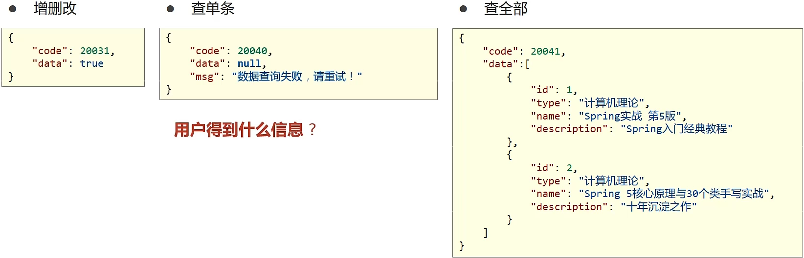
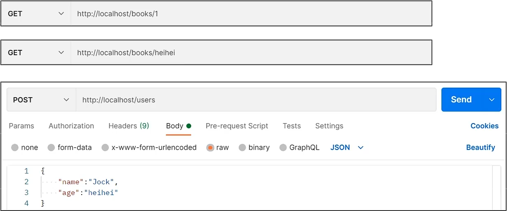
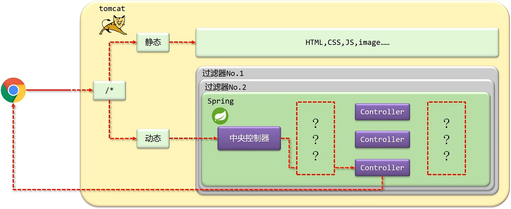

# Spring Framework

## Spring Framework 系统架构

Spring Framework 是 Spring 生态圈中最基础的项目，是其他项目的根基


## 核心概念

- 代码书写现状
  - 耦合度偏高
- 解决方案
  - 使用对象时，在程序中不要主动使用 new 产生对象，转换为由 **外部** 提供对象


### IoC (Inversion of Control) 控制反转

- 使用对象时，由主动 new 产生对象转换为由 **外部** 提供对象，此过程中对象创建控制权由程序转移到 **外部**，此思想称为 **控制反转**

### Spring 技术对 IoC 思想进行了买现

- Spring 提供了一个容器，称为 **IoC 容器**，用来充当 IoC 思想中的 **"外部"**
- IoC 容器负责对象的创建、初始化等一系列工作，被创建或被管理的对象在 IoC 容器中统称为 **Bean**

### DI (Dependency Injection) 依赖注入

- 在容器中建立 bean 与 bean 之间的依赖关系的整个过程，称为依赖注入


> **Spring 官方文档对 bean 的解释是：**
> In Spring, the objects that form the backbone of your application and that are managed by the Spring IoC container are called beans. A bean is an object that is instantiated (实例化), assembled (组装), and otherwise managed by a Spring IoC container.

### 目标：**充分解耦**

- 使用 IoC 容器管理 bean (IoC)
- 在 IoC 容器内将有依赖关系的 bean 进行关系绑定 (DI)

### 最终效果

- 使用对象时不仅可以直接从 IoC 容器中获取，并且获取到的 bean 已经绑定了所有的依赖关系

## IoC 入门案例

### IoC 入门案例思路分析

1. 管理什么？（Service 与 Dao）
2. 如何将被管理的对象告知 IoC 容器？（配置)
3. 被管理的对象交给 IoC 容器，如何获取到 IoC 容器？（接口）
4. IoC 容器得到后，如何从容器中获取 bean？（接口方法）
5. 使用 Spring 导入哪些坐标？（pom.xml)

### IoC 入门案例（XML版)

#### 1. 配置 Maven 依赖

```xml
<dependency>
    <groupId>org.springframework</groupId>
    <artifactId>spring-context</artifactId>
    <version>5.2.10.RELEASE</version>
</dependency>
```

#### 定义 Spring 管理的类（接口）

##### BookDao.java

```java
package com.itheima.dao;

public interface BookDao {
    void save();
}
```

##### BookDaoImpl.java

```java
package com.itheima.dao.impl;

import com.itheima.dao.BookDao;

public class BookDaoImpl implements BookDao {
    @Override
    public void save() {
        System.out.println("book dao save...");
    }
}
```

##### BookService.java

```java
package com.itheima.service;

public interface BookService {
    void save();
}
```

##### BookServiceImpl.java

```java
package com.itheima.service.impl;

import com.itheima.dao.BookDao;
import com.itheima.dao.impl.BookDaoImpl;
import com.itheima.service.BookService;

public class BookServiceImpl implements BookService {
    private BookDao bookDao = new BookDaoImpl();

    @Override
    public void save() {
        System.out.println("book service save...");
        bookDao.save();
    }
}
```

#### 3. 创建 Spring 配置文件，配置对应类作为 Spring 管理的 bean

```xml
<?xml version="1.0" encoding="UTF-8"?>
<beans xmlns="http://www.springframework.org/schema/beans"
       xmlns:xsi="http://www.w3.org/2001/XMLSchema-instance"
       xsi:schemaLocation="http://www.springframework.org/schema/beans http://www.springframework.org/schema/beans/spring-beans.xsd">
    <!--1. 导入 spring 的坐标 spring-context，对应版本是 5.2.10.RELEASE-->
    <!--2. 配置 bean-->
    <!--bean 标签表示配置 bean-->
    <!--id 属性表示给 bean 起名字-->
    <!--class 属性表示给 bean 定义类型-->
    <bean id="bookDao" class="com.itheima.dao.impl.BookDaoImpl"/>
    <bean id="bookService" class="com.itheima.service.impl.BookServiceImpl"/>
</beans>
```

> bean 定义时 id 属性在同一个上下文中不能重复

#### 4. 初始化 IoC 容器（Spring 核心容器 / Spring 容器），通过容器获取 bean

```java
package com.itheima;

import com.itheima.dao.BookDao;
import com.itheima.service.BookService;
import org.springframework.context.ApplicationContext;
import org.springframework.context.support.ClassPathXmlApplicationContext;

public class App2 {
    public static void main(String[] args) {
        // 获取 IoC 容器
        ApplicationContext ctx = new ClassPathXmlApplicationContext("applicationContext.xml");
        // 获取 bean
        BookDao bookDao = (BookDao) ctx.getBean("bookDao");
        bookDao.save();

        BookService bookService = (BookService) ctx.getBean("bookService");
        bookService.save();
    }
}
```

> **结论：还在 service 对象中 new 对象，故没解耦**

## DI 入门案例

### DI 入门案例思路分析

1. 基于 IoC 管理 bean
2. Service 中使用 new 形式创建的 Dao 对象是否保留？（否)
3. Service 中需要的 Dao 对象如何进入到 Service 中？（提供方法）
4. Service 与 Dao 间的关系如何描述？（配置)

### DI 入门案例 (XML 版)

#### 1. 删除使用 new 的形式创建对象的代码


#### 2. 提供依赖对象对应的 setter 方法

```java
public class BookServiceImpl implements BookService {
    // 删除业务层中 new 的方式创建 dao 对象
    private BookDao bookDao;

    @Override
    public void save() {
        System.out.println("book service save...");
        bookDao.save();
    }

    // 6. 提供对应的 set 方法
    public void setBookDao(BookDao bookDao) {
        this.bookDao = bookDao;
    }
}
```

#### 3. 配置 service 与 dao 之间的关系

```xml
<?xml version="1.0" encoding="UTF-8"?>
<beans xmlns="http://www.springframework.org/schema/beans"
       xmlns:xsi="http://www.w3.org/2001/XMLSchema-instance"
       xsi:schemaLocation="http://www.springframework.org/schema/beans http://www.springframework.org/schema/beans/spring-beans.xsd">
    <!--1. 导入 spring 的坐标 spring-context，对应版本是 5.2.10.RELEASE-->
    <!--2. 配置 bean-->
    <!--bean 标签表示配置 bean-->
    <!--id 属性表示给 bean 起名字-->
    <!--class 属性表示给 bean 定义类型-->
    <bean id="bookDao" class="com.itheima.dao.impl.BookDaoImpl"/>

    <bean id="bookService" class="com.itheima.service.impl.BookServiceImpl">
        <!--7.配置 service 与 dao 的关系-->
        <!--property 标签表示配置当前 bean 的属性-->
        <!--name 属性表示配置哪一个具体的属性-->
        <!--ref 属性表示参照哪一个 bean-->
        <property name="bookDao" ref="bookDao"/>
    </bean>
</beans>
```

## bean 基础配置


### bean 别名配置


> **注意事项：**获取 bean 无论是通过 id 还是 name 获取，如果无法获取到，将抛出异常 `NoSuchBeanDefinitionException`
> `NoSuchBeanDefinitionException`：No bean named '`bookServiceImpl`' available

### bean 作用范围配置


#### 为什么 bean 默认为单例？

​	为了节省资源，如果不设置单例模式，每次 Service 调用 Dao 都会创造一个 Dao 对象。而反复调用一个 Dao 对象的时候过程中没有创建新的数据，故单例。

#### 适合交给容器进行管理的 bean

- 表现层对象

- 业务层对象

- 数据层对象

- 工具对象

#### 不适合交给容器进行管理的 bean

- 封装实体的域对象

## bean 实例化

### bean 是如何创建的？

构造方法

### 实例化 bean 的三种方式 —— 构造方法（常用）

#### 提供可访问的构造方法

```java
public class BookDaoImpl implements BookDao {
    // 构造方法
    // 也可以调用私有的方法（反射）
    // Spring 调用的是无参的构造方法
    private BookDaoImpl() {
        System.out.println("book dao constructor is running ....");
    }

    public void save() {
        System.out.println("book dao save ...");
    }
}
```

#### 配置

```xml
<bean id="bookDao" class="com.itheima.dao.impl.BookDaoImpl"/>
```

#### 无参构造方法如果不存在，将抛出异常 `BeanCreationException`

### 实例化 bean 的三种方式 —— 静态工厂（了解）

#### 静态工厂

```java
//静态工厂创建对象
public class OrderDaoFactory {
    public static OrderDao getOrderDao(){
        System.out.println("factory setup....");
        return new OrderDaoImpl();
    }
}
```

#### 配置

```xml
<!--方式二：使用静态工厂实例化bean-->
<bean id="orderDao" class="com.itheima.factory.OrderDaoFactory" factory-method="getOrderDao"/>
```


### 实例化 bean 的三种方式 —— 实例工厂（了解）

#### 实例工厂

```java
public class UserDaoFactory {
    public UserDao getUserDao(){
        return new UserDaoImpl();
    }
}
```

#### 配置

```xml
<!--方式三：使用实例工厂实例化 bean-->
<bean id="userFactory" class="com.itheima.factory.UserDaoFactory"/>
<bean id="userDao" factory-method="getUserDao" factory-bean="userFactory"/>
```

#### FactoryBean

```java
public class UserDaoFactoryBean implements FactoryBean<UserDao> {
    //代替原始实例工厂中创建对象的方法
    public UserDao getObject() throws Exception {
        return new UserDaoImpl();
    }

    public Class<?> getObjectType() {
        return UserDao.class;
    }

}
```

## bean 生命周期

### bean 生命周期控制

- **生命周期**：从创建到消亡的完整过程
- **bean 生命周期**：bean 从创建到销毁的整体过程
- **bean 生命周期控制**：在 bean 创建后到销毁前做一些事情

### 方法一：

#### 提供生命周期控制方法

```java
public class BookDaoImpl implements BookDao {
    @Override
    public void save() {
        System.out.println("dao save...");
    }

    /**
     * 表示 bean 初始化对应的操作
     */
    public void init(){
        System.out.println("init");
    }

    /**
     * 表示 bean 销毁前对应的操作
     */
    public void destory(){
        System.out.println("destory");
    }
}
```

#### 配置生命周期控制方法

```xml
<bean id="BookDao" class="com.itheima.dao.impl.BookDaoImpl" init-method="init" destroy-method="destory"/>
```

### 方法二（了解）：

#### 实现 InitializingBean, DisposableBean 接口

```java
public class BookServiceImpl implements BookService, InitializingBean, DisposableBean {
    private BookDao bookDao;

    public void setBookDao(BookDaoImpl bookDao) {
        System.out.println("set...");
        this.bookDao = bookDao;
    }

    @Override
    public void save() {
        bookDao.save();
    }

    @Override
    public void destroy() throws Exception {
        System.out.println("destory");
    }

    @Override
    public void afterPropertiesSet() throws Exception {
        System.out.println("service init");
    }
```

- 初始化容器
  1. 创建对象（内存分配)
  2. 执行构造方法
  3. 执行属性注入（set 操作)
  4. 执行 bean 初始化方法

- 使用 bean
  1. 执行业务操作
- 关闭 / 销毁容器
  1. 执行 bean 销毁方法

### bean 销毁时机

- 容器关闭前触发 bean 的销毁

- 关闭容器方式：

  - 手工关闭容器

    `ConfigurableApplicationContext` 接口 `close()` 操作

    ```java
    public class AppForLiftCycle {
        public static void main(String[] args) {
            ClassPathXmlApplicationContext ctx = new ClassPathXmlApplicationContext("applicationContext.xml");
            BookService bookService = (BookService) ctx.getBean("BookService");
            bookService.save();
            ctx.close();
        }
    }
    ```

    

- 注册关闭钩子，在虚拟机退出前先关闭容器再退出虚拟机

  `ConfigurableApplicationContext` 接口 `registerShutdownHook()` 操作

  ```java
  public class AppForLiftCycle {
      public static void main(String[] args) {
          ClassPathXmlApplicationContext ctx = new ClassPathXmlApplicationContext("applicationContext.xml");
          ctx.registerShutdownHook(); // 注册钩子，表示关闭 Java 虚拟机之前销毁
          BookService bookService = (BookService) ctx.getBean("BookService");
          bookService.save();
      }
  }
  ```

  

## 依赖注入方式

### 一、setter 注入 —— 引用类型

#### 在 bean 中定义引用类型属性并提供可访问的 set 方法

```java
public class BookServiceImpl implements BookService {
    private BookDao bookDao;
    private UserDao userDao;
    
    @Override
    public void save() {
        bookDao.save();
        userDao.save();
    }

    public void setBookDao(BookDao bookDao) {
        this.bookDao = bookDao;
    }

    public void setUserDao(UserDao userDao) {
        this.userDao = userDao;
    }
}
```

#### 配置中使用 property 标签 ref 属性注入引用类型对象

```xml
<?xml version="1.0" encoding="UTF-8"?>
<beans xmlns="http://www.springframework.org/schema/beans"
       xmlns:xsi="http://www.w3.org/2001/XMLSchema-instance"
       xsi:schemaLocation="http://www.springframework.org/schema/beans http://www.springframework.org/schema/beans/spring-beans.xsd">
    <bean id="bookDao" class="com.itheima.dao.impl.BookDaoImpl"/>
    <bean id="userDao" class="com.itheima.dao.impl.UserDaoImpl"/>
    <bean id="bookService" class="com.itheima.service.impl.BookServiceImpl">
        <property name="bookDao" ref="bookDao"/>
        <property name="userDao" ref="userDao"/>
    </bean>
</beans>
```

### 二、setter 注入 —— 简单类型

#### 在 bean 中定义引用类型属性并提供可访问的 set 方法

```java
public class BookDaoImpl implements BookDao {
    private int connectionNum;
    private String databaseName;

    public void setConnectionNum(int connectionNum) {
        this.connectionNum = connectionNum;
    }

    public void setDatabaseName(String databaseName) {
        this.databaseName = databaseName;
    }

    @Override
    public void save() {
        System.out.println("[bookDao] save..." + connectionNum +","+ databaseName);
    }
}
```

#### 配置中使用 property 标签 value 属性注入简单类型数据

```xml
<?xml version="1.0" encoding="UTF-8"?>
<beans xmlns="http://www.springframework.org/schema/beans"
       xmlns:xsi="http://www.w3.org/2001/XMLSchema-instance"
       xsi:schemaLocation="http://www.springframework.org/schema/beans http://www.springframework.org/schema/beans/spring-beans.xsd">
    
    <bean id="bookDao" class="com.itheima.dao.impl.BookDaoImpl">
        <property name="databaseName" value="mysql"/>
        <property name="connectionNum" value="100"/>
    </bean>
    
    <bean id="bookService" class="com.itheima.service.impl.BookServiceImpl">
        <property name="bookDao" ref="bookDao"/>
    </bean>
</beans>
```

### 三、构造器 注入 —— 引用类型

#### 在 bean 中定义引用类型属性并提供构造方法

```java
public class UserServiceImpl implements UserService {
    private UserDao userDao;
    private BookDao bookDao;

    public UserServiceImpl(UserDao userDao, BookDao bookDao) {
        this.userDao = userDao;
        this.bookDao = bookDao;
    }

    @Override
    public void save() {
        userDao.save();
        bookDao.save();
    }
}
```

#### 配置中使用 property 标签 ref 属性注入引用类型对象

```xml
<?xml version="1.0" encoding="UTF-8"?>
<beans xmlns="http://www.springframework.org/schema/beans"
       xmlns:xsi="http://www.w3.org/2001/XMLSchema-instance"
       xsi:schemaLocation="http://www.springframework.org/schema/beans http://www.springframework.org/schema/beans/spring-beans.xsd">

    <bean class="com.itheima.dao.impl.UserDaoImpl" id="userDao"/>

    <bean class="com.itheima.dao.impl.BookDaoImpl" id="bookDao"/>

    <bean class="com.itheima.service.impl.UserServiceImpl" id="userService">
        <constructor-arg name="userDao" ref="userDao"/>
        <constructor-arg name="bookDao" ref="bookDao"/>
    </bean>
</beans>
```

### 四、构造器 注入 —— 简单类型

#### 在 bean 中定义引用类型属性并提供可访问的构造方法

```java
package com.itheima.dao.impl;

import com.itheima.dao.BookDao;

public class BookDaoImpl implements BookDao {
    private int connectionNum;

    public BookDaoImpl(int connectionNum, String databaseName) {
        this.connectionNum = connectionNum;
        this.databaseName = databaseName;
    }

    private String databaseName;

    @Override
    public void save() {
        System.out.println("[BookDao] save..." + databaseName + "," + connectionNum);
    }
}
```

#### 配置中使用 property 标签 value 属性注入简单类型数据

```xml
<?xml version="1.0" encoding="UTF-8"?>
<beans xmlns="http://www.springframework.org/schema/beans"
       xmlns:xsi="http://www.w3.org/2001/XMLSchema-instance"
       xsi:schemaLocation="http://www.springframework.org/schema/beans http://www.springframework.org/schema/beans/spring-beans.xsd">

    <bean class="com.itheima.dao.impl.UserDaoImpl" id="userDao"/>

    <bean class="com.itheima.dao.impl.BookDaoImpl" id="bookDao">
        <constructor-arg name="databaseName" value="mysql"/>
        <constructor-arg name="connectionNum" value="10"/>
    </bean>

    <bean class="com.itheima.service.impl.UserServiceImpl" id="userService">
        <constructor-arg name="userDao" ref="userDao"/>
        <constructor-arg name="bookDao" ref="bookDao"/>
    </bean>
</beans>
```

### 构造器注入 —— 参数适配（了解）

#### 配置中使用 constructor-arg 标签 type 属性设置按形参类型注入

```xml
<bean class="com.itheima.dao.impl.BookDaoImpl" id="bookDao">
    <constructor-arg type="int" value="10"/>
    <constructor-arg type="java.lang.String" value="mysql"/>
</bean>
```

#### 配置中使用 constructor-arg 标签 index属性设置按形参类型注入

```xml
<bean class="com.itheima.dao.impl.BookDaoImpl" id="bookDao">
    <constructor-arg index="0" value="10"/>
    <constructor-arg index="1" value="mysql"/>
</bean>
```

### 依赖注入方式选择

1. 强制依赖（bean 必须要用的东西）使用构造器进行，使用 setter 注入有概率不进行注入导致 null 对象出现
2. 可选依赖（bean 可用可不用的对象）使用 setter 注入进行，灵活性强
3. Spring 框架倡导使用构造器，第三方框架内部大多数采用构造器注入的形式进行数据初始化，相对严谨
4. 如果有必要可以两者同时使用，使用构造器注入完成强制依赖的注入，使用 setter 注入完成可选依赖的注入
5. 实际开发过程中还要根据实际情况分析，如果受控对象没有提供 setter 方法就必须使用构造器注入
6. **自己开发的模块推荐使用 setter 注入**

## 依赖自动装配

### IoC 容器根据 bean 所依赖的资源在容器中自动查找并注入到 bean 中的过程称为自动装配

- 自动装配方式
  - 按类型（常用） `byType`
  - 按名称 `byName`
  - 按构造方法 `constructor`
  - 不启用自动装配

#### 配置中使用 bean 标签 autowire 属性设置自动装配的类型

```xml
<bean class="com.itheima.dao.impl.BookDaoImpl" id="bookDao"/>
<bean class="com.itheima.service.impl.BookServiceImpl" id="bookService" autowire="byType"/>
```

### 依赖自动装配特征

- 自动装配用于引用类型依赖注入，不能对简单类型进行操作

- 使用按类型装配时 (byType) 必须保障容器中相同类型的 bean 唯一，**推荐使用**

- 使用按名称装配时 (byName) 必须保障容器中具有指定名称的 bean，因变量名与配置耦合，**不推荐使用**
- 自动装配 **优先级低于** setter 注入与构造器注入，同时出现时自动装配配置失效

## 集合注入

### 注入集合对象

#### 注入数组对象

```xml
<property name="array">
    <array>
        <value>100</value>
        <value>200</value>
        <value>300</value>
    </array>
</property>
```

#### 注入 List 对象（重点）

```xml
<property name="list">
    <list>
        <value>itcast</value>
        <value>itheima</value>
        <value>xuexi</value>
    </list>
</property>
```

#### 注入 Set 对象

```xml
<property name="set">
    <set>
        <value>itcast</value>
        <value>itheima</value>
        <value>xuexi</value>
        <value>xuexi</value>
    </set>
</property>
```

#### 注入 Map 对象（重点）

```xml
<property name="map">
    <map>
        <entry key="country" value="China"/>
        <entry key="province" value="Beijing"/>
        <entry key="city" value="Beijing"/>
    </map>
</property>
```

#### 注入 Properties 对象

```xml
<property name="properties">
    <props>
        <prop key="country">China</prop>
        <prop key="province">Beijing</prop>
        <prop key="city">Beijing</prop>
    </props>
</property>
```

## 案例：数据源对象管理

### 第三方资源配置管理 - DruidDataSource

#### 导入 druid 坐标

```xml
<dependency>
    <groupId>com.alibaba</groupId>
    <artifactId>druid</artifactId>
    <version>1.2.13-SNSAPSHOT</version>
</dependency>
```

#### 配置数据源对象作为 spring 管理的 bean

```xml
<!--管理 DruidDataSource 对象-->
<bean class="com.alibaba.druid.pool.DruidDataSource" id="dataSource">
    <property name="driverClassName" value="com.mysql.jdbc.Driver"/>
    <property name="url" value="jdbc:mysql://localhost:3306/spring_db"/>
    <property name="username" value="root"/>
    <property name="password" value="root"/>
</bean>
```

### 第三方资源配置管理 - ComboPooledDataSource

#### 导入 C3P0 坐标

```xml
<dependency>
    <groupId>c3p0</groupId>
    <artifactId>c3p0</artifactId>
    <version>0.9.1.2</version>
</dependency>
```

#### 配置数据源对象作为 spring 管理的 bean

```xml
<bean class="com.mchange.v2.c3p0.ComboPooledDataSource" id="dataSource">
    <property name="driverClass" value="com.mysql.jdbc.Driver"/>
    <property name="jdbcUrl" value="jdbc:mysql://localhost:3306/spring_db"/>
    <property name="user" value="root"/>
    <property name="password" value="root"/>
</bean>
```

## 加载 properties 文件

### 加载 properties 配置文件信息

#### 开启 context 命名空间

```xml
<?xml version="1.0" encoding="UTF-8"?>
<!--1. 开启 context 命名空间-->
<beans xmlns="http://www.springframework.org/schema/beans"
       xmlns:xsi="http://www.w3.org/2001/XMLSchema-instance"
       xmlns:context="http://www.springframework.org/schema/context"
       xsi:schemaLocation="
           http://www.springframework.org/schema/beans
           http://www.springframework.org/schema/beans/spring-beans.xsd
           http://www.springframework.org/schema/context
           http://www.springframework.org/schema/context/spring-context.xsd">
</beans>
```

#### 使用 context 命名空间，加载指定 properties 文件

```xml
<!--2. 使用 context 空间加载 properties 文件-->
<context:property-placeholder location="jdbc.properties"/>
```

#### 使用 ${} 读取加载的属性值

```xml
<!--3. 使用属性占位符 ${} 读取 properties 中的属性-->
<bean class="com.alibaba.druid.pool.DruidDataSource" id="dataSource">
    <property name="driverClassName" value="${jdbc.driver}"/>
    <property name="url" value="${jdbc.url}"/>
    <property name="username" value="${jdbc.username}"/>
    <property name="password" value="${jdbc.password}"/>
</bean>
```

### 开启命名空间方式

#### 不加载系统属性

```xml
<context:property-placeholder location="jdbc.properties" system-properties-mode="NEVER"/>
```

#### 加载多个 properties 文件

```xml
<context:property-placeholder location="jdbc.properties,msg.properties"/>
```

#### 加载所有 properties 文件

```xml
<context:property-placeholder location="*.properties"/>
```

#### 加载 properties.文件 标准 格式

```xml
<context:property-placeholder location="classpath:*.properties"/>
```

#### 从类路径或 jar 包中搜索并加载 properties 文件

```xml
<context:property-placeholder location="classpath*:*.properties"/>
```

## 容器

### 创建容器

#### 方式一：类路径加载配置文件

```java
// 1. 加载类路径下的配置文件
ApplicationContext ctx = new ClassPathXmlApplicationContext("applicationContext.xml");
```

#### 方式二：文件路径加载配置文件

```java
// 2. 从文件系统下加载配置文件
ApplicationContext fctx = new FileSystemXmlApplicationContext("E:\\java-git\\Spring\\Spring_10_container\\src\\main\\resources\\applicationContext.xml");
```

#### 加载多个配置文件

```java
// 3. 加载多个配置文件
ApplicationContext ctx = new ClassPathXmlApplicationContext("applicationContext.xml","applicationContext2.xml");
```

### 获取 bean

#### 方式一：使用 bean 名称获取

```java
BookDao bookDao = (BookDao)ctx.getBean("bookDao");
```

#### 方式二：使用 bean 名称获取并指定类型

```java
BookDao bookDao = ctx.getBean("bookDao", BookDao.class);
```

#### 方式三：使用 bean 类型获取

```java
BookDao bookDao = ctx.getBean(BookDao.class);
```

### 容器类层次结构


### BeanFactory

#### 类路径加载配置文件

```java
Resource resources = new ClassPathResource("applicationContext.xml");
BeanFactory bf = new XmlBeanFactory(resources);
BookDao bookDao = bf.getBean("bookDao", BookDao.class);
bookDao.save();
```

#### BeanFactory 创建完毕后，所有的 bean 均为延迟加载

## 核心容器总结

### 容器相关

- BeanFactory 是 IoC 容器的顶层接口，初始化 BeanFactory 对象时，加载的 bean 延迟加载

- ApplicationContext 接口是 Spring 容器的核心接口，初始化时 bean 立即加载

- ApplicationContext 接口提供基础的 bean 操作相关方法，通过其他接口扩展其功能

  - ApplicationContext 接口常用初始化类

  - ClassPathXmlApplicationContext

  - FileSystemXmlApplicationContext

### bean 相关


### 依赖注入相关


## 注解开发

### 注解开发定义 bean

#### 使用 @Component 定义 bean

**BookDaoImpl.java**

```java
@Component("bookDao")
public class BookDaoImpl implements BookDao {

    @Override
    public void save() {
        System.out.println("save...");
    }
}
```

**BookServiceImpl.java**

```java
@Component
public class BookServiceImpl implements BookService {
    BookDao bookDao;

    public BookServiceImpl(BookDao bookDao) {
        this.bookDao = bookDao;
    }

    @Override
    public void save() {
        bookDao.save();
    }
}
```

#### 核心配置文件中通过组件扫描加载 bean

```xml
<context:component-scan base-package="com.itheima"/>
```

#### Spring 提供 `@Component` 注解的三个衍生注解

- @Controller：用于表现层（） bean 定义
- @Service：用于业务层 （service）bean 定义
- @Repository：用于数据层（dao） bean 定义

### 纯注解开发

Spring3.0 升级了纯注解开发模式，使用 Java 类替代配置文件，开启了 Spring 快速开发赛道

Java 类代替 Spring 核心配置文件

#### **com.itheima.config.SpringConfig.java**

```java
@Configuration
@ComponentScan({"com.itheima.service","com.itheima.dao"})
public class SpringConfig {

}
```

#### AppForAnnotation.java

```java
public class AppForAnnotation {
    public static void main(String[] args) {
        ApplicationContext ctx = new AnnotationConfigApplicationContext(SpringConfig.class);
        BookDao bookDao = (BookDao) ctx.getBean("bookDao");
        bookDao.save();
    }
}
```


- `@Configuration` 注解用于设定当前类为配置类
- `@ComponentScan` 注解用于设定扫描路径，此注解只能添加一次，多个数据请用数组格式

```java
@ComponentScan({"com.itheima.service","com.itheima.dao"})
```

## bean 管理

### bean 作用范围

#### 使用 @Scope 定义 bean 作用范围

```java
@Scope("prototype")
public class BookServiceImpl implements BookService {
}
```

### bean 生命周期

#### 使用 @PostConstruct、@PreDestroy 定义 bean 生命周期

```java
@Service
@Scope("prototype")
public class BookServiceImpl implements BookService {
    BookDao bookDao;

    public BookServiceImpl(BookDao bookDao) {
        this.bookDao = bookDao;
    }

    @Override
    public void save() {
        bookDao.save();
    }

    @PostConstruct // 构造方法后运行的方法
    public void init() {
        System.out.println("init...");
    }

    @PreDestroy // 销毁前运行的方法
    public void destory() {
        System.out.println("destory...");
    }
}
```

## 依赖注入

### 自动装配

#### 使用 @Autowired 注解开启自动装配模式（按类型）


> **注意：**自动装配基于反射设计创建对象并暴力反射对应属性为私有属性初始化数据，因此 *无需提供 setter 方法*
>
> **注意：**自动装配建议使用无参构造方法创建对象（默认），如果不提供对应构造方法，请提供唯一的构造方法

#### 使用 @Qualifier 注解开启指定名称装配 bean

```java
@Service
public class BookServiceImpl implements BookService {
    @Autowired
    @Qualifier("bookDao2")
    private BookDao bookDao;

    @Override
    public void save() {
        bookDao.save();
    }
}
```

> 注意：`@Qualifier` 注解无法单独使用，必须配合 `@Autowired` 注解使用

#### 使用 @Value 实现简单类型注入

```java
@Service
public class BookServiceImpl implements BookService {
    
    @Value("itheima123")
    private String name;

    @Override
    public void save() {
        bookDao.save();
        System.out.println("name = " + name);
    }
}
```

### 加载 properties 文件

#### 使用 @PropertySource 注解加载 properties 文件

```java
@Configuration
@ComponentScan({"com.itheima.dao", "com.itheima.service"})
@PropertySource("classpath:jdbc.properties")
// @PropertySources({"...","..."})
public class SpringConfig {
}
```

> **注意：**路径仅支持单一文件配置，多文件请使用数组格式配置，不允许使用通配符

## 第三方 bean 管理

### 第三方 bean 管理

```java
@Configuration
public class JdbcConfig {
    // 1. 定义一个方法用于获得要管理的对象
    // 2. 添加 @Bean 表示当前方法的返回值是一个 bean
    @Bean
    public DataSource dataSource() {
        DruidDataSource ds = new DruidDataSource();
        ds.setDriverClassName("com.mysql.jdbc.Driver");
        ds.setUrl("jdbc:mysql://localhost:3306/spring_db");
        ds.setUsername("root");
        ds.setPassword("password");
        return ds;
    }
}
```

#### 使用 @Import 注解手动加入配置类到核心配置，此注解只能添加一次，多个数据请用数组格式

```java
@Configuration
@Import({JdbcConfig.class})
public class SpringConfig {
}
```

### 第三方 bean 依赖注入

#### 简单类型依赖注入

```java
@Value("com.mysql.jdbc.Driver")
private String driver;
@Value("jdbc:mysql://localhost:3306/spring_db")
private String url;
@Value("root")
private String username;
@Value("root")
private String password;
```

#### 引用类型依赖注入

```java
@Bean
public DataSource dataSource(BookDao bookDao) {
    System.out.println("bookDao = " + bookDao);
    DruidDataSource ds = new DruidDataSource();
    ds.setDriverClassName(driver);
    ds.setUrl(url);
    ds.setUsername(username);
    ds.setPassword(password);
    return ds;
}
```

- 引用类型注入只需要为 bean 定义方法设置形参即可容器会根据类型自动装配对象

## 注解开发总结

### XML 配置比对注解配置


## Spring 整合 MyBatis

[Spring利用注解整合Mybatis的方法详解_java_脚本之家 (jb51.net)](https://www.jb51.net/article/251138.htm)

### 思路分析 - 分析 bean

#### MyBatis 程序核心对象分析


### 整合 MyBatis


## 整合 JUnit

### 使用 Spring 整合 Junit 专用的类加载器

```java
@RunWith(SpringJUnit4ClassRunner.class)
@ContextConfiguration(classes = SpringConfig.class)
public class UserServiceTest extends TestCase {

    @Autowired
    private UserService userService;

    @Test
    public void testSelectById() {
        User user = userService.selectById(2);
        System.out.println(user);
    }

    @Test
    public void testSelectAll() {
        System.out.println(userService.selectAll());
    }
}
```

## AOP 简介

- AOP (Aspect Oriented Programming) **面向切面** 编程，一种编程范式，指导开发者如何组织程序结构
  - OOP (Object Oriented Programming) **面向对象** 编程

- **作用：**在不惊动原始设计的基础上为其进行功能增强

- **Spring 理念：**无入侵式/无侵入式

### AOP 核心概念


#### 连接点 (JoinPoint)：

程序执行过程中的任意位置，粒度为执行方法、抛出异常、设置变量等

- 在 SpringAOP 中，理解为方法的执丸行

#### 切入点 (Pointcut)：

匹配连接点的式子

- 在 SpringAOP 中，一个切入点可以只描述一个具体方法，也可以匹配多个方法

  - 一个具体方法：`com.itheima.dao` 包下的 BookDao 接口中的无形参无返回值的save 方法

  - 匹配多个方法：所有的 save 方法，所有的 get 开头的方法，所有以 Dao 结尾的接口中的任意方法，所有带有一个参数的方法

#### 通知 (Advice)：

在切入点处执行的操作，也就是共性功能

- 在 SpringAOP 中，功能最终以方法的形式呈现

#### 通知类：

定义通知的类

#### 切面 (Aspect)：

描述通知与切入点的对应关系

### AOP 入门案例思路分析

案例设定：测定接口执行效率

简化设定：在接口执行前输出当前系统时间

开发模式：XML or 注解

#### 思路分析：

1. 导入坐标 (pom.xml)
2. 制作连接点方法（原始操作，Dao接口与实现类)
3. 制作共性功能（通知类与通知）
4. 定义切入点
5. 绑定切入点与通知关系（切面）

### AOP 入门案例（注解版）

#### 1. 导入 aop 相关坐标

```xml
<dependency>
    <groupId>org.aspectj</groupId>
    <artifactId>aspectjweaver</artifactId>
    <version>1.9.9.1</version>
</dependency>
```

> **说明**：spring-contexts 坐标依赖 spring-aop 坐标


#### 定义 dao 接口与实现类

```java
public interface BookDao {
    void save();

    void update();

    void delete();

    void select();
}
```

```java
@Repository
public class BookDaoImpl implements BookDao {

    @Override
    public void save() {
            System.out.println("save...");
    }

    @Override
    public void update() {
        System.out.println("update");
    }

    @Override
    public void delete() {
        System.out.println("delete");
    }

    @Override
    public void select() {
        System.out.println("select");
    }
}
```

#### 定义通知类，制作通知

```java
@Before("pointcut()")
public void method(){
    System.out.println("System.currentTimeMillis() = " + System.currentTimeMillis());
}
```

#### 定义切入点

```java
@Component
@Aspect
public class MyAdvice {

    @Pointcut("execution(void com.itheima.dao.BookDao.update())")
    private void pointcut(){
		// 切入点定义依托一个不具有实际意义的方法进行，即无参数，无返回值，方法体无实际逻辑
    }

    @Before("pointcut()")
    public void method(){
        System.out.println("System.currentTimeMillis() = " + System.currentTimeMillis());
    }
}
```

> **说明**：切入点定义依托一个不具有实际意义的方法进行，即无参数，无返回值，方法体无实际逻辑

#### 绑定切入点与通知关系，并指定通知添加到原始连接点的具体执行位置

```java
@Before("pointcut()")
```

#### 定义通知类受 Spring 容器管理，并定义当前类为切面类

```java
@Component
@Aspect
```

## AOP 工作流程

1. Spring 容器启动
2. 读取所有切面配置中的切入点 
3. 初始化 bean，判定 bean 对应的类中的方法是否匹配到任意切入点
   - 匹配失败，创建对象
   - 匹配成功，创建原始对象（**目标对象**）的 **代理** 对象
4. 获取 bean 执行方法
   - 获取 bean，调用方法并执行，完成操作
   - 获取的 bean 是代理对象时，根据代理对象的运行模式运行原始方法与增强的内容，完成操作

- **目标对象（Target）：**原始功能去掉共性功能对应的类产生的对象，这种对象是无法直接完成最终工作的
- **代理（Proy）：**目标对象无法直接完成工作，需要对其进行功能回填，通过原始对象的代理对象实现

> **总结**：SpringAOP 本质：代理模式

## AOP 切入点表达式

- **切入点**：要进行增强的方法

- **切入点表达式**：要进行增强的方法的描述方式

### 语法格式


**描述方式一：**执行 `com.itheima.dao` 包下的 BookDao 接口中的无参数 update 方法

```java
execution(void com.itheima.dao.BookDao.update())
```

**描述方式二**：执行 `com.theima.dao.impl` 包下的 BookDaoImpl 类中的无参数 update 方法

```java
execution(void com.itheima.dao.impl.BookDaoImpl.update())
```

#### 切入点表达式标准格式：

动作关键字（`访问修饰符返回值包名.类/接口名.方法名（参数）异常名`）

```java
execution (public User com.itheima.service.UserService.findById (int))
```

- 动作关键字：描述切入点的行为动作，例如 execution 表示执行到指定切入点
- 访问修饰符：public，private 等，可以省略
- 返回值
- 包名
- 类 / 接口名
- 方法名
- 参数
- 异常名：方法定义中抛出指定异常，可以省略

### 通配符

#### 可以使用通配符描述切入点，快速描述

- `*`：单个独立的任意符号，可以独立出现，也可以作为前缀或者后缀的匹配符出现

```java
execution (public * com.itheima.*.UserService.find*(*))
```

匹配 `com.itheima` 包下的任意包中的 UserService 类或接口中所有 find 开头的带有一个参数的方法

- `..`：多个连续的任意符号，可以独立出现，常用于 **简化包名与参数** 的书写

```java
execution (public User com..UserService.findById (..))
```

匹配 `com` 包下的任意包中的 UserService 类或接口中所有名称为 findByld 的方法

- `+`：专用于匹配子类类型

```java
execution(* *..*Service+.*(..))
```

返回值不限定，包不限定，业务层的所有方法，参数不限定

### 书写技巧

- 所有代码按照标准规范开发，否则以下技巧全部失效
- 描述切入点 **通常描述接口**，而不描述实现类
- 访问控制修饰符针对接口开发均采用 public 描述（**可省略访问控制修饰符描述**）
- 返回值类型对于增删改类使用精准类型加速匹配，对于查询类使用 `*` 通配快速描述
- **包名** 书写 **尽量不使用 `..` 匹配**，效率过低，常用 `*` 做单个包描述匹配，或精准匹配
- **接口名** / 类名书写名称与模块相关的 **采用 `*` 匹配**，例如 `UserService` 书写成 `*Service`，绑定业务层接口名
- **方法名** 书写以 **动词** 进行 **精准匹配**，名词采用 `*` 匹配，例如 `getByld` 书写成 `getBy*`，`selectAll` 书写成 `selectAll`
- 参数规侧较为复杂，根据业务方法灵活调整
- 通常 **不使用异常** 作为 **匹配规侧**

## AOP 通知类型

- AOP 通知描述了抽取的共性功能，根据共性功能抽取的位置不同，最终运行代码时要将其加入到合理的位置

### A0P 通知共分为 5 种类型

- 前置通知

  

- 后置通知

  

- 环绕通知（重点）

  

- 返回后通知（了解）

  

- 抛出异常后通知（了解）

  

### @Around 注意事项

1. 环绕通知必须依赖形参 ProceedingLoinPoint 才能实现对原始方法的调用，进而实现原始方法调用前后同时添加通知
2. 通知中如果未使用 ProceedingJoinPoint 对原始方法进行调用将跳过原始方法的执行
3. 对原始方法的调用可以不接收返回值，通知方法设置成 void 即可，如果接收返回值，必须设定为 Object 类型
4. 原始方法的返回值如果是 void 类型，通知方法的返回值类型可以设置成 void，也可以设置成 Object
5. 由于无法预知原始方法运行后是否会抛出异常，因此环绕通知方法必须抛出 Throwable 对象

## 案例：测量业务层接口万次执行效率

### 测量业务层接口执行效率

#### 需求：

任意业务层接口执行均可显示其执行效率（执行时长)

#### 分析：

1. 业务功能：业务层接口执行前后分别记录时间，求差值得到执行效率
2. 通知类型选择前后均可以增强的类型一环绕通知

通知类：

```java
@Component
@Aspect
public class ProjectAdvice {

    // 匹配业务层所有接口
    @Pointcut("execution(* com.itheima.service.*Service.*(..))")
    private void servicePt() {
    }

    @Around("ProjectAdvice.servicePt()")
    public void runSpeed(ProceedingJoinPoint proceedingJoinPoint) throws Throwable {
        Signature signature = proceedingJoinPoint.getSignature();
        Long startTime = System.currentTimeMillis();
        for (int i = 0; i < 10000; i++) {
            if (i % 100 == 0)
                System.out.println(i / 100 + "%");
            if (i == 9999)
                System.out.println("100%");
            proceedingJoinPoint.proceed();
        }
        Long endTime = System.currentTimeMillis();
        Long totalTime = endTime - startTime;
        System.out.println("当前类型：" + signature.getDeclaringType());
        System.out.println("当前方法：" + signature.getName());
        System.out.println("业务层接口万次执行时间：" + totalTime + "ms");
    }
}
```

> **补充说明：**
> 当前测试的接口执行效率仅仅是一个理论值，并不是一次完整的执行过程

## AOP 通知获取数据

### 获取切入点方法的参数

#### JoinPoint：适用于前置、后置、返回后、抛出异常后通知

```java
@Before("pt()")
public void before(JoinPoint joinPoint) {
    Object[] args = joinPoint.getArgs();
    System.out.println(Arrays.toString(args));
    System.out.println("before advice");
}
```

#### ProceedJointPoint：适用于环绕通知

```java
@Around("pt()")
public Object around(ProceedingJoinPoint proceedingJoinPoint) throws Throwable {
    Object[] args = proceedingJoinPoint.getArgs();
    System.out.println("Arrays.toString(args) = " + Arrays.toString(args));
    // 拦截并修改值
    args[0] = 666;
    // 重新赋值参数
    Object proceed = proceedingJoinPoint.proceed(args);
    System.out.println("after");
    return proceed;
}
```

### 获取切入点方法返回值

- 返回后通知
- 环绕通知

### 获取切入点方法运行异常信息

#### 抛出异常后通知

```java
@AfterReturning(value = "pt()", returning = "ret")
public void afterReturning(Object ret){
    // 接收返回值
    System.out.println("after Returning advice ret = " + ret);
}
```

#### 环绕通知

```java
@Around ("pt()")
public Object around(ProceedingJoinPoint pjp) throws Throwable{
	object ret = pjp.proceed();
	return ret;
}
```

## 案例：百度网盘密码数据兼容处理

百度网盘分享链接输入密码数据错误兼容性处理

### 需求：

对百度网盘分享链接输入密码时尾部多输入的空格做兼容处理


### 分析：

- 在业务方法执行之前对所有的输入参数进行格式处理  —— `trim()`

- 使用处理后的参数调用原始方法 —— 环绕通知中存在对原始方法的调用

## AOP 总结

### 概念

AOP (Aspect Oriented Programming) 面向切面编程，一种编程范式

### 作用

在不惊动原始设计的基础上为方法进行 **功能增强**

### 核心概念

- **代理（Proxy)：**SpringAOP的核心本质是采用代理模式实现的
- **连接点 (JoinPoint)：**在SpringAOP中，理解为任意方法的执行
- **切入点 (Pointcut)：**匹配连接点的式子，也是具有共性功能的方法描述
- **通知 (Advice)：**若干个方法的共性功能，在切入点处执行，最终体现为一个方法
- **切面 (Aspect)：**描述通知与切入点的对应关系
- **目标对象 (Target)：**被代理的原始对象成为目标对象

### 切入点表达式标准格式：

`动作关键字 (访问修饰符返回值包名.类/接口名.方法名 (参数) 异常名)`

`execution(* com.itheima.service.*Service.*(..))`

### 切入点表达式描述通配符

**作用：**用于快速描述，范围描述

`*`：匹配任意符号（常用）

`..`：匹配多个连续的任意符号（常用）

`+`：匹配子类类型

### 切入点表达式书写技巧

1. 按 **标准规范** 开发
2. 查询操作的 **返回值** 建议使用 `*` 匹配
3. **减少使用** `..` 的形式描述包
4. 对接口进行描述，使用 `*` 表示模块名，例如 UserService 的匹配描述为 `*Service`
5. 方法名书写保留动词，例如 get，使用 `*` 表示名词，例如 getById 匹配描述为 `getBy*`
6. 参数根据实际情况灵活调整

### 通知类型

- 前置通知

- 后置通知

- 环绕通知（重点，可以模拟出其他的几种通知）

  - 环绕通知依赖形参 ProceedingJoinPoint 才能实现对原始方法的调用

  - 环绕通知可以隔离原始方法的调用执

  - 环绕通知返回值设置为 Object 类型

  - 环绕通知中可以对原始方法调用过程中出现的异常进行处理

- 返回后通知
- 抛出异常后通知

## Spring 事务简介

**事务作用：**在数据层保障一系列的数据库操作同成功同失败
**Spring 事务作用：**在 **数据层** 或 **业务层** 保障一系列的数据库操作 **同成功同失败**


### 案例：银行账户转账 - 模拟银行账户间转账业务

**需求**：实现任意两个账户间转账操作

**需求微缩**：A账户减钱，B账户加钱

#### 分析：

1. 数据层提供基础操作，指定账户减钱 (outMoney)，指定账户加钱 (inMoney)
2. 业务层提供转账操作 (transfer)，调用减钱与加钱的操作
3. 提供 2 个账号和操作金额执行转账操作
4. 基于 Spring 整合 MyBatis 环境搭建上述操作

#### 在业务层接口上添加 Spring 事务管理

```java
public interface AccountService {
    /**
     * 转账操作
     *
     * @param out   传出方
     * @param in    转入方
     * @param money 金额
     */
    // 配置当前接口方法具有事务
    @Transactional
    public void transfer(String out, String in, Double money);
}
```

> **注意事项**
> Spring 注解式事务通常添加在业务层接口中而不会添加到业务层实现类中，降低耦合注解式事务可以添加到业务方法上表示当前方法开启事务，也可以添加到接口上表示当前接口所有方法开启事务

#### 设置事务管理器

```java
//配置事务管理器，mybatis使用的是jdbc事务
@Bean
public PlatformTransactionManager transactionManager(DataSource dataSource){
    DataSourceTransactionManager transactionManager = new DataSourceTransactionManager();
    transactionManager.setDataSource(dataSource);
    return transactionManager;
}
```

#### 开启注解式事务驱动

```java
@Configuration
@ComponentScan("com.itheima")
@PropertySource("classpath:jdbc.properties")
@Import({JdbcConfig.class,MybatisConfig.class})
//开启注解式事务驱动
@EnableTransactionManagement
public class SpringConfig {
}
```

## Spring 事务角色

### 事务角色

- **事务管理员**：发起事务方，在 Spring 中通常指代业务层开启事务的方法

- **事务协调员**：加入事务方，在 Spring 中通常指代数据层方法，也可以是业务层方法


## 事务相关配置

### 事务配置


### 案例：转账业务追加日志

**需求**：实现任意两个账户间转账操作，并对每次转账操作在数据库进行留痕
**需求微缩**：A 账户减钱，B 账户加钱，数据库记录日志

#### 分析

1. 基于转账操作案例添加日志模块，实现数据库中记录日志
2. 业务层转账操作 (transfer)，调用减钱、加钱与记录日志功能

#### 实现效果预期：

无论转账操作是否成功，均进行转账操作的日志留痕


#### 存在的问题

日志的记录与转账操作隶属同一个事务，同成功同失败


### 事务传播行为


# SpringMVC

## SpringMVC 简介

### SpringMVC 概述

- SpringMVC 技术与 Servlet 技术功能等同，均属于 **web 层** 开发技术
- SpringMVC 是一种基于 Java 实现 MVC 模型的轻量级 Web 框架（框架：半成品软件）
- 优点：
  - 使用简单，开发便捷 (相比于 Servlet)
  - 灵活性强


### SpringMVC 入门案例

#### 1. 使用 SpringMVC 技术需要先导入 SpringMVC 坐标与 Servlet 坐标

```xml
<!--servlet-->
<dependency>
    <groupId>javax.servlet</groupId>
    <artifactId>javax.servlet-api</artifactId>
    <version>4.0.1</version>
    <scope>provided</scope>
</dependency>

<!--spring mvc-->
<dependency>
    <groupId>org.springframework</groupId>
    <artifactId>spring-webmvc</artifactId>
    <version>5.2.10.RELEASE</version>
</dependency>
```

#### 2. 创建 SpringMVC 控制器类（等同于 Servlet 功能）

```java
// 2. 定义 controller
// 2.1 使用 @Controller 定义表现层的 bean
@Controller
public class UserController {
    // 2.2 设置当前操作访问路径
    @RequestMapping("/save")
    // 2.3 设置当前操作的返回值类型，把返回的东西作为整体返回
    @ResponseBody
    public String save(){
        System.out.println("user save");
        return "{'module':'springmvc'}";
    }
}
```

#### 3. 初始化 SpringMVC 环境（同 Spring 环境），设定 SpringMVC 加载对应的 bean

```java
// 3.创建 springmav 配置文件，加载 controller 对应的 bean
@Configuration
@ComponentScan("com.itheima.controller")
public class SpringMvcConfig {
}
```

#### 4. 初始化 Servlet 容器，加载 SpringMVC 环境，并设置 SpringMVC 技术处理的请求

```java
// 4. 定义一个 Servlet 容器启动的配置类，在里面加载 spring 的配置
public class ServletContainersInitConfig extends AbstractDispatcherServletInitializer {

    // 加载 springmvc 容器配置
    @Override
    protected WebApplicationContext createServletApplicationContext() {
        // 初始化一个 web 专用的 applicationContext
        AnnotationConfigWebApplicationContext ctx = new AnnotationConfigWebApplicationContext();
        ctx.register(SpringMvcConfig.class);
        return ctx;
    }

    // 设置那些请求归属 springmvc 处理
    @Override
    protected String[] getServletMappings() {
        // 所有请求
        return new String[]{"/"};
    }

    // 加载 spring 容器配置
    @Override
    protected WebApplicationContext createRootApplicationContext() {
        return null;
    }
}
```

#### @Controller


#### @RequestMapping


#### @ResponseBody


#### SpringMVC 入门程序开发总结 (1 + N)

##### 一次性工作

- 创建工程，设置服务器，加载工程

- 导入坐标


- 创建 web 容器启动类，加载 SpringMVC 配置，并设置 SpringMVC  请求拦截路径


- SpringMVC 核心配置类（设置配置类，扫描 controller 包，加载 Controller 控制器 bean)

##### 多次工作

- 定义处理请求的控制器类

- 定义处理请求的控制器方法，并配置映射路径 (@RequestMapping) 与返回 json 数据 (@ResponseBody)

#### AbstractDispatcherServletInitializer 类是 SpringMVC 提供的快速初始化 Web3.0 容器的抽象类

##### AbstractDispatcherServletInitializer 提供三个接口方法供用户实现

- `createServletApplicationContext()` 方法，创建 Servlet 容器时，加载 SpringMVC 对应的 bean 并放入WebApplicationContext 对象范围中，而 WebApplicationContext 的作用范围为 ServletContext 范围，即整个 web 容器范围


- `getServletMappings()` 方法，设定 SpringMVC 对应的请求映射路径，设置为 / 表示拦截所有请求，任意请求都将转入到 SpringMVC 进行处理


`createRootApplicationContext()` 方法，如果创建 Servlet 容器时需要加载非 SpringMVC 对应的 bean，使用当前方法进行，吏用方式同 `createServletApplicationContext()`


### 入门案例工作流程分析

#### 启动服务器初始化过程

1. 服务器启动，执行 ServletContainersInitConfig 类，初始化 web 容器
2. 执行 createServltApplicationContext 方法，创建了 WebApplicationContext 对象
3. 加载SpringMvcConfig 执行 @ComponentScan 加载对应的 bean
4. 加载 UserController，每个 `@RequestMapping` 的名称对应一个具体的方法
5. 执行 getServletMappings 方法，定义所有的请求都通过 SpringMVC

#### 单次请求过程

1. 发送请求 `localhost/save`
2. web 容器发现所有请求都经过 SpringMVC，将请求交给 SpringMVC 处理
3. 解析请求路径 `/save`
4. 由 `/save` 匹配执行对应的方法 `save()`
5. `执行save()`
6. 检测到有 `@ResponseBody` 直接将 `save()` 方法的返回值作为响应求体返回给请求方

### Controller 加载控制与业务 bean 加载控制

- SpringMVC 相关 bean (表现层 bean)
- Spring控制的 bean
  - 业务 bean (Service)
  - 功能 bean (DataSources 等)
- SpringMVC 相关 bean 加载控制
  - SpringMVC 加载的 bean 对应的包均在 `com.itheima.controller` 包内
- Spring 相关 bean 加载控制
  - **方式一**：Spring 加载的 bean 设定扫描范围为 `com.theima`，排除掉 `controller` 包内的 `bean`
  - **方式二**：Spring 加载的 bean 设定扫描范围为精准范围，例如 service 包、dao 包等
  - **方式三**：不区分 Spring 与 SpringMVC 的环境，加载到同一个环境中


#### @ComponentScan


#### bean 的加载格式

```java
public class ServletContainersInitConfig extends AbstractDispatcherServletInitializer {

    // 加载 springmvc 容器配置
    @Override
    protected WebApplicationContext createServletApplicationContext() {
        // 初始化一个 web 专用的 applicationContext
        AnnotationConfigWebApplicationContext ctx = new AnnotationConfigWebApplicationContext();
        ctx.register(SpringMvcConfig.class);
        return ctx;
    }

    // 设置那些请求归属 springmvc 处理
    @Override
    protected String[] getServletMappings() {
        // 所有请求
        return new String[]{"/"};
    }

    // 加载 spring 容器配置
    @Override
    protected WebApplicationContext createRootApplicationContext() {
        AnnotationConfigWebApplicationContext ctx = new AnnotationConfigWebApplicationContext();
        ctx.register(SpringConfig.class);
        return ctx;
    }
}
```

#### 简化开发

```java
public class ServletContainersInitConfig extends AbstractAnnotationConfigDispatcherServletInitializer {

    @Override
    protected Class<?>[] getRootConfigClasses() {
        return new Class[]{SpringConfig.class};
    }

    @Override
    protected Class<?>[] getServletConfigClasses() {
        return new Class[]{SpringMvcConfig.class};
    }

    @Override
    protected String[] getServletMappings() {
        return new String[]{"/"};
    }
}
```

## 请求与响应

### 请求映射路径

#### @RequestMapping


### 请求方式

#### Get 请求


#### Post 请求


#### Post 请求中文乱码处理

为 web 容器添加过滤器并指定字符集，Spring-web 包中提供了专用的字符过滤器

```java
public class ServletContainerInitConfig extends AbstractAnnotationConfigDispatcherServletInitializer {
    @Override
    protected Class<?>[] getRootConfigClasses() {
        return new Class[0];
    }

    @Override
    protected Class<?>[] getServletConfigClasses() {
        return new Class[]{SpringMvcConfig.class};
    }

    @Override
    protected String[] getServletMappings() {
        return new String[]{"/"};
    }

    @Override
    protected Filter[] getServletFilters() {
        CharacterEncodingFilter filter = new CharacterEncodingFilter();
        filter.setEncoding("UTF-8");
        return new Filter[]{filter};
    }
}
```

### 请求参数

#### 普通参数

- 参数种类
- 普通参数
- POJO 类型参数
- 嵌套 POJO 类型参数
- 数组类型参数
- 集合类型参数

```java
// 普通参数
@RequestMapping("/commonParam")
@ResponseBody
public String commonParam(String name, int age) {
    System.out.println("name = " + name);
    System.out.println("age = " + age);
    return "{'module':'common param" + name + age + "'}";
}

//普通参数：请求参数名与形参名不同时，使用@RequestParam注解关联请求参数名称与形参名称之间的关系
@RequestMapping("/commonParamDifferentName")
@ResponseBody
public String commonParamDifferentName(@RequestParam("name") String userName , int age){
    System.out.println("普通参数传递 userName ==> "+userName);
    System.out.println("普通参数传递 age ==> "+age);
    return "{'module':'common param different name'}";
}

//POJO参数：请求参数与形参对象中的属性对应即可完成参数传递
@RequestMapping("/pojoParam")
@ResponseBody
public String pojoParam(User user){
    System.out.println("pojo参数传递 user ==> "+user);
    return "{'module':'pojo param'}";
}

//嵌套POJO参数：嵌套属性按照层次结构设定名称即可完成参数传递
@RequestMapping("/pojoContainPojoParam")
@ResponseBody
public String pojoContainPojoParam(User user){
    System.out.println("pojo嵌套pojo参数传递 user ==> "+user);
    return "{'module':'pojo contain pojo param'}";
}

//数组参数：同名请求参数可以直接映射到对应名称的形参数组对象中
@RequestMapping("/arrayParam")
@ResponseBody
public String arrayParam(String[] likes){
    System.out.println("数组参数传递 likes ==> "+ Arrays.toString(likes));
    return "{'module':'array param'}";
}

//集合参数：同名请求参数可以使用@RequestParam注解映射到对应名称的集合对象中作为数据
@RequestMapping("/listParam")
@ResponseBody
public String listParam(@RequestParam List<String> likes){
    System.out.println("集合参数传递 likes ==> "+ likes);
    return "{'module':'list param'}";
}
```

#### JSON 参数

- json 数组
- json 对象 (POJO)
- json 数组 (POJO)

```java
// 集合参数：json格式
// 1.开启json数据格式的自动转换，在配置类中开启@EnableWebMvc
// 2.使用@RequestBody注解将外部传递的json数组数据映射到形参的集合对象中作为数据
@RequestMapping("/listParamForJson")
@ResponseBody
public String listParamForJson(@RequestBody List<String> likes) {
    System.out.println("list common(json)参数传递 list ==> " + likes);
    return "{'module':'list common for json param'}";
}

// POJO参数：json格式
// 1.开启json数据格式的自动转换，在配置类中开启@EnableWebMvc
// 2.使用@RequestBody注解将外部传递的json数据映射到形参的实体类对象中，要求属性名称一一对应
@RequestMapping("/pojoParamForJson")
@ResponseBody
public String pojoParamForJson(@RequestBody User user) {
    System.out.println("pojo(json)参数传递 user ==> " + user);
    return "{'module':'pojo for json param'}";
}

// 集合参数：json格式
// 1.开启json数据格式的自动转换，在配置类中开启@EnableWebMvc
// 2.使用@RequestBody注解将外部传递的json数组数据映射到形参的保存实体类对象的集合对象中，要求属性名称一一对应
@RequestMapping("/listPojoParamForJson")
@ResponseBody
public String listPojoParamForJson(@RequestBody List<User> list) {
    System.out.println("list pojo(json)参数传递 list ==> " + list);
    return "{'module':'list pojo for json param'}";
}
```

#### 1. 添加 json 数据转换相关坐标

```xml
<dependency>
    <groupId>com.fasterxml.jackson.core</groupId>
    <artifactId>jackson-databind</artifactId>
    <version>2.14.0-rc2</version>
</dependency>
```

#### 2. 设置发送 json 数据（请求 body 中添加 json 数据）


#### 3. 开启自动转换 json 数据的支持

```java
@Configuration
@ComponentScan("com.itheima.controller")
// 开启自动转换 json 数据的支持
@EnableWebMvc
public class SpringMvcConfig {
}
```

> **注意事项**
>
> `@EnableWebMvc` 注解功能强大，该注解整合了多个功能，此处仅使用其中一部分功能，即 json 数据进行自动类型转换

#### 4. 设置接收 json 数据

```java
// POJO参数：json格式
// 1.开启json数据格式的自动转换，在配置类中开启@EnableWebMvc
// 2.使用@RequestBody注解将外部传递的json数据映射到形参的实体类对象中，要求属性名称一一对应
@RequestMapping("/pojoParamForJson")
@ResponseBody
// 写入 @RequestBody
public String pojoParamForJson(@RequestBody User user) {
    System.out.println("pojo(json)参数传递 user ==> " + user);
    return "{'module':'pojo for json param'}";
}
```


### @RequestBody 与 @RequestParam 区别

#### 区别

- `@RequestParam` 用于接收 url 地址传参，表单传参【application/x-www-form-urlencoded】

- `@RequestBody` 用于接收 json 数据【application/json】

#### 应用

- 后期开发中，发送 json 格式数据为主，`@RequestBody` 应用较广

- 如果发送非 json 格式数据，选用 `@RequestParam` 接收请求参数

### 日期类型参数传递

#### 日期类型数据基于系统不同格式也不尽相同

- 2088-08-18

- 2088/08/18

- 08/18/2088

#### 接收形参时，根据不同的日期格式设置不同的接收方式

```java
// 日期参数
// 使用@DateTimeFormat注解设置日期类型数据格式，默认格式yyyy/MM/dd
@RequestMapping("/dataParam")
@ResponseBody
public String dataParam(Date date,
                        @DateTimeFormat(pattern = "yyyy-MM-dd") Date date1,
                        @DateTimeFormat(pattern = "yyyy-MM-dd HH:mm:ss") Date date2) {
    System.out.println("参数传递 date ==> " + date);
    System.out.println("参数传递 date1(yyyy-MM-dd) ==> " + date1);
    System.out.println("参数传递 date2(yyyy-MM-dd HH:mm:ss) ==> " + date2);
    return "{'module':'data param'}";
}
```

### 响应

- 响应页面

- 响应数据
  - 文本数据
  - json 数据

#### 响应页面（了解）

```java
// 响应页面 / 跳转页面
@RequestMapping("/toJumpPage")
public String ToJumpPage() {
    System.out.println("跳转页面");
    return "page.jsp";
}
```

#### 响应纯文本数据（了解）

```java
// 响应纯文本数据
@RequestMapping("/toText")
@ResponseBody
public String toText() {
    System.out.println("返回纯文本数据");
    return "response text";
}
```

#### 响应 json 数据（对象转 json）

```java
// 响应 POJO 对象
@RequestMapping("/toJsonPOJO")
@ResponseBody
public User toJsonPOJO() {
    System.out.println("返回 json 对象");
    User user = new User();
    user.setName("itcast");
    user.setAge(15);
    Address address = new Address("Beijing", "Beijing");
    user.setAddress(address);
    return user;
}
```

#### 响应 json 数据（对象集合转 json 数组）

```java
// 响应 POJO 集合类型
@RequestMapping("/toJsonList")
@ResponseBody
public List<User> toJsonList() {
    System.out.println("返回 json 集合数据");
    Address address = new Address("Beijing", "Beijing");
    User user1 = new User("传智播客", 15, address);
    User user2 = new User("黑马程序员", 12, address);
    List<User> userList = new ArrayList<>();
    userList.add(user1);
    userList.add(user2);
    return userList;
}
```

#### @ResponseBody


#### HttpMessageConverter 接口

类型转换器 JSON -> BODY


## REST 风格

### REST 简介

**REST** (Representational State Transfer)，表现形式状态转换

#### 传统风格资源描述形式

- http://localhost/user/getById?id=1
- http://localhost/user/saveUser

#### REST 风格描述形式

- http://localhost/user/1
- http://localhost/user

#### 优点

- **隐藏资源的访问行为**，无法通过地址得知对资源是何种操作
- 书写简化

#### 按照 REST 风格访问资源时使用行为动作区分对资源进行了何种操作


`路径 + 请求方式 = 使用行为`

> **根据 REST 风格对资源进行访问称为 RESTful**
>
> **注意事项：**
>
> - 上述行为是约定方式，约定不是规范，可以打破，所以称REST风格，而不是 REST 规范
>
> - 描述模块的名称通常使用复数，也就是加 s 的格式描述，表示此类资源，而非单个资源，例如：`users`、`books`、`accounts`.…


### RESTful 入门案例

#### 1. 设定 http 请求动作（动词）


#### 2. 设定请求参数（路径变量）


#### @RequestMapping


#### @PathVariable


#### @RequestBody、@RequestParam、@PathVariable

##### 区别

- `@RequestParam` 用于接收 url 地址传参或表单传参

- `@RequestBody` 用于接收 json 数据
- `@PathVariable` 用于接收路径参数，使用 `{参数名称}` 描述路径参数

##### 应用

- 后期开发中，发送请求参数超过 1 个时，以 json 格式为主，`@RequestBody` 应用较广

- 如果发送非 json 格式数据，选用 `@RequestParam` 接收请求参数

- 采用 RESTful：进行开发，当参数数量较少时，例如 1 个，可以采用 `@PathVariable` 接收请求路径变量，通常用于传递 id 值

### RESTful 快速开发

```java
package com.itheima.controller;

import com.itheima.domain.Book;
import org.springframework.stereotype.Controller;
import org.springframework.web.bind.annotation.*;

//@Controller
//@ResponseBody配置在类上可以简化配置，表示设置当前每个方法的返回值都作为响应体
//@ResponseBody
@RestController     // 使用@RestController注解替换@Controller与@ResponseBody注解，简化书写
@RequestMapping("/books")
public class BookController {

    // @RequestMapping( method = RequestMethod.POST)
    @PostMapping        // 使用@PostMapping简化Post请求方法对应的映射配置
    public String save(@RequestBody Book book) {
        System.out.println("book save..." + book);
        return "{'module':'book save'}";
    }

    // @RequestMapping(value = "/{id}" ,method = RequestMethod.DELETE)
    @DeleteMapping("/{id}")     // 使用@DeleteMapping简化DELETE请求方法对应的映射配置
    public String delete(@PathVariable Integer id) {
        System.out.println("book delete..." + id);
        return "{'module':'book delete'}";
    }

    // @RequestMapping(method = RequestMethod.PUT)
    @PutMapping         // 使用@PutMapping简化Put请求方法对应的映射配置
    public String update(@RequestBody Book book) {
        System.out.println("book update..." + book);
        return "{'module':'book update'}";
    }

    // @RequestMapping(value = "/{id}" ,method = RequestMethod.GET)
    @GetMapping("/{id}")    // 使用@GetMapping简化GET请求方法对应的映射配置
    public String getById(@PathVariable Integer id) {
        System.out.println("book getById..." + id);
        return "{'module':'book getById'}";
    }

    // @RequestMapping(method = RequestMethod.GET)
    @GetMapping             // 使用@GetMapping简化GET请求方法对应的映射配置
    public String getAll() {
        System.out.println("book getAll...");
        return "{'module':'book getAll'}";
    }
}
```

#### @RestController


#### @GetMapping、@PostMapping、@PutMapping、@DeleteMapping


### 案例：基于 RESTful 页面数据交互

#### 1. 制作 SpringMVC 控制器，并测试接口功能

BookController.java

```java
@RestController
@RequestMapping("/books")
public class BookController {

    @PostMapping
    public String save(@RequestBody Book book) {
        System.out.println("book = " + book);

        return "{'module':'book save success'}";
    }

    @GetMapping
    public List<Book> getAll() {
        List<Book> bookList = new ArrayList<Book>();
        Book book1 = new Book("计算机", "SpringMVC入门课程", "小试牛刀");
        Book book2 = new Book("计算机", "SpringMVC实战课程", "小试牛刀");
        bookList.add(book1);
        bookList.add(book2);
        return bookList;
    }
}
```

#### 2. 设置对静态资源的访问放行

SpringMvcSupport.java

```java
@Configuration
public class SpringMvcSupport extends WebMvcConfigurationSupport {
    @Override
    protected void addResourceHandlers(ResourceHandlerRegistry registry) {
        // 当访问 pages/??? 不要走 mvc，走 /pages 目录下的内容
        registry.addResourceHandler("/pages/**").addResourceLocations("/pages/");
        registry.addResourceHandler("/js/**").addResourceLocations("/js/");
        registry.addResourceHandler("/css/**").addResourceLocations("/css/");
        registry.addResourceHandler("/plugins/**").addResourceLocations("/plugins/");
    }
}
```

#### 3. 前端页面通过异步提交访问后台控制器

```vue
//添加
saveBook () {
    axios.post("/books",this.formData).then((res)=>{

    });
},

//主页列表查询
getAll() {
    axios.get("/books").then((res)=>{
        this.dataList = res.data;
    });
},
```

# SSM 整合

## SSM 整合

### SSM 整合流程

1. 创建工程

2. SSM 整合

   - Spring

     - SpringConfig

   - MyBatis

     - MybatisConfig


     - JdbcConfig


     - jdbc.properties


   - SpringMVC
     - ServletConfig
     - SpringMvcConfig

3. 功能模块

   - 表与实体类

   - dao（接口 + 自动代理）

   - service（接口 + 实现类）
     - 业务层接口测试（整合 Unit）


   - controller
     - 表现层接口测试 （PostMan）

## 表现层数据封装

### 前端接收数据格式

前端接收数据格式一创建结果模型类，封装数据到 data 属性中



### 设置统一数据返回结果类

```java
public class Result{
    private object data;
    private Integer code;
    private String msg;
}
```

> **注意事项**
> Result 类中的字段并不是固定的，可以根据需要自行增减
> 提供若干个构造方法，方便操作

#### 设置统一数据返回结果类

```java
@Data
@AllArgsConstructor
@NoArgsConstructor
public class Result {
    private Integer code;
    private Object data;
    private String msg;

    /* 先码值再数据，这是一种习惯 */
    public Result(Integer code, Object data) {
        this.code = code;
        this.msg = msg;
    }
}
```

> **注意事项**
> Result 类中的字段并不是固定的，可以根据需要自行增减
> 提供若干个构造方法，方便操作

#### 设置统一数据返回结果编码

```java
public class Code {
    /**
     * 成功状态码
     */
    public static final Integer SAVE_OK = 20011;
    public static final Integer DELETE_OK = 20021;
    public static final Integer UPDATE_OK = 20031;
    public static final Integer GET_OK = 20041;
    /**
     * 失败状态码
     */
    public static final Integer SAVE_ERR = 20010;
    public static final Integer DELETE_ERR = 20020;
    public static final Integer UPDATE_ERR = 20030;
    public static final Integer GET_ERR = 20040;
}
```

> **注意事项**
> Code 类的常量设计也不是固定的，可以根据需要自行增减，例如将查询再进行细分为`GET_OK`，`GET_ALL_OK`，`GET_PAGE_OK`

## 异常处理器

程序开发过程中不可避免的会遇到异常现象

### 出现异常现象的常见位置与常见诱因如下：

- **框架内部抛出的异常**：因使用不合规导致

- **数据层抛出的异常**：因外部服务器故障导致（例如：服务器访问超时）

- **业务层抛出的异常**：因业务逻辑书写错误导致（例如：遍历业务书写操作，导致索引异常等）
- **表现层抛出的异常**：因数据收集、校验等规则导致（例如：不匹配的数据类型间导致异常）
- **工具类抛出的异常**：因工具类书写不严谨不够健壮导致（例如：必要释放的连接长期未释放等）

> **思考**：
>
> - 各个层级均出现异常，异常处理代码书写在哪一层？
>
>   ​	—— **所有的异常均抛出到表现层进行处理**
>
> - 表现层处理异常，每个方法中单独书写，代码书写量巨大且意义不强，如何解决？
>
>   ​	—— AOP 思想

### 异常处理器

#### 集中的、统一的处理项目中出现的异常

```java
@RestControllerAdvice
public class ProjectExceptionAdvice {

    // 拦截异常
    @ExceptionHandler(Exception.class)
    public Result doException(Exception ex) {
        System.out.println("捕获异常");
        return new Result(666, null,"捕获异常");
    }
}
```

### 项目异常分类

#### 业务异常 (BusinessException)

- 不规范的用户行为操作产生的异常

- 规范的用户行为产生的异常

#### 系统异常 (SystemException)

- 项目运行过程中可预计且无法避免的异常

#### 其他异常 (Exception)

- 编程人员未预期到的异常

#### 其他异常 (Exception)

- 发送固定消息传递给用户，安抚用户

- 发送特定消息给编程人员，提醒维护（纳入预期范围内）

- 记录日志





#### 1. 自定义项目系统级异常

```java
@Data
public class SystemException extends RuntimeException {
    // 异常编号
    private Integer code;

    public SystemException(Integer code, String message) {
        super(message);
        this.code = code;
    }

    public SystemException(Integer code, String message, Throwable cause) {
        super(message, cause);
        this.code = code;
    }
}
```

#### 2. 自定义项目业务级异常

```java
@Data
public class BusinessException extends RuntimeException {

    // 异常代码
    private Integer code;

    public BusinessException(Integer code, String message) {
        super(message);
        this.code = code;
    }

    public BusinessException(Integer code, String message, Throwable cause) {
        super(message, cause);
        this.code = code;
    }
}
```

#### 3. 自定义异常编码（持续补充）

```java
public class Code {

    /**
     * 成功状态码
     */
    public static final Integer SAVE_OK = 20011;
    public static final Integer DELETE_OK = 20021;
    public static final Integer UPDATE_OK = 20031;
    public static final Integer GET_OK = 20041;

    /**
     * 失败状态码
     */
    public static final Integer SAVE_ERR = 20010;
    public static final Integer DELETE_ERR = 20020;
    public static final Integer UPDATE_ERR = 20030;
    public static final Integer GET_ERR = 20040;

    public static final Integer SYSTEM_ERR = 50001;
    public static final Integer SYSTEM_UNKNOW_ERR = 59999;
    public static final Integer SYSTEM_TIMEOUT_ERR = 50002;
    public static final Integer BUSINESS_ERR = 60002;
}
```

#### 4. 触发自定义异常

```java
public Book selectById(int id) {
    if (id == 1)
        throw new BusinessException(Code.BUSINESS_ERR, "请不要使用你");
    
    // 将可能出现的异常进行包装，转换成自定义异常
    try {
        int i = 1 / 0;
    } catch (Exception e) {
        throw new SystemException(Code.SYSTEM_TIMEOUT_ERR, "服务器访问超时", e);
    }
    Book book = bookDao.selectById(id);
    return book;
}
```

#### 5. 拦截并处理异常

```java
@RestControllerAdvice
public class ProjectExceptionAdvice {
    // 拦截到系统异常
    @ExceptionHandler(SystemException.class)
    public Result doSystemException(SystemException ex) {
        System.out.println("捕获到系统异常");
        // 记录日志
        // 发送消息给运维
        // 发送邮件给开发人员
        return new Result(ex.getCode(), null, ex.getMessage());
    }

    // 拦截业务异常
    @ExceptionHandler(BusinessException.class)
    public Result doBusinessException(BusinessException ex) {
        System.out.println("捕获到业务异常");
        // 记录日志
        // 发送消息给运维
        // 发送邮件给开发人员
        return new Result(ex.getCode(), null, ex.getMessage());
    }

    // 拦截其他异常
    @ExceptionHandler(Exception.class)
    public Result doException(Exception ex) {
        System.out.println("捕获到其他异常");
        // 记录日志
        // 发送消息给运维
        // 发送邮件给开发人员
        return new Result(Code.SYSTEM_TIMEOUT_ERR, null, ex.getMessage());
    }
}
```

#### 6. 异常处理器效果对比


## SSM 整合

### 案例：SSM 整合标准开发

#### 1. 自定义项目系统级异常

```javascript
axios.get("/books").then((res) => {});
axios.post("/books", this.formData).then((res) => {});
axios.delete("/books/" + row.id).then((res) => {});
axios.put("/books", this.formData).then((res) => {});
axios.get("/books/" + row.id).then((res) =>);
```

## 拦截器

### 拦截器概念



拦截器 (Interceptor) 是一种动态拦截方法调用的机制，在 SpringMVC 中动态拦截控制器方法的执行

#### 作用：

- 在指定的方法调用前后执行预先设定的代码

- 阻止原始方法的执行

#### 拦截器与过滤器区别

- **归属不同**：Filter 属于 Servlet 技术，Interceptor 属于 SpringMVC 技术

- **拦截内容不同：**Filter 对所有访问进行增强，Interceptor 仅针对 SpringMVC 的访问进行增强

### 入门案例

1. 制作拦截器功能类
2. 配置拦截器的执行位置

#### 1. 声明拦截器的 bean，并实现 HandlerInterceptor：接口（注意：扫描加载 bean)

```java
@Component
public class ProjectInterceptor implements HandlerInterceptor {
    public boolean preHandle(HttpServletRequest request, HttpServletResponse response, Object handler) throws Exception {
        System.out.println("preHandle");
        return false;
    }

    public void postHandle(HttpServletRequest request, HttpServletResponse response, Object handler, ModelAndView modelAndView) throws Exception {
        System.out.println("postHandle");
    }

    public void afterCompletion(HttpServletRequest request, HttpServletResponse response, Object handler, Exception ex) throws Exception {
        System.out.println("afterCompletion");
    }
}
```

#### 2. 定义配置类，继承 WebMvcConfigurationSupport，实现 addInterceptor 方法（注意：扫描加载配置）

```java
@Configuration
public class SpringMvcSupport extends WebMvcConfigurationSupport {

    @Autowired
    private ProjectInterceptor projectInterceptor;
    // 配置本地资源映射路径
    @Override
    protected void addResourceHandlers(ResourceHandlerRegistry registry) {
        ResourceHandlerRegistration resourceHandlerRegistration = registry.addResourceHandler("/pages/**").addResourceLocations("/pages/");;
    }
    // 拦截器
    @Override
    protected void addInterceptors(InterceptorRegistry registry) {
        registry.addInterceptor(projectInterceptor).addPathPatterns("/books");
    }
}
```

#### 3. 添加拦截器并设定拦载的访问路径，路径可以通过可变参数设置多个

```java
registry.addInterceptor(projectInterceptor).addPathPatterns("/books","/books/*");
```

#### 4. 使用标准接口 WebMvcConfigurer 简化开发（注意：侵入式较强）

```java
@Configuration
@ComponentScan({"com.itheima.controller"})
@EnableWebMvc
public class SpringMvcConfig implements WebMvcConfigurer {
    @Autowired
    private ProjectInterceptor projectInterceptor;

    // 配置本地资源映射路径
    public void addResourceHandlers(ResourceHandlerRegistry registry) {
        registry.addResourceHandler("/pages/**").addResourceLocations("/pages/");
    }

    public void addInterceptors(InterceptorRegistry registry) {
        registry.addInterceptor(projectInterceptor).addPathPatterns("/books");
    }
}
```

### 拦截器工作流程分析


### 拦截器参数

#### 前置处理


##### 参数

`request`：请求对象

`response`：响应对象

`handler`：被调用的处理器对象，本质上是一个方法对象，对反射技术中的Method对象进行了再包装

##### 返回值

返回值为 false，被拦截的处理器将不执行

#### 后置处理


##### 参数

`modelAndView`：如果处理器执行完成具有返回结果，可以读取到对应数据与页面信息，并进行调整

#### 完成后处理


##### 参数

`ex`：如果处理器执行过程中出现异常对象，可以针对异常情况进行单独处理

### 多拦截器执行顺序

- 当配置多个拦截器时，形成拦截器链

- 拦截器链的运行顺序参照拦截器添加顺序为准

- 当拦截器中出现对原始处理器的拦截，后面的拦截器均终止运行

- 当拦截器运行中断，仅运行配置在前面的拦截器的 afterCompletion 操作


> **总结**：
>
> - `preHandle`:与配置顺序相同，必定运行
>
> - `postHandle`:与配置顺序相反，可能不运行
>
> - `afterCompletion`:与配置顺序相反，可能不运行


# SpringBoot

### SpringBoot 概念

SpringBoot 提供了一种快速使用 Spring 的方式，基于约定优于配置的思想，其设计目的是用来简化Spring应用的初始搭建以及开发过程，可以让开发人员不必在配置与逻辑业务之间进行思维的切换，全身心的投入到逻辑业务的代码编写中，从而大大提高了开发的效率，一定程度上缩短了项目周期。2014 年 4 月，SpringBoot1.0.0 发布。Spring 的顶级项目之一 (https:/spring.io)。


## SpringBoot 快速入门

## SpringBoot 起步依赖原理分析

## SpringBoot 配置

## SpringBoot 整合其他框架