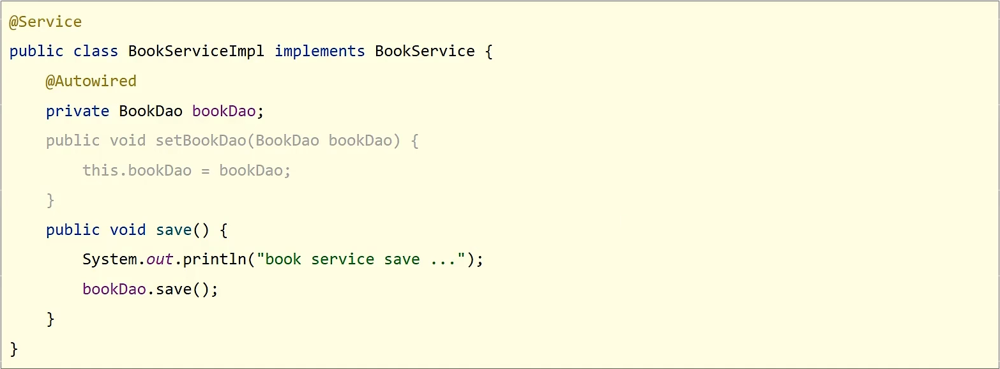

# Spring Framework

## Spring Framework 系统架构

Spring Framework 是 Spring 生态圈中最基础的项目，是其他项目的根基


## 核心概念

- 代码书写现状
  - 耦合度偏高
- 解决方案
  - 使用对象时，在程序中不要主动使用 new 产生对象，转换为由 **外部** 提供对象


### IoC (Inversion of Control) 控制反转

- 使用对象时，由主动 new 产生对象转换为由 **外部** 提供对象，此过程中对象创建控制权由程序转移到 **外部**，此思想称为 **控制反转**

### Spring 技术对 IoC 思想进行了买现

- Spring 提供了一个容器，称为 **IoC 容器**，用来充当 IoC 思想中的 **"外部"**
- IoC 容器负责对象的创建、初始化等一系列工作，被创建或被管理的对象在 IoC 容器中统称为 **Bean**

### DI (Dependency Injection) 依赖注入

- 在容器中建立 bean 与 bean 之间的依赖关系的整个过程，称为依赖注入


> **Spring 官方文档对 bean 的解释是：**
> In Spring, the objects that form the backbone of your application and that are managed by the Spring IoC container are called beans. A bean is an object that is instantiated (实例化), assembled (组装), and otherwise managed by a Spring IoC container.

### 目标：**充分解耦**

- 使用 IoC 容器管理 bean (IoC)
- 在 IoC 容器内将有依赖关系的 bean 进行关系绑定 (DI)

### 最终效果

- 使用对象时不仅可以直接从 IoC 容器中获取，并且获取到的 bean 已经绑定了所有的依赖关系

## IoC 入门案例

### IoC 入门案例思路分析

1. 管理什么？（Service 与 Dao）
2. 如何将被管理的对象告知 IoC 容器？（配置)
3. 被管理的对象交给 IoC 容器，如何获取到 IoC 容器？（接口）
4. IoC 容器得到后，如何从容器中获取 bean？（接口方法）
5. 使用 Spring 导入哪些坐标？（pom.xml)

### IoC 入门案例（XML版)

#### 1. 配置 Maven 依赖

```xml
<dependency>
    <groupId>org.springframework</groupId>
    <artifactId>spring-context</artifactId>
    <version>5.2.10.RELEASE</version>
</dependency>
```

#### 定义 Spring 管理的类（接口）

##### BookDao.java

```java
package com.itheima.dao;

public interface BookDao {
    void save();
}
```

##### BookDaoImpl.java

```java
package com.itheima.dao.impl;

import com.itheima.dao.BookDao;

public class BookDaoImpl implements BookDao {
    @Override
    public void save() {
        System.out.println("book dao save...");
    }
}
```

##### BookService.java

```java
package com.itheima.service;

public interface BookService {
    void save();
}
```

##### BookServiceImpl.java

```java
package com.itheima.service.impl;

import com.itheima.dao.BookDao;
import com.itheima.dao.impl.BookDaoImpl;
import com.itheima.service.BookService;

public class BookServiceImpl implements BookService {
    private BookDao bookDao = new BookDaoImpl();

    @Override
    public void save() {
        System.out.println("book service save...");
        bookDao.save();
    }
}
```

#### 3. 创建 Spring 配置文件，配置对应类作为 Spring 管理的 bean

```xml
<?xml version="1.0" encoding="UTF-8"?>
<beans xmlns="http://www.springframework.org/schema/beans"
       xmlns:xsi="http://www.w3.org/2001/XMLSchema-instance"
       xsi:schemaLocation="http://www.springframework.org/schema/beans http://www.springframework.org/schema/beans/spring-beans.xsd">
    <!--1. 导入 spring 的坐标 spring-context，对应版本是 5.2.10.RELEASE-->
    <!--2. 配置 bean-->
    <!--bean 标签表示配置 bean-->
    <!--id 属性表示给 bean 起名字-->
    <!--class 属性表示给 bean 定义类型-->
    <bean id="bookDao" class="com.itheima.dao.impl.BookDaoImpl"/>
    <bean id="bookService" class="com.itheima.service.impl.BookServiceImpl"/>
</beans>
```

> bean 定义时 id 属性在同一个上下文中不能重复

#### 4. 初始化 IoC 容器（Spring 核心容器 / Spring 容器），通过容器获取 bean

```java
package com.itheima;

import com.itheima.dao.BookDao;
import com.itheima.service.BookService;
import org.springframework.context.ApplicationContext;
import org.springframework.context.support.ClassPathXmlApplicationContext;

public class App2 {
    public static void main(String[] args) {
        // 获取 IoC 容器
        ApplicationContext ctx = new ClassPathXmlApplicationContext("applicationContext.xml");
        // 获取 bean
        BookDao bookDao = (BookDao) ctx.getBean("bookDao");
        bookDao.save();

        BookService bookService = (BookService) ctx.getBean("bookService");
        bookService.save();
    }
}
```

> **结论：还在 service 对象中 new 对象，故没解耦**

## DI 入门案例

### DI 入门案例思路分析

1. 基于 IoC 管理 bean
2. Service 中使用 new 形式创建的 Dao 对象是否保留？（否)
3. Service 中需要的 Dao 对象如何进入到 Service 中？（提供方法）
4. Service 与 Dao 间的关系如何描述？（配置)

### DI 入门案例 (XML 版)

#### 1. 删除使用 new 的形式创建对象的代码


#### 2. 提供依赖对象对应的 setter 方法

```java
public class BookServiceImpl implements BookService {
    // 删除业务层中 new 的方式创建 dao 对象
    private BookDao bookDao;

    @Override
    public void save() {
        System.out.println("book service save...");
        bookDao.save();
    }

    // 6. 提供对应的 set 方法
    public void setBookDao(BookDao bookDao) {
        this.bookDao = bookDao;
    }
}
```

#### 3. 配置 service 与 dao 之间的关系

```xml
<?xml version="1.0" encoding="UTF-8"?>
<beans xmlns="http://www.springframework.org/schema/beans"
       xmlns:xsi="http://www.w3.org/2001/XMLSchema-instance"
       xsi:schemaLocation="http://www.springframework.org/schema/beans http://www.springframework.org/schema/beans/spring-beans.xsd">
    <!--1. 导入 spring 的坐标 spring-context，对应版本是 5.2.10.RELEASE-->
    <!--2. 配置 bean-->
    <!--bean 标签表示配置 bean-->
    <!--id 属性表示给 bean 起名字-->
    <!--class 属性表示给 bean 定义类型-->
    <bean id="bookDao" class="com.itheima.dao.impl.BookDaoImpl"/>

    <bean id="bookService" class="com.itheima.service.impl.BookServiceImpl">
        <!--7.配置 service 与 dao 的关系-->
        <!--property 标签表示配置当前 bean 的属性-->
        <!--name 属性表示配置哪一个具体的属性-->
        <!--ref 属性表示参照哪一个 bean-->
        <property name="bookDao" ref="bookDao"/>
    </bean>
</beans>
```

## bean 基础配置


### bean 别名配置


> **注意事项：**获取 bean 无论是通过 id 还是 name 获取，如果无法获取到，将抛出异常 `NoSuchBeanDefinitionException`
> `NoSuchBeanDefinitionException`：No bean named '`bookServiceImpl`' available

### bean 作用范围配置


#### 为什么 bean 默认为单例？

​	为了节省资源，如果不设置单例模式，每次 Service 调用 Dao 都会创造一个 Dao 对象。而反复调用一个 Dao 对象的时候过程中没有创建新的数据，故单例。

#### 适合交给容器进行管理的 bean

- 表现层对象

- 业务层对象

- 数据层对象

- 工具对象

#### 不适合交给容器进行管理的 bean

- 封装实体的域对象

## bean 实例化

### bean 是如何创建的？

构造方法

### 实例化 bean 的三种方式 —— 构造方法（常用）

#### 提供可访问的构造方法

```java
public class BookDaoImpl implements BookDao {
    // 构造方法
    // 也可以调用私有的方法（反射）
    // Spring 调用的是无参的构造方法
    private BookDaoImpl() {
        System.out.println("book dao constructor is running ....");
    }

    public void save() {
        System.out.println("book dao save ...");
    }
}
```

#### 配置

```xml
<bean id="bookDao" class="com.itheima.dao.impl.BookDaoImpl"/>
```

#### 无参构造方法如果不存在，将抛出异常 `BeanCreationException`

### 实例化 bean 的三种方式 —— 静态工厂（了解）

#### 静态工厂

```java
//静态工厂创建对象
public class OrderDaoFactory {
    public static OrderDao getOrderDao(){
        System.out.println("factory setup....");
        return new OrderDaoImpl();
    }
}
```

#### 配置

```xml
<!--方式二：使用静态工厂实例化bean-->
<bean id="orderDao" class="com.itheima.factory.OrderDaoFactory" factory-method="getOrderDao"/>
```


### 实例化 bean 的三种方式 —— 实例工厂（了解）

#### 实例工厂

```java
public class UserDaoFactory {
    public UserDao getUserDao(){
        return new UserDaoImpl();
    }
}
```

#### 配置

```xml
<!--方式三：使用实例工厂实例化 bean-->
<bean id="userFactory" class="com.itheima.factory.UserDaoFactory"/>
<bean id="userDao" factory-method="getUserDao" factory-bean="userFactory"/>
```

#### FactoryBean

```java
public class UserDaoFactoryBean implements FactoryBean<UserDao> {
    //代替原始实例工厂中创建对象的方法
    public UserDao getObject() throws Exception {
        return new UserDaoImpl();
    }

    public Class<?> getObjectType() {
        return UserDao.class;
    }

}
```

## bean 生命周期

### bean 生命周期控制

- **生命周期**：从创建到消亡的完整过程
- **bean 生命周期**：bean 从创建到销毁的整体过程
- **bean 生命周期控制**：在 bean 创建后到销毁前做一些事情

### 方法一：

#### 提供生命周期控制方法

```java
public class BookDaoImpl implements BookDao {
    @Override
    public void save() {
        System.out.println("dao save...");
    }

    /**
     * 表示 bean 初始化对应的操作
     */
    public void init(){
        System.out.println("init");
    }

    /**
     * 表示 bean 销毁前对应的操作
     */
    public void destory(){
        System.out.println("destory");
    }
}
```

#### 配置生命周期控制方法

```xml
<bean id="BookDao" class="com.itheima.dao.impl.BookDaoImpl" init-method="init" destroy-method="destory"/>
```

### 方法二（了解）：

#### 实现 InitializingBean, DisposableBean 接口

```java
public class BookServiceImpl implements BookService, InitializingBean, DisposableBean {
    private BookDao bookDao;

    public void setBookDao(BookDaoImpl bookDao) {
        System.out.println("set...");
        this.bookDao = bookDao;
    }

    @Override
    public void save() {
        bookDao.save();
    }

    @Override
    public void destroy() throws Exception {
        System.out.println("destory");
    }

    @Override
    public void afterPropertiesSet() throws Exception {
        System.out.println("service init");
    }
```

- 初始化容器
  1. 创建对象（内存分配)
  2. 执行构造方法
  3. 执行属性注入（set 操作)
  4. 执行 bean 初始化方法

- 使用 bean
  1. 执行业务操作
- 关闭 / 销毁容器
  1. 执行 bean 销毁方法

### bean 销毁时机

- 容器关闭前触发 bean 的销毁

- 关闭容器方式：

  - 手工关闭容器

    `ConfigurableApplicationContext` 接口 `close()` 操作

    ```java
    public class AppForLiftCycle {
        public static void main(String[] args) {
            ClassPathXmlApplicationContext ctx = new ClassPathXmlApplicationContext("applicationContext.xml");
            BookService bookService = (BookService) ctx.getBean("BookService");
            bookService.save();
            ctx.close();
        }
    }
    ```

    

- 注册关闭钩子，在虚拟机退出前先关闭容器再退出虚拟机

  `ConfigurableApplicationContext` 接口 `registerShutdownHook()` 操作

  ```java
  public class AppForLiftCycle {
      public static void main(String[] args) {
          ClassPathXmlApplicationContext ctx = new ClassPathXmlApplicationContext("applicationContext.xml");
          ctx.registerShutdownHook(); // 注册钩子，表示关闭 Java 虚拟机之前销毁
          BookService bookService = (BookService) ctx.getBean("BookService");
          bookService.save();
      }
  }
  ```

  

## 依赖注入方式

### 一、setter 注入 —— 引用类型

#### 在 bean 中定义引用类型属性并提供可访问的 set 方法

```java
public class BookServiceImpl implements BookService {
    private BookDao bookDao;
    private UserDao userDao;
    
    @Override
    public void save() {
        bookDao.save();
        userDao.save();
    }

    public void setBookDao(BookDao bookDao) {
        this.bookDao = bookDao;
    }

    public void setUserDao(UserDao userDao) {
        this.userDao = userDao;
    }
}
```

#### 配置中使用 property 标签 ref 属性注入引用类型对象

```xml
<?xml version="1.0" encoding="UTF-8"?>
<beans xmlns="http://www.springframework.org/schema/beans"
       xmlns:xsi="http://www.w3.org/2001/XMLSchema-instance"
       xsi:schemaLocation="http://www.springframework.org/schema/beans http://www.springframework.org/schema/beans/spring-beans.xsd">
    <bean id="bookDao" class="com.itheima.dao.impl.BookDaoImpl"/>
    <bean id="userDao" class="com.itheima.dao.impl.UserDaoImpl"/>
    <bean id="bookService" class="com.itheima.service.impl.BookServiceImpl">
        <property name="bookDao" ref="bookDao"/>
        <property name="userDao" ref="userDao"/>
    </bean>
</beans>
```

### 二、setter 注入 —— 简单类型

#### 在 bean 中定义引用类型属性并提供可访问的 set 方法

```java
public class BookDaoImpl implements BookDao {
    private int connectionNum;
    private String databaseName;

    public void setConnectionNum(int connectionNum) {
        this.connectionNum = connectionNum;
    }

    public void setDatabaseName(String databaseName) {
        this.databaseName = databaseName;
    }

    @Override
    public void save() {
        System.out.println("[bookDao] save..." + connectionNum +","+ databaseName);
    }
}
```

#### 配置中使用 property 标签 value 属性注入简单类型数据

```xml
<?xml version="1.0" encoding="UTF-8"?>
<beans xmlns="http://www.springframework.org/schema/beans"
       xmlns:xsi="http://www.w3.org/2001/XMLSchema-instance"
       xsi:schemaLocation="http://www.springframework.org/schema/beans http://www.springframework.org/schema/beans/spring-beans.xsd">
    
    <bean id="bookDao" class="com.itheima.dao.impl.BookDaoImpl">
        <property name="databaseName" value="mysql"/>
        <property name="connectionNum" value="100"/>
    </bean>
    
    <bean id="bookService" class="com.itheima.service.impl.BookServiceImpl">
        <property name="bookDao" ref="bookDao"/>
    </bean>
</beans>
```

### 三、构造器 注入 —— 引用类型

#### 在 bean 中定义引用类型属性并提供构造方法

```java
public class UserServiceImpl implements UserService {
    private UserDao userDao;
    private BookDao bookDao;

    public UserServiceImpl(UserDao userDao, BookDao bookDao) {
        this.userDao = userDao;
        this.bookDao = bookDao;
    }

    @Override
    public void save() {
        userDao.save();
        bookDao.save();
    }
}
```

#### 配置中使用 property 标签 ref 属性注入引用类型对象

```xml
<?xml version="1.0" encoding="UTF-8"?>
<beans xmlns="http://www.springframework.org/schema/beans"
       xmlns:xsi="http://www.w3.org/2001/XMLSchema-instance"
       xsi:schemaLocation="http://www.springframework.org/schema/beans http://www.springframework.org/schema/beans/spring-beans.xsd">

    <bean class="com.itheima.dao.impl.UserDaoImpl" id="userDao"/>

    <bean class="com.itheima.dao.impl.BookDaoImpl" id="bookDao"/>

    <bean class="com.itheima.service.impl.UserServiceImpl" id="userService">
        <constructor-arg name="userDao" ref="userDao"/>
        <constructor-arg name="bookDao" ref="bookDao"/>
    </bean>
</beans>
```

### 四、构造器 注入 —— 简单类型

#### 在 bean 中定义引用类型属性并提供可访问的构造方法

```java
package com.itheima.dao.impl;

import com.itheima.dao.BookDao;

public class BookDaoImpl implements BookDao {
    private int connectionNum;

    public BookDaoImpl(int connectionNum, String databaseName) {
        this.connectionNum = connectionNum;
        this.databaseName = databaseName;
    }

    private String databaseName;

    @Override
    public void save() {
        System.out.println("[BookDao] save..." + databaseName + "," + connectionNum);
    }
}
```

#### 配置中使用 property 标签 value 属性注入简单类型数据

```xml
<?xml version="1.0" encoding="UTF-8"?>
<beans xmlns="http://www.springframework.org/schema/beans"
       xmlns:xsi="http://www.w3.org/2001/XMLSchema-instance"
       xsi:schemaLocation="http://www.springframework.org/schema/beans http://www.springframework.org/schema/beans/spring-beans.xsd">

    <bean class="com.itheima.dao.impl.UserDaoImpl" id="userDao"/>

    <bean class="com.itheima.dao.impl.BookDaoImpl" id="bookDao">
        <constructor-arg name="databaseName" value="mysql"/>
        <constructor-arg name="connectionNum" value="10"/>
    </bean>

    <bean class="com.itheima.service.impl.UserServiceImpl" id="userService">
        <constructor-arg name="userDao" ref="userDao"/>
        <constructor-arg name="bookDao" ref="bookDao"/>
    </bean>
</beans>
```

### 构造器注入 —— 参数适配（了解）

#### 配置中使用 constructor-arg 标签 type 属性设置按形参类型注入

```xml
<bean class="com.itheima.dao.impl.BookDaoImpl" id="bookDao">
    <constructor-arg type="int" value="10"/>
    <constructor-arg type="java.lang.String" value="mysql"/>
</bean>
```

#### 配置中使用 constructor-arg 标签 index属性设置按形参类型注入

```xml
<bean class="com.itheima.dao.impl.BookDaoImpl" id="bookDao">
    <constructor-arg index="0" value="10"/>
    <constructor-arg index="1" value="mysql"/>
</bean>
```

### 依赖注入方式选择

1. 强制依赖（bean 必须要用的东西）使用构造器进行，使用 setter 注入有概率不进行注入导致 null 对象出现
2. 可选依赖（bean 可用可不用的对象）使用 setter 注入进行，灵活性强
3. Spring 框架倡导使用构造器，第三方框架内部大多数采用构造器注入的形式进行数据初始化，相对严谨
4. 如果有必要可以两者同时使用，使用构造器注入完成强制依赖的注入，使用 setter 注入完成可选依赖的注入
5. 实际开发过程中还要根据实际情况分析，如果受控对象没有提供 setter 方法就必须使用构造器注入
6. **自己开发的模块推荐使用 setter 注入**

## 依赖自动装配

### IoC 容器根据 bean 所依赖的资源在容器中自动查找并注入到 bean 中的过程称为自动装配

- 自动装配方式
  - 按类型（常用） `byType`
  - 按名称 `byName`
  - 按构造方法 `constructor`
  - 不启用自动装配

#### 配置中使用 bean 标签 autowire 属性设置自动装配的类型

```xml
<bean class="com.itheima.dao.impl.BookDaoImpl" id="bookDao"/>
<bean class="com.itheima.service.impl.BookServiceImpl" id="bookService" autowire="byType"/>
```

### 依赖自动装配特征

- 自动装配用于引用类型依赖注入，不能对简单类型进行操作

- 使用按类型装配时 (byType) 必须保障容器中相同类型的 bean 唯一，**推荐使用**

- 使用按名称装配时 (byName) 必须保障容器中具有指定名称的 bean，因变量名与配置耦合，**不推荐使用**
- 自动装配 **优先级低于** setter 注入与构造器注入，同时出现时自动装配配置失效

## 集合注入

### 注入集合对象

#### 注入数组对象

```xml
<property name="array">
    <array>
        <value>100</value>
        <value>200</value>
        <value>300</value>
    </array>
</property>
```

#### 注入 List 对象（重点）

```xml
<property name="list">
    <list>
        <value>itcast</value>
        <value>itheima</value>
        <value>xuexi</value>
    </list>
</property>
```

#### 注入 Set 对象

```xml
<property name="set">
    <set>
        <value>itcast</value>
        <value>itheima</value>
        <value>xuexi</value>
        <value>xuexi</value>
    </set>
</property>
```

#### 注入 Map 对象（重点）

```xml
<property name="map">
    <map>
        <entry key="country" value="China"/>
        <entry key="province" value="Beijing"/>
        <entry key="city" value="Beijing"/>
    </map>
</property>
```

#### 注入 Properties 对象

```xml
<property name="properties">
    <props>
        <prop key="country">China</prop>
        <prop key="province">Beijing</prop>
        <prop key="city">Beijing</prop>
    </props>
</property>
```

## 案例：数据源对象管理

### 第三方资源配置管理 - DruidDataSource

#### 导入 druid 坐标

```xml
<dependency>
    <groupId>com.alibaba</groupId>
    <artifactId>druid</artifactId>
    <version>1.2.13-SNSAPSHOT</version>
</dependency>
```

#### 配置数据源对象作为 spring 管理的 bean

```xml
<!--管理 DruidDataSource 对象-->
<bean class="com.alibaba.druid.pool.DruidDataSource" id="dataSource">
    <property name="driverClassName" value="com.mysql.jdbc.Driver"/>
    <property name="url" value="jdbc:mysql://localhost:3306/spring_db"/>
    <property name="username" value="root"/>
    <property name="password" value="root"/>
</bean>
```

### 第三方资源配置管理 - ComboPooledDataSource

#### 导入 C3P0 坐标

```xml
<dependency>
    <groupId>c3p0</groupId>
    <artifactId>c3p0</artifactId>
    <version>0.9.1.2</version>
</dependency>
```

#### 配置数据源对象作为 spring 管理的 bean

```xml
<bean class="com.mchange.v2.c3p0.ComboPooledDataSource" id="dataSource">
    <property name="driverClass" value="com.mysql.jdbc.Driver"/>
    <property name="jdbcUrl" value="jdbc:mysql://localhost:3306/spring_db"/>
    <property name="user" value="root"/>
    <property name="password" value="root"/>
</bean>
```

## 加载 properties 文件

### 加载 properties 配置文件信息

#### 开启 context 命名空间

```xml
<?xml version="1.0" encoding="UTF-8"?>
<!--1. 开启 context 命名空间-->
<beans xmlns="http://www.springframework.org/schema/beans"
       xmlns:xsi="http://www.w3.org/2001/XMLSchema-instance"
       xmlns:context="http://www.springframework.org/schema/context"
       xsi:schemaLocation="
           http://www.springframework.org/schema/beans
           http://www.springframework.org/schema/beans/spring-beans.xsd
           http://www.springframework.org/schema/context
           http://www.springframework.org/schema/context/spring-context.xsd">
</beans>
```

#### 使用 context 命名空间，加载指定 properties 文件

```xml
<!--2. 使用 context 空间加载 properties 文件-->
<context:property-placeholder location="jdbc.properties"/>
```

#### 使用 ${} 读取加载的属性值

```xml
<!--3. 使用属性占位符 ${} 读取 properties 中的属性-->
<bean class="com.alibaba.druid.pool.DruidDataSource" id="dataSource">
    <property name="driverClassName" value="${jdbc.driver}"/>
    <property name="url" value="${jdbc.url}"/>
    <property name="username" value="${jdbc.username}"/>
    <property name="password" value="${jdbc.password}"/>
</bean>
```

### 开启命名空间方式

#### 不加载系统属性

```xml
<context:property-placeholder location="jdbc.properties" system-properties-mode="NEVER"/>
```

#### 加载多个 properties 文件

```xml
<context:property-placeholder location="jdbc.properties,msg.properties"/>
```

#### 加载所有 properties 文件

```xml
<context:property-placeholder location="*.properties"/>
```

#### 加载 properties.文件 标准 格式

```xml
<context:property-placeholder location="classpath:*.properties"/>
```

#### 从类路径或 jar 包中搜索并加载 properties 文件

```xml
<context:property-placeholder location="classpath*:*.properties"/>
```

## 容器

### 创建容器

#### 方式一：类路径加载配置文件

```java
// 1. 加载类路径下的配置文件
ApplicationContext ctx = new ClassPathXmlApplicationContext("applicationContext.xml");
```

#### 方式二：文件路径加载配置文件

```java
// 2. 从文件系统下加载配置文件
ApplicationContext fctx = new FileSystemXmlApplicationContext("E:\\java-git\\Spring\\Spring_10_container\\src\\main\\resources\\applicationContext.xml");
```

#### 加载多个配置文件

```java
// 3. 加载多个配置文件
ApplicationContext ctx = new ClassPathXmlApplicationContext("applicationContext.xml","applicationContext2.xml");
```

### 获取 bean

#### 方式一：使用 bean 名称获取

```java
BookDao bookDao = (BookDao)ctx.getBean("bookDao");
```

#### 方式二：使用 bean 名称获取并指定类型

```java
BookDao bookDao = ctx.getBean("bookDao", BookDao.class);
```

#### 方式三：使用 bean 类型获取

```java
BookDao bookDao = ctx.getBean(BookDao.class);
```

### 容器类层次结构


### BeanFactory

#### 类路径加载配置文件

```java
Resource resources = new ClassPathResource("applicationContext.xml");
BeanFactory bf = new XmlBeanFactory(resources);
BookDao bookDao = bf.getBean("bookDao", BookDao.class);
bookDao.save();
```

#### BeanFactory 创建完毕后，所有的 bean 均为延迟加载

## 核心容器总结

### 容器相关

- BeanFactory 是 IoC 容器的顶层接口，初始化 BeanFactory 对象时，加载的 bean 延迟加载

- ApplicationContext 接口是 Spring 容器的核心接口，初始化时 bean 立即加载

- ApplicationContext 接口提供基础的 bean 操作相关方法，通过其他接口扩展其功能

  - ApplicationContext 接口常用初始化类

  - ClassPathXmlApplicationContext

  - FileSystemXmlApplicationContext

### bean 相关


### 依赖注入相关


## 注解开发

### 注解开发定义 bean

#### 使用 @Component 定义 bean

**BookDaoImpl.java**

```java
@Component("bookDao")
public class BookDaoImpl implements BookDao {

    @Override
    public void save() {
        System.out.println("save...");
    }
}
```

**BookServiceImpl.java**

```java
@Component
public class BookServiceImpl implements BookService {
    BookDao bookDao;

    public BookServiceImpl(BookDao bookDao) {
        this.bookDao = bookDao;
    }

    @Override
    public void save() {
        bookDao.save();
    }
}
```

#### 核心配置文件中通过组件扫描加载 bean

```xml
<context:component-scan base-package="com.itheima"/>
```

#### Spring 提供 `@Component` 注解的三个衍生注解

- @Controller：用于表现层（） bean 定义
- @Service：用于业务层 （service）bean 定义
- @Repository：用于数据层（dao） bean 定义

### 纯注解开发

Spring3.0 升级了纯注解开发模式，使用 Java 类替代配置文件，开启了 Spring 快速开发赛道

Java 类代替 Spring 核心配置文件

#### **com.itheima.config.SpringConfig.java**

```java
@Configuration
@ComponentScan({"com.itheima.service","com.itheima.dao"})
public class SpringConfig {

}
```

#### AppForAnnotation.java

```java
public class AppForAnnotation {
    public static void main(String[] args) {
        ApplicationContext ctx = new AnnotationConfigApplicationContext(SpringConfig.class);
        BookDao bookDao = (BookDao) ctx.getBean("bookDao");
        bookDao.save();
    }
}
```


- `@Configuration` 注解用于设定当前类为配置类
- `@ComponentScan` 注解用于设定扫描路径，此注解只能添加一次，多个数据请用数组格式

```java
@ComponentScan({"com.itheima.service","com.itheima.dao"})
```

## bean 管理

### bean 作用范围

#### 使用 @Scope 定义 bean 作用范围

```java
@Scope("prototype")
public class BookServiceImpl implements BookService {
}
```

### bean 生命周期

#### 使用 @PostConstruct、@PreDestroy 定义 bean 生命周期

```java
@Service
@Scope("prototype")
public class BookServiceImpl implements BookService {
    BookDao bookDao;

    public BookServiceImpl(BookDao bookDao) {
        this.bookDao = bookDao;
    }

    @Override
    public void save() {
        bookDao.save();
    }

    @PostConstruct // 构造方法后运行的方法
    public void init() {
        System.out.println("init...");
    }

    @PreDestroy // 销毁前运行的方法
    public void destory() {
        System.out.println("destory...");
    }
}
```

## 依赖注入

### 自动装配

#### 使用 @Autowired 注解开启自动装配模式（按类型）



> **注意：**自动装配基于反射设计创建对象并暴力反射对应属性为私有属性初始化数据，因此 *无需提供 setter 方法*
>
> **注意：**自动装配建议使用无参构造方法创建对象（默认），如果不提供对应构造方法，请提供唯一的构造方法

#### 使用 @Qualifier 注解开启指定名称装配 bean

```java
@Service
public class BookServiceImpl implements BookService {
    @Autowired
    @Qualifier("bookDao2")
    private BookDao bookDao;

    @Override
    public void save() {
        bookDao.save();
    }
}
```

> 注意：`@Qualifier` 注解无法单独使用，必须配合 `@Autowired` 注解使用

#### 使用 @Value 实现简单类型注入

```java
@Service
public class BookServiceImpl implements BookService {
    
    @Value("itheima123")
    private String name;

    @Override
    public void save() {
        bookDao.save();
        System.out.println("name = " + name);
    }
}
```

### 加载 properties 文件

#### 使用 @PropertySource 注解加载 properties 文件

```java
@Configuration
@ComponentScan({"com.itheima.dao", "com.itheima.service"})
@PropertySource("classpath:jdbc.properties")
// @PropertySources({"...","..."})
public class SpringConfig {
}
```

> **注意：**路径仅支持单一文件配置，多文件请使用数组格式配置，不允许使用通配符

## 第三方 bean 管理

### 第三方 bean 管理

```java
@Configuration
public class JdbcConfig {
    // 1. 定义一个方法用于获得要管理的对象
    // 2. 添加 @Bean 表示当前方法的返回值是一个 bean
    @Bean
    public DataSource dataSource() {
        DruidDataSource ds = new DruidDataSource();
        ds.setDriverClassName("com.mysql.jdbc.Driver");
        ds.setUrl("jdbc:mysql://localhost:3306/spring_db");
        ds.setUsername("root");
        ds.setPassword("password");
        return ds;
    }
}
```

#### 使用 @Import 注解手动加入配置类到核心配置，此注解只能添加一次，多个数据请用数组格式

```java
@Configuration
@Import({JdbcConfig.class})
public class SpringConfig {
}
```

### 第三方 bean 依赖注入

#### 简单类型依赖注入

```java
@Value("com.mysql.jdbc.Driver")
private String driver;
@Value("jdbc:mysql://localhost:3306/spring_db")
private String url;
@Value("root")
private String username;
@Value("root")
private String password;
```

#### 引用类型依赖注入

```java
@Bean
public DataSource dataSource(BookDao bookDao) {
    System.out.println("bookDao = " + bookDao);
    DruidDataSource ds = new DruidDataSource();
    ds.setDriverClassName(driver);
    ds.setUrl(url);
    ds.setUsername(username);
    ds.setPassword(password);
    return ds;
}
```

- 引用类型注入只需要为 bean 定义方法设置形参即可容器会根据类型自动装配对象

## 注解开发总结

### XML 配置比对注解配置


## Spring 整合 MyBatis


# Spring Boot 概述

### Spring Boot 概念

Spring Boot 提供了一种快速使用 Spring 的方式，基于约定优于配置的思想，可以让开发人员不必在配置与逻辑业务之间进行思维的切换，全身心的投入到逻辑业务的代码编写中，从而大大提高了开发的效率，一定程度上缩短了项目周期。2014 年 4 月，Spring Boot1.0.0 发布。Spring 的顶级项目之一 (https:/spring.io)。


## SpringBoot 快速入门

## SpringBoot 起步依赖原理分析

## SpringBoot 配置

## SpringBoot 整合其他框架